# Run it globally on AWS

AWS is constructed around distinct geographic regions. That may be more suitable for some applications, such as those with strict compliance requirements about where its data can reside. I'm interested in seeing if/how I could replicate what I set up on Fly.io earlier. If you recall I had the database and initial compute set up in the UK, then added an additional vm on the west coast of the US.

The **TL;DR**: No. I did get the Live Beats app running in two separate regions and configured requests to load-balance between them. However an ECS cluster only exists in a single AWS region. In theory, the nodes in Europe could (via VPC peering) connect to ones in the US. However they don't _know_ about them. My current [clustering strategy](/docs/10-aws-phoenix-clustering.md) relies on the ECS cluster reporting the nodes within it. Service discovery/connect would need to be used. What namespace would that use though 🤔? That is a definite advantage that Fly.io has over AWS when it comes to running Phoenix LiveView: using clustering. Your app may not be.

## Which region?

I'll change my region (from the top-right) to be _another_ one. I picked use US West (Oregon):

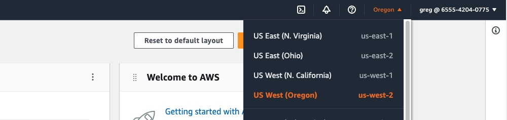

## Costs

There are additional costs to consider when running an app in multiple regions. The biggest will be the cost of replicating resources. For example adding a load balancer in each region. Each load balancer has an hourly cost in _addition_ to its usage costs (such as connections or data).

Data transfer _between_ AWS regions is more expensive (for example having a compute service in region A communicate with a database in region B).

You also have the costs incurred from using some form of AWS service to handle _global_ load-balancing. Whether that is AWS Route 53 or the AWS Global Accelerator.

## Database

In my case I'm replicating what I did on Fly.io and so _I_ will use the _same_ RDS instance (in the UK) for reads _and_ writes. This isn't ideal. The further away the compute is, the slower it will interact with the database. Ideally you would want to use some kind of replication. AWS supports creating [cross-region read replicas](https://docs.aws.amazon.com/AmazonRDS/latest/UserGuide/Concepts.RDS_Fea_Regions_DB-eng.Feature.CrossRegionReadReplicas.html). You could then connect to the closest read replica, making _reads_ much faster. Most applications perform more reads than writes and so would benefit from this. Writes would still need to be sent to the primary database. The trade-off is the increased cost of adding the additional read-replica instance(s).

## Certificate

Unfortunately certificates in AWS ACM [are regional](https://docs.aws.amazon.com/acm/latest/userguide/acm-regions.html):

> Certificates in ACM are regional resources ... For certificates provided by ACM, this means you must revalidate each domain name in the certificate for each region. You cannot copy a certificate between regions.

Ddo that first as it may take a while to be issued. In the new AWS region (e.g US West) search for "ACM" and click on "Certificate Manager". Request a new public certificate for e.g `www.your-domain.com`, just like before. Check to see what `CNAME` name/value you need to add to verify you own that domain, and then if they are different to before (they shouldn't be as it is the same hostname!) add _that_ record in your DNS provider's system (in my case that is Cloudflare).

That can then be verifying in the background. It should be ready by the time the load balancer needs it.

## VPC

When accessing a resource in another AWS region, an additional complexity is introduced: VPCs and their associated networking. If you recall from the earlier guide, the simplest option was just to use the default VPC each AWS account comes with. That saves you from having to think too much about subnets, route tables, internet gateways ... and so on. Unfortunately for inter-region communication, you do need to think about VPCs.

When you create resources (like EC2 instances), they are put in a VPC. If you want one of those resources (for example an ECS container) to communicate with a resource in a VPC in another AWS region (for example an RDS instance), you need to set up [VPC peering](https://docs.aws.amazon.com/vpc/latest/userguide/vpc-peering.html).

The problem is that _my_ default VPC in `eu-west-2` has a CIDR that overlaps the default VPC in `us-west-2`. Which means ... [I can't use VPC peering](https://docs.aws.amazon.com/vpc/latest/peering/vpc-peering-basics.html#vpc-peering-limitations):

> You cannot create a VPC peering connection between VPCs that have matching or overlapping IPv4 CIDR blocks.

> You cannot create a VPC peering connection between VPCs that have matching or overlapping IPv6 CIDR blocks.

If I were to proceed on, well, I would face [this unfortunate issue](https://serverfault.com/questions/698797/connecting-two-aws-vpc-regions-of-the-same-cidr-range).

The good news: you can create a _new_ VPC, [for free](https://aws.amazon.com/vpc/faqs/)

> There are no additional charges for creating and using the VPC itself

The bad news: it does involve quite a few steps, both to create the VPC and then to peer with the one in your other AWS region.

I'll give it a try.

First, in `us-west-2` I'll create a new VPC with a new IPv4 CIDR block (that does not overlap the one used by `eu-west-2`).

I'm currently only using public subnets but by default it creates two public ones and two private ones.

## VPC peering

For reference, this is [essentially what I'll be doing](https://stackoverflow.com/questions/59416491/connect-to-rds-in-a-different-region-from-ec2-instance?rq=1).

In my original region (where my RDS is) of `eu-west-2`, I need to [create a peering request](https://docs.aws.amazon.com/vpc/latest/peering/create-vpc-peering-connection.html). From its VPC page, I'll click on "Peering connections" and create it there.

Switching back over to `us-west-2` I'll now _accept_ that peering request from by going to _its_ equivalent VPC console page and again clicking that same "Peering connections" page. It shows as "Pending acceptance".

That then shows as "Provisioning". It will move to "Active" in a few moments:

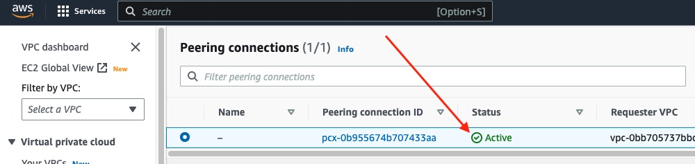

The next problem is DNS. By default, DNS resolution of hostname to private IPs is disabled. That's a problem because I'm using the RDS hostname to connect to it. The app needs to be able to resolve that hostname to an IP. So that [needs enabling](https://docs.aws.amazon.com/vpc/latest/peering/modify-peering-connections.html.).

Click the "Edit DNS settings" button and toggle the option to enabled.

**Note:** You need to do the same process in _both- regions for them to \_both_ show as "Enabled":

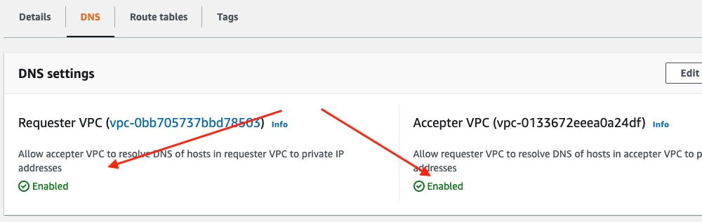

When you first accepted the peering connection, it probably said to add a route to the (now) peered VPC. So click on "Route tables" to do that now.

In `eu-west-2`, in its "route tables", edit the existing public routes to add a _new_ route so that traffic with destination `10.0.0.0/22` (which is my CIDR) is sent to a target of (pick "Peering Connection") the `us-west-2` VPC. Click "save changes".

In `us-west-2`, in its "route tables", edit the new VPC's single public routes to add a _new_ route so that traffic with destination `172.31.0.0/16` (which is my CIDR) is sent to a target of (pick "Peering Connection") the `eu-west-2` VPC. Click "save changes".

Now traffic should be routed between them, privately, and host names should be resolved to their private IPs.

**Note:** Public subnets need a route to an IGW (Internet Gateway). If not e.g ECS won't be able to fetch the secrets and the task will repeatedly fail to start because it needs those secrets.

By default a _new_ public subnet _won't_ have a public IPv4 address associated with it. As a result, fetching secrets may _also_ fail. In which case your tasks will repeatedly fail to launch. I needed to select each of my public subnets in my new VPC (in `us-west-2`), click "Actions", then "Edit subnet settings", and check that box for each:

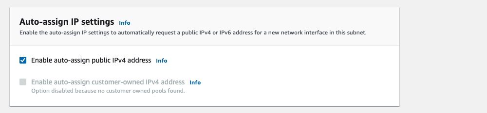

## Compute

Now there is a new VPC in `us-west-2` to launch it in, I will need to set up a new compute service in US West. I will continue to use ECS and so will need to duplicate how I set that up. I'll need to create a new ECS cluster, then a task definition and finally a service.

So I'll start by searching for "ECS"

I have no ECS clusters in _this_ region and so the first step is to click "Get started" on the welcome page, then create one:

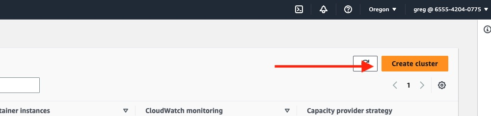

I'll go through the same steps as before. I'll give the cluster a name. But this time I'll use my new VPC in this region. This one has two public subnets and two private subnets, so I'll just pick the two public subnets.

I'll and leave Fargate selected as the capacity provider for its infrastructure.

The cluster is created:

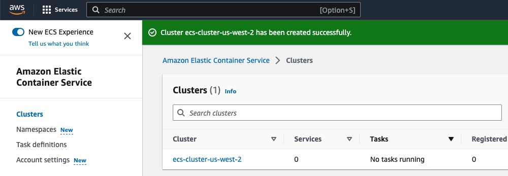

As before, next I'll go to "Task definitions" and create a new task definition to tell my service _what_ it will be running. Click the orange button in the top-right to create a new one.

Give it a name, then scroll down to specifying the first container. There must be at least one, so it is essential. First it asks for the image details. Give it a name. I already have an image, in ECR in the UK. So I'll put that in here to avoid having to re-build, tag and push it to _both_ regions each time I make a change:

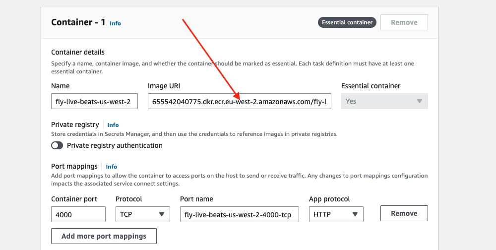

Scroll down to the environment variables. You will need to add all the same ones as before **but** ...

1. Where the name or value references an AWS region, such as `AWS_ECS_CLUSTER_REGION`, of course update that to use the one now being used.

2. If you have called your new ECS cluster or service a different name, use that here e.g for `AWS_ECS_CLUSTER_NAME`.

3. If you recall, the only reason I could use just the _name_ of the secrets and _not_ the full arn was because those secrets were stored in the same AWS region. If I were to do the same here (for example use `/staging/fly-live-beats/secret-key-base`) the deployment would fail. ECS would try and fetch that secret from the Parameter Store in US West, not find it, and fail. It needs to know to fetch it from the UK. Hence needing the full arn. In _my_ case the arn for each _secret_ is like this (use your original AWS region and your AWS account number instead) `arn:aws:ssm:eu-west-2:123456789012:parameter/staging/fly-live-beats/secret-key-base`.

Click "Next".

As before I'll drop down the CPU and memory to use the lowest ones initially to reduce cost.

As before, where it _then_ asks for the "Task role" and the "Task execution role" make sure to pick the two custom IAM roles you made before. Else it won't be able to fetch your secrets.

Click "Next"

Review the details and click "Create". That should only take a moment.

Now you need to create a service. Click on your cluster's name. The default tab is the "Services" one. On the right is a "Create" button. Click that.

As before, I'll switch over the compute option radio button to use "Launch type" as Fargate.

Scroll down, and this will be a "Service".

Pick the task definition from the dropdown.

Next you need to give the service a name. Make sure you call it the same name set in its environment variables e.g `fly-live-beats-service`.

As before, I would suggest initially setting the number of tasks as `0`. That can then be set as `1` or `2` once the service has been created.

As before, expand the "Networking" tab. I'll choose my _new_ VPC in this region. Then I'll leave just the public subnets.

Make sure to check the radio button to "Create a new security group" so you can avoid using the "default" one. As before, call it something obvious like `fly-live-beats-service-sg`. As before, I'll need to edit the rules after it is created to split out the rules needed by the service and those needed by the load balancer. For _now_ I'll allow access on its port `4000` to anybody:

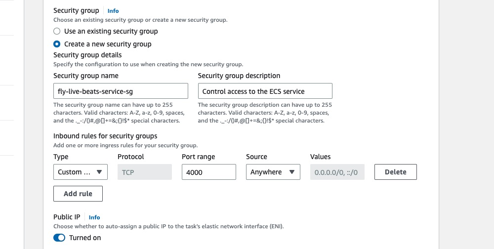

As before, I need a load balancer to distribute traffic across the containers. So expand the "Load balancing" panel and choose "Application Load Balancer". Assuming you don't have one in this region, choose the option to create a new load balancer.

Give it a name e.g `fly-live-beats-alb`.

As before, you need to create a new listener. Enter `443` as the port and choose `HTTPS` for the protocol. That will ask you to pick a certificate from ACM. You should be able to choose the one you previously verified (above) in _this_ region.

Create a new target group, e.g `fly-live-beats-ecs-target`. For the health check path, I'll use `/signin`.

Click "Create". That may take a few minutes to deploy.

You should then see it has deployed. At this point no tasks are running since I'll need to figure out the networking first _before_ running one:

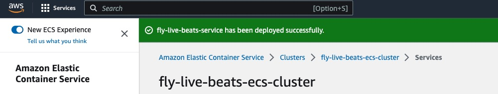

## Networking

I'll need to configure the security groups to permit access both within the region and now _also_ cross-region (my database remains in the UK, in a separate VPC).

First I'll set up the security groups as I did in the previous region. I'll create a new one for the ALB (making sure to create it in my new VPC's ID). Once done, I'll then allow communication from that to the ECS service and for containers to communicate within the service (allowing all requests from the new VPC's CIDR). You can see the original guide.

At this point the ECS should work within US West. However it would not be able to connect to the RDS database. That is in the UK. I can't simply allow an incoming connection from the US ECS security group in the UK RDS security group ... because _it_ does not know it exists. If you try that (adding the ID of a security group from another AWS region) you would see:

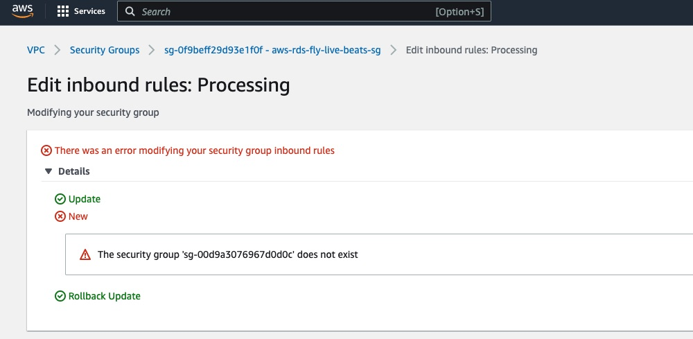

I need to add an inbound rule to the RDS's security group to allow requests on port `5432` from the CIDR of my new VPC in `us-west-2`.

## Deploy

Having set up the networking, I should now be able to get a container running. As before, I'll do that by going into "ECS", clicking on my cluster, then on my service, and then on the "Update service" button. I'll scroll down and start cautiously. I'll increase the number of "Desired tasks" to `1` (previously it was `0`). I'll then scroll down, click "Update", and that will trigger a deployment. I'll keep an eye on that in the service's "Deployments" tab and check the "Logs" tab for any issues.

If you see _this_ in the service's "Logs" tab, it can't have been able to connect:

```
[error] Postgrex.Protocol (#PID<0.2062.0>) failed to connect: ** (DBConnection.ConnectionError) tcp connect (rds-name-here.eu-west-2.rds.amazonaws.com:5432): timeout
```

If all is well (it shows the service has reached a steady state, the number of targets behind the load balancer is `1` and there are no issues in the "Logs") you might like to then go ahead and repeat that, clicking "Update service" again, but this time increasing the number of desired tasks to `2`.

Of course currently your actual custom domain (such as `www.your-domain.com`) is still pointed at the original ALB, in my case in `eu-west-2`. To see if the app in `us-west-2` is responding you would need to use its ALB's hostname. For example `app-name-alb-123456.us-west-2.elb.amazonaws.com`.

**Note:** As shown you _will_ get a WebSocket error (because `PXH_HOST` does not match that hostname) _and_ also an SSL error (because ALB does not support HTTPS without a custom domain, and you are not using that so the certificate does not match) but that's fine for now. Both will be solved when the custom domain is pointed at a global routing/load-balancing service:

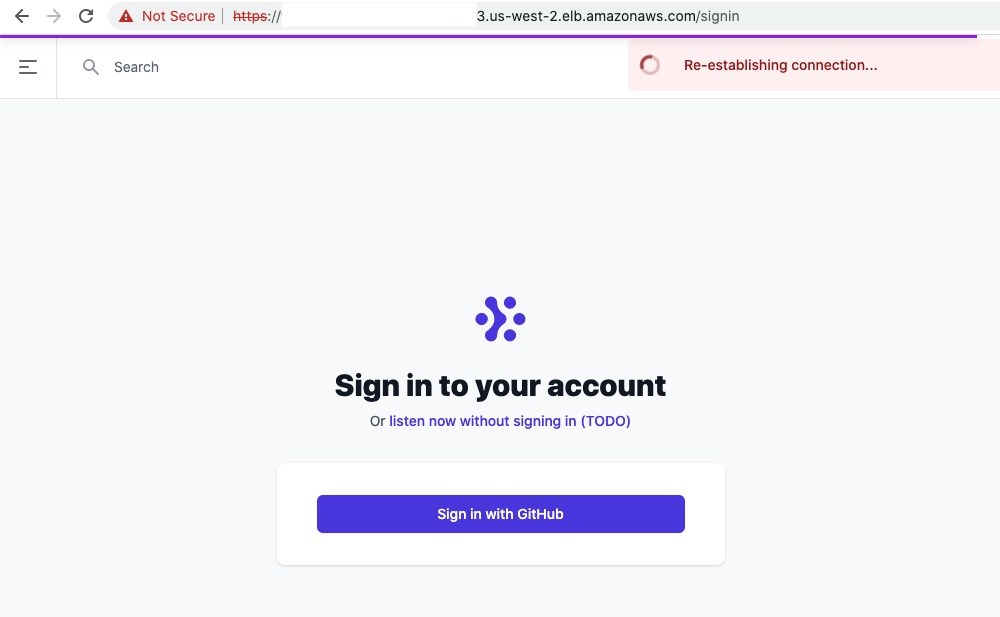

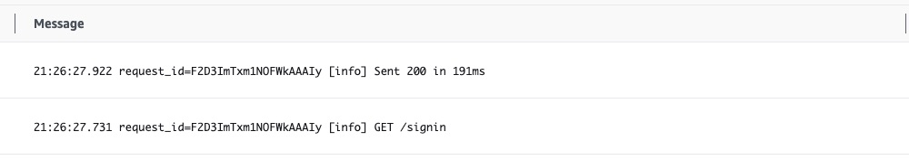

## Global load balancing

At this point I have two load balancers in both AWS regions, each distributing traffic across the containers in their respective regions. However how do I decide which of those load balancers a global user's request should be sent to 🤔 ?

## DNS?

One option could be to do it using DNS. The AWS DNS service, Route 53, supports [geo-location routing](https://docs.aws.amazon.com/Route53/latest/DeveloperGuide/routing-policy-geo.html) and latency-based routing, deciding which record to return based on the user's location.

In terms of pricing there is a small cost to add a hosted zone, and you then pay per million queries.

## Global accelerator?

Another way to route users is using the [AWS Global Accelerator](https://aws.amazon.com/blogs/networking-and-content-delivery/achieve-up-to-60-better-performance-for-internet-traffic-with-aws-global-accelerator/). That provides a static anycast IP (like how Fly.io does). You can then tell it your endpoints (in my case that is a load balancer in the UK, and another in the US) and it will route a user to the closest one. The appeal of _this_ approach is the request should enter the AWS network at the closest point to the user (the AWS edge) then travel over the fast, internal AWS network to the service. That should result in a faster response.

AWS have set up a page where you can [see how much of a difference it makes](https://speedtest.globalaccelerator.aws/#/). In my case, most downloads were 30-40% faster when using Global Accelerator. For example I've been working with `us-west-2` so that is a good test:

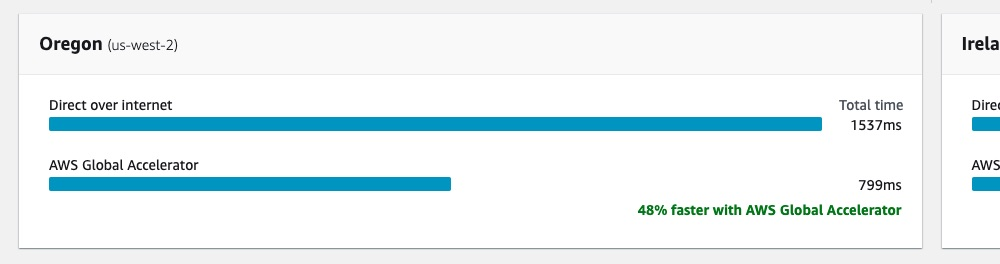

**Note:** The HTTPS connection will still be terminated by the load balancer and so you still provide the SSL certificate there.

In terms of pricing there is a fixed hourly cost to run the service _plus_ an additional cost per GB of data it handles.

Since I have my DNS set up with an external provider (Cloudflare), I'm going to try adding the global accelerator to my application to see how it works.

In my original region of `eu-west-2` I'll search for "Global Accelerator". Click that button:

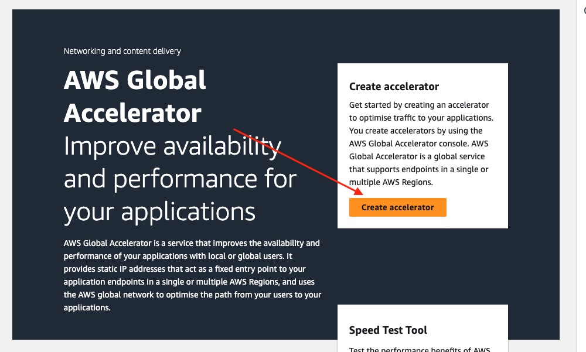

Give it a name, choose a type (I'll stick with the standard one), and since I've only been using IPv4 I'll stick with that default.

Click "Next".

I only need a single listener, on HTTPS/443. Since this will act as a global load balancer, receiving the connections:

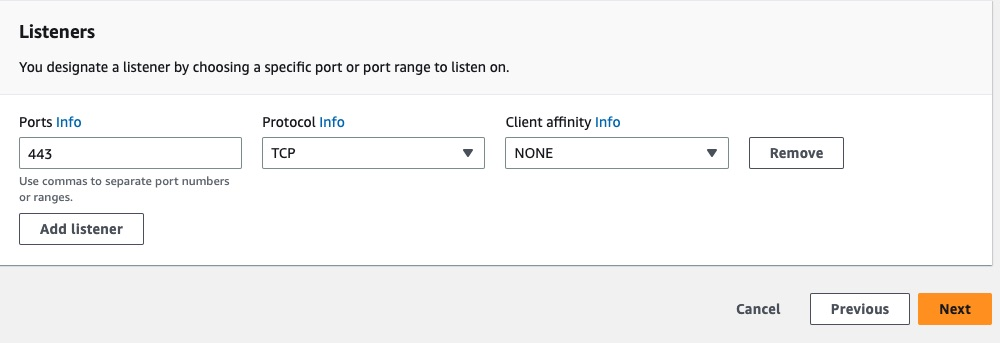

Click "Next".

The endpoint groups decide where the accelerator directs those requests to. First I'll pick `eu-west-2`. I don't need to override any ports, so I'll click the button to add another endpoint group. For that, I'll pick `us-west-2` (where my other load balancer is).

Click "Next".

The final step is to tell it the endpoints to route to. I have already created a load balancer in each region, so I just need to click "Add endpoint", then choose that from its respective dropdown menu that appears when I select "ALB":

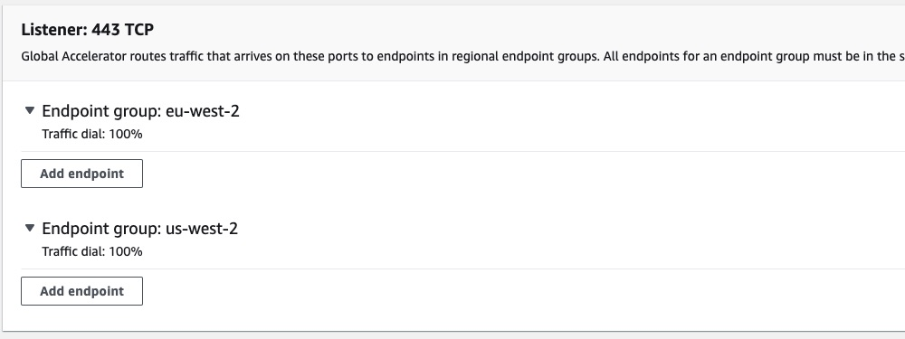

Click "Create accelerator"

Its status will initially be "In progress". In my case it took about 10 minutes to move to "Deployed".

You will see each accelerator has two IPv4 _and_ a DNS name. According [to the AWS docs](https://docs.aws.amazon.com/global-accelerator/latest/dg/dns-addressing-custom-domains.mapping-your-custom-domain.html) you can use _either_ to route traffic to it (so an `A` record or a `CNAME` record).

I'll try using its DNS hostname.

In my DNS `www.your-domain.com` is still pointed at the ALB in `eu-west-2` (I've then got that ALB hostname as a backup to switch the `CNAME` back to in case there is any issue with the accelerator).

I'll edit that record so that `www.your-domain.com` _now_ points at the DNS name shown for the Global Accelerator (for example `123456789..awsglobalaccelerator.com`).

It may take a minute for the DNS to propagate.

If you now check the app, it should work. You should not get any WebSocket error _and_ HTTPS works (because the TCP connection is terminated at the AWS Edge but the TLS termination is handled by the load balancer):

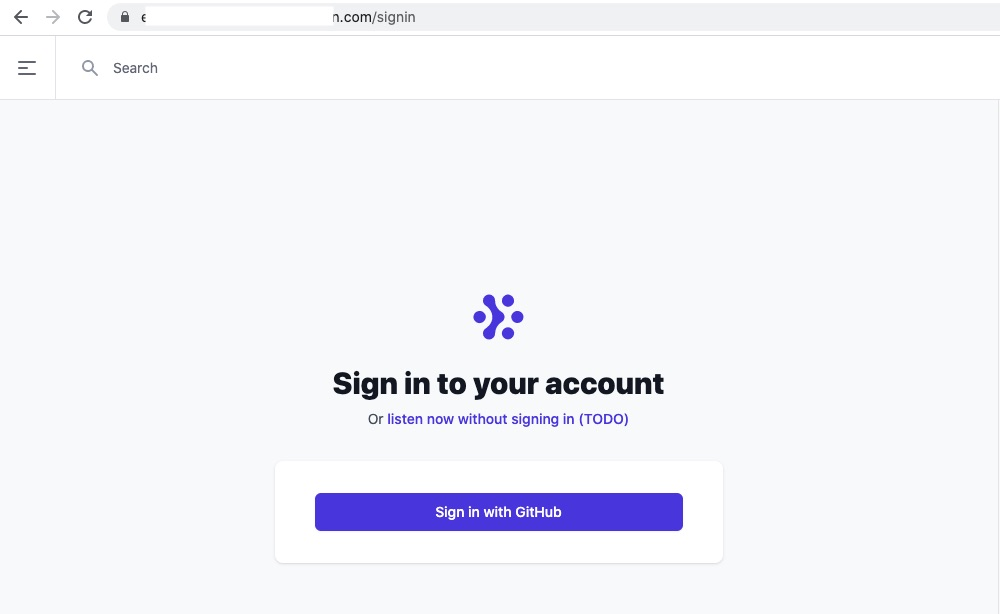

It works! 🚀

To check requests are being routed to the nearest location, I requested the URL using [https://tools.pingdom.com/](https://tools.pingdom.com/). So that I could see which request it was, I put in a made-up path which I could then easily look for in the logs e.g `https://www.your-domain.com/test-from-pingdom`.

Sure enough, when requested from the US West coast, the "logs" tab for the app running in `us-west-2` showed that request being handled _there_.

```
request_id=F2D-PFyPZbjMVLcAADci [info] GET /test-from-pingdom
```

I'll now take a look at how [pricing compares](/docs/12-compare-pricing.md) between Fly.io and AWS.
