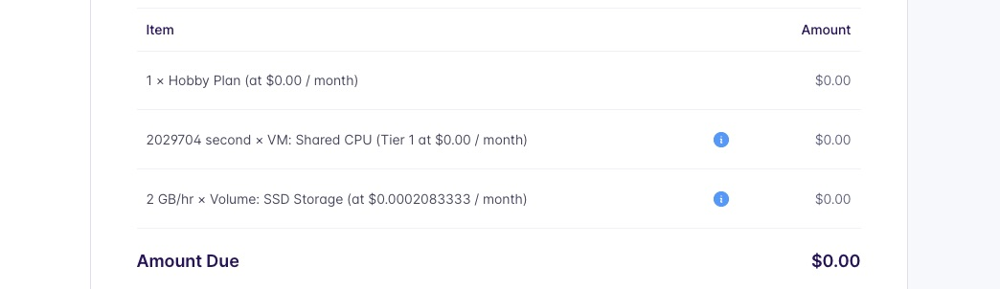
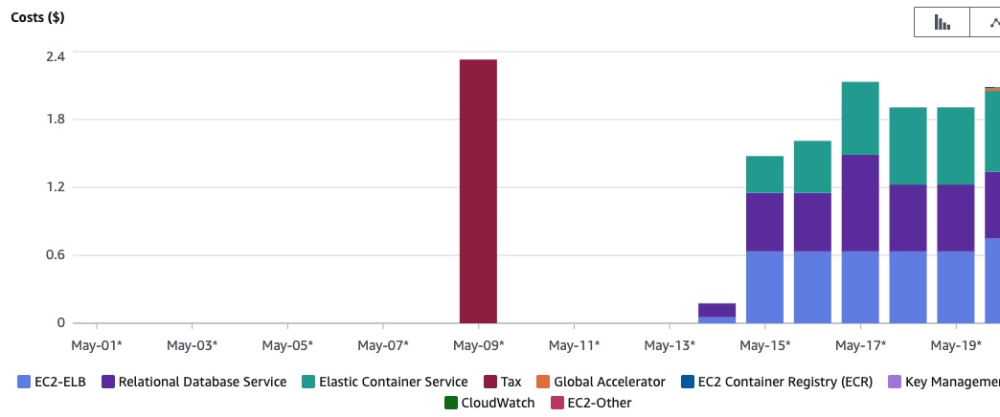

# Pricing

I deployed the same application to both Fly.io and AWS. I've generally used their smallest/cheapest options to see how they compare. As such, each service _can_ cost substantially more than this.

## Fly.io

You start out on their Hobby Plan. That has no monthly commitment and you pay for the resources you use. In my case, that's currently $0. My app fits within the free monthly allowance 🙂:

How much would their services cost if I were to exceed the free allowance?

#### Compute

VMs start at $0.0000008/s ($1.94/mo) and range up to $0.0003766/s ($976.25/mo).

In my case I created two of the smallest "shared-cpu-1x" VMs and so the compute cost was $1.94/month \* 2 for the VMs.

**Pricing page:** [https://fly.io/docs/about/pricing/#apps-v2-and-machines](https://fly.io/docs/about/pricing/#apps-v2-and-machines)

#### Load balancer

Free. Fly.io provides a [global proxy](https://fly.io/docs/reference/services/) which automatically handles load balancing across your VMs.

#### Global routing

Free. Fly.io provides each new app with a [dedicated anycast IPv6 and shared anycast IPv4](https://fly.io/docs/reference/services/).

#### Database

Since Fly.io does not provide a managed database service, a database app is priced just like a regular app.

In my case I created one of the smallest "shared-cpu-1x" VMs and so the compute cost of the database was $1.94/month for the VM.

**Pricing page:** [https://fly.io/docs/about/pricing/#apps-v2-and-machines](https://fly.io/docs/about/pricing/#apps-v2-and-machines)

#### Persistent storage

For the compute, I ran two VMs. Each machine have a 1GB volume attached to each so that cost $0.15/GB \* 2.

For the database, I ran one VM. That machine had a 1GB volume attached to each so that cost $0.15/GB. In production you would use a HA database, doubling that cost.

**Pricing page:** [https://fly.io/docs/about/pricing/#persistent-storage-volumes](https://fly.io/docs/about/pricing/#persistent-storage-volumes)

#### Bandwidth

My app were run in North America and Europe. If I were to exceed the free monthly allowance (100 GB) the cost would be $0.02 per GB. Other regions are more expensive:

**Pricing page:** [https://fly.io/docs/about/pricing/#network-prices](https://fly.io/docs/about/pricing/#network-prices)

#### Registry

Free. Fly.io provides a shared, private registry to store your images without any additional configuration.

#### Logging

Free. Fly.io provides a tail of the latest X log lines from their CLI or dashboard. However if you want to look further back you would need to ship them to an external service.

#### Free tier/allowance

There is a free _allowance_ to let you run a small app each month. Mine fit into that.

I ran two of the smallest machines (shared-cpu-1x, 256MB) for the app, and another single instance database. A total of 3 vms. I also used three 1GB volumes, for a total of 3GB.

**Pricing page:** [https://fly.io/docs/about/pricing/#free-allowances](https://fly.io/docs/about/pricing/#free-allowances)

#### Support

Without any commitment you only have access to community support. There is a busy [community forum](https://community.fly.io) where someone will usually be able to assist.

Plans that include support from Fly.io staff [start at $29 a month](https://fly.io/plans).

## AWS

If you are using an AWS account within an AWS Organization, access to billing data _may_ be turned off. I believe it is by default. If so, you might see a blank page/error. You would need to enable it for accounts within the organization from the management AWS account (the one which pays the bills).

On the right-hand side you can select a date range, choose the granularity and filter by e.g service or region. I generated a daily graph for the month, showing each AWS service that incurred a cost. The larger bar on the left-hand side is the tax which of course accumulates over _all_ the services used and will defer depending where you are in the world.

Like on Fly.io I opted for the smallest options from each service (for example running one or two ECS containers with 0.5 vCPU and a single RDS instance, a `db.t3.micro`). That costs _roughly_ $2 a day. Your costs will be substantially higher than this in production. You would need to run more containers, _bigger_ containers (more vCPU and/or RAM), and at the very least a HA database (with two instances). Most of the AWS pricing pages have examples of usage and how much that would cost. There are a _lot_ of billing items so it is worth checking each service in detail _and_ keeping a regular eye on your account's cost explorer to avoid any unexpected surprises at the end of the month.

**Note:** Since it varies per region, I'm basing _my_ pricing on the `eu-west-2` region. AWS pricing [assumes 730 hours in a month](https://aws.amazon.com/calculator/calculator-assumptions/).

How much would their services cost if I were to exceed the free allowance?

#### Compute

I have been using [AWS Fargate](https://aws.amazon.com/fargate/).

For Linux/x86 (which I'm using), Fargate costs $0.04656 per vCPU per hour and $0.00511 per GB per hour (that cost can be reduced by up to 70% using its spot pricing, however that requires your app to be interrupt-tolerant). The cost is calculated per second, with a one-minute minimum.

What is the cost of running one of the smallest possible container on ECS (with 0.25 vCPU and 0.5 GB of RAM)?

For the vCPU, it would cost ($0.04656 / 4) \* 730 = $8.4972

For the RAM it would cost ($0.00511 / 2) \* 730 = $1.86515

So a total of $10.36235 per month.

In this case, I'm running two (for the smallest cluster). So that would cost $10.36235 \* 2 = $20.7247.

**Pricing page:** [https://aws.amazon.com/fargate/pricing/](https://aws.amazon.com/fargate/pricing/)

#### Load balancer

I have been using [Application Load Balancers](https://aws.amazon.com/elasticloadbalancing/application-load-balancer/).

You are billed for each hour an Application Load Balancer is running. They are billed at $0.02646 per hour or $0.02646 \* 730 = $19.3158 a month.

You are then billed for the number of Load Balancer Capacity Units used per hour. Each LCU costs $0.0084 per hour. They contain a number of metrics but essentially the more active your app is (connections, data and rule evaluations), the more LCU will be needed. It's worth looking at their pricing examples to get an idea how much your app would use.

This app will have minimal usage so 1 LCU will bee sufficient. That adds $0.0084 \* 730 = $6.132 per month.

So that is a minimum total of $19.3158 + $6.132 = $25.4478 to run _one_ Application Load Balancer for a month.

**Pricing page:** [https://aws.amazon.com/elasticloadbalancing/pricing/?did=ap_card&trk=ap_card](https://aws.amazon.com/elasticloadbalancing/pricing/?did=ap_card&trk=ap_card)

#### Global routing

I have been using [AWS Global Accelerator](https://aws.amazon.com/global-accelerator/)

There is a fixed fee per accelerator of $0.025 per hour, so for a month that is $0.025 \* 730 = $18.25.

You _then_ pay a premium per gigabyte of data transferred over the network (in _addition_ to the [normal data transfer rate](https://aws.amazon.com/ec2/pricing/on-demand/)) of between $0.01 and $0.10 per GB. For data transfer within America and Europe it is roughly $0.015 per GB, so that adds roughly 20% on top of the standard data transfer charge.

If your app is only running in a single AWS region (particularly within America or Europe) you likely wouldn't need to use this.

**Pricing page:** [https://aws.amazon.com/global-accelerator/pricing/?did=ap_card&trk=ap_card](https://aws.amazon.com/global-accelerator/pricing/?did=ap_card&trk=ap_card)

#### Database

I have been using [Amazon RDS for PostgreSQL](https://aws.amazon.com/rds/postgresql/).

A Single-AZ deployment (not recommended for production!) of the smallest instance (`db.t4g.micro`) costs $0.018 pr hour, or $13.14 pr month.

In production you _would_ need HA and so you should look at the Multi-AZ deployment tab (essentially each price is doubled as you are then running _two_ instance, with one on permanent standby).

Storage costs $0.133 per GB per month. Again, for HA you would double that as your data would be stored twice. So $0.266 per GB per month.

**Pricing page:** [https://aws.amazon.com/rds/postgresql/pricing/?pg=pr&loc=3&refid=ap_card](https://aws.amazon.com/rds/postgresql/pricing/?pg=pr&loc=3&refid=ap_card)

#### Persistent storage

I _would_ use [Elastic File System](https://aws.amazon.com/efs/).

For this app I didn't attach any persistent storage. I used the ephemeral storage each of my containers came with. But for a fair comparison to Fly.io (where the data is persisted) the cost would have been a base of $0.33 per GB per month.

**Pricing page:** [https://aws.amazon.com/efs/pricing/(https://aws.amazon.com/efs/pricing/](https://aws.amazon.com/efs/pricing/(https://aws.amazon.com/efs/pricing/)

#### Bandwidth

The pricing for bandwidth is slightly complicated in that transfers within the same region can either be free or $0.01/GB, there is a reduced cost for transfers between AWS regions (generally $0.02/GB), and then there is a higher cost for data sent out to the Internet.

Each service may have a different rate but usually you can consider the pricing based on EC2. The first 10TB transferred to the internet each month are billed at $0.09 per GB.

**Pricing page:** [https://aws.amazon.com/ec2/pricing/on-demand/#Data_Transfer](https://aws.amazon.com/ec2/pricing/on-demand/#Data_Transfer)

#### Registry

I have been using its [Amazon Elastic Container Registry](https://aws.amazon.com/ecr/).

You pay $0.10 per GB per month for data stored in a repository, and then $0.09 per GB for data transferred from a private repository (which you will probably be using). My images were only 50-100MB and so even if I had kept them the whole month, the cost would be barely $0.10.

**Pricing page:** [https://aws.amazon.com/ecr/pricing/?did=ap_card&trk=ap_card](https://aws.amazon.com/ecr/pricing/?did=ap_card&trk=ap_card)

#### Logging

I have been using [Cloudwatch](https://aws.amazon.com/cloudwatch/)

Log collection is $0.5985 per GB and storage is $0.0315 per GB. My app generates a small amount of log data and so this cost is minimal.

**Pricing page:** [https://aws.amazon.com/cloudwatch/pricing/](https://aws.amazon.com/cloudwatch/pricing/)

#### Free tier

AWS divides its free allowances between _free trials_, _12-months free_ and _always free_.

It's worth checking their [free tier page](https://aws.amazon.com/free/?all-free-tier) and use the filters on the left to see what you are entitled to.

For example for RDS (their database service), _new_ AWS customers get 750 hours each month for free for 12 months for one of the smallest instances. That essentially makes it free (for the compute part, excluding any data transfer).

#### Support

Without any commitment you only have access to community support. There are forums such as [https://repost.aws/](https://repost.aws/) where you can find the answer to many questions.

Premium support [starts at $29 a month](https://aws.amazon.com/premiumsupport/plans/).

## AWS vs Fly.io

The total cost of running this app on Fly.io is ... $0. Which is hard to believe. For that I can run 3 VMs with 3 1GB volumes. There is no cost for global routing, load balancing, or images.

Excluding the free tiers, well running its 3 VMs (2 for the app, and 1 for the database) would cost ($1.94 \* 3) = $5.82 a month on Fly.io. That is cheaper than running a single container on ECS Fargate. The cost of running the _smallest_ container on ECS Fargate is $10.36235 a month. That does come with 512MB, compared to 256MB on Fly.io, however even if we halve the cost (not correct since the RAM is a smaller part of the cost, but still), that would _still_ be $10.36235/2 = $5.181175. That is the cost of running three VMs on Fly.io for the cost of running one on AWS.

Yes, compute costs on AWS can be reduced. On ECS you _can_ use EC2 as the capacity provider, instead of Fargate. You _can_ use spot capacity on Fargate if your app is interrupt-tolerant. However then you have to manage the capacity or deal with making your app interrupt-tolerant.

So ... [in conclusion](/docs/13-in-conclusion.md)
