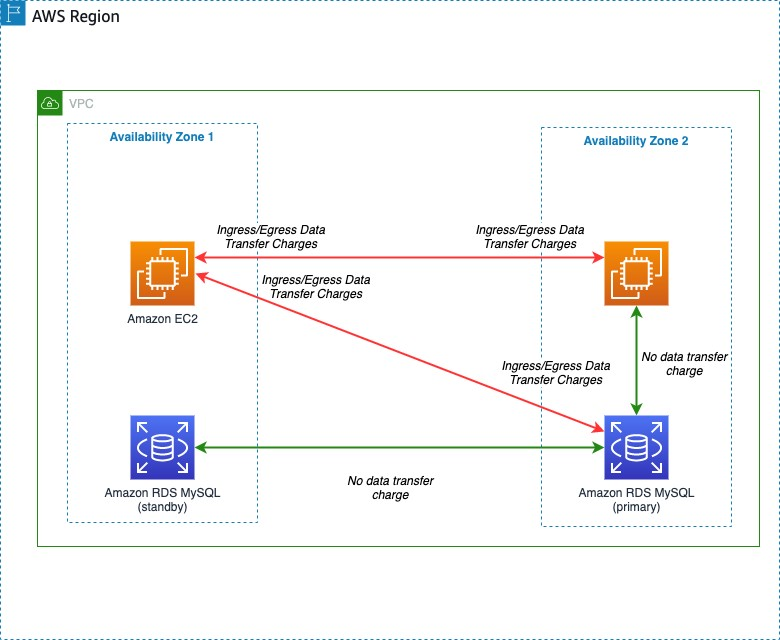

# Pricing

I deployed the same application to both Fly.io and AWS. I've generally used their smallest/cheapest options to see how they compare. As such, each service _can_ cost substantially more.

I've also excluded any _temporary_ free allowances (such as free trials or 12-month free allowances). If you visit https://aws.amazon.com/free/ and use the checkbox filters on the left you can see which AWS services have a trial, 12-months free (for new accounts) or a _permanent_ free allowance. Currently AWS Lambda is the only compute option with a permanent free allowance. Some (like RDS) do have 12-months. For example you can run one of the smallest RDS instances for 750 hours a month (so, a month) for free.

## Fly.io

### Compute

VMs start at $0.0000008/s ($1.94/mo) and range up to $0.0003766/s ($976.25/mo). For my app I used two of the smallest "shared-cpu-1x" VMs and so the compute cost would $1.94/month \* 2 for the VMs.

**Pricing page:** [https://fly.io/docs/about/pricing/#apps-v2-and-machines](https://fly.io/docs/about/pricing/#apps-v2-and-machines)

### Load balancer

Free. Fly.io provides a [global proxy](https://fly.io/docs/reference/services/). That automatically handles load balancing across your VMs.

### Global routing

Free. Fly.io provides each new app with a [dedicated anycast IPv6 and shared anycast IPv4](https://fly.io/docs/reference/services/). Their proxy is global.

### Database

Since Fly.io does not provide a managed database service, a database app is priced just like a regular app. In my case I created one of the smallest "shared-cpu-1x" VMs and so the compute cost of the database was $1.94/month for the VM. In production you would use a HA database, doubling that cost.

**Pricing page:** [https://fly.io/docs/about/pricing/#apps-v2-and-machines](https://fly.io/docs/about/pricing/#apps-v2-and-machines)

### Persistent storage

For the compute, I ran two VMs. Each machine have a 1GB volume attached to each. So that would cost $0.15 per GB \* 2.

For the database, I ran one VM. That machine had a 1GB volume attached to each. So that would cost $0.15 per GB. In production you would use a HA database, doubling that cost.

**Pricing page:** [https://fly.io/docs/about/pricing/#persistent-storage-volumes](https://fly.io/docs/about/pricing/#persistent-storage-volumes)

### Bandwidth

I ran my app in North America `sea` and Europe `lhr` and so if I were to exceed the free monthly bandwidth allowance (100 GB), the cost would be $0.02 per GB. Other regions are more expensive:

**Pricing page:** [https://fly.io/docs/about/pricing/#network-prices](https://fly.io/docs/about/pricing/#network-prices)

### Registry

Free. Fly.io provides a shared, private registry to store your images without any additional configuration.

### Logging

Free. Fly.io provides a tail of the latest X log lines from their CLI or dashboard. However if you want to look further back you would need to ship them to an external service, adding an extra cost.

### Free tier/allowance?

There is a free _allowance_ to let you run a small app each month. Mine fit into that.

I ran two of the smallest machines (shared-cpu-1x, 256MB) for the app, and another single instance database. A total of 3 vms. I also used three 1GB volumes, for a total of 3GB.

**Pricing page:** [https://fly.io/docs/about/pricing/#free-allowances](https://fly.io/docs/about/pricing/#free-allowances)

### Support

Without any commitment you only have access to community support. There is a busy [community forum](https://community.fly.io) where someone will usually be able to assist.

Plans that include support from Fly.io staff [start at $29 a month](https://fly.io/plans).

## AWS

### Compute

I have been using [AWS Fargate](https://aws.amazon.com/fargate/).

For Linux/x86 (which I'm using), Fargate costs $0.04656 per vCPU per hour and $0.00511 per GB per hour (that cost can be reduced by up to 70% using its spot pricing, however _that_ requires your app to be interrupt-tolerant). The cost is calculated per second, with a one-minute minimum.

What is the cost of running one of the smallest possible container on ECS (with 0.25 vCPU and 0.5 GB of RAM)?

For the vCPU, it would cost ($0.04656 / 4) \* 730 = $8.4972

For the RAM it would cost ($0.00511 / 2) \* 730 = $1.86515

So that works out to $10.36235 per month.

I'm running two per AWS region. So that would cost $10.36235 \* 2 = $20.7247.

**Pricing page:** [https://aws.amazon.com/fargate/pricing/](https://aws.amazon.com/fargate/pricing/)

### Load balancer

I have been using [Application Load Balancers](https://aws.amazon.com/elasticloadbalancing/application-load-balancer/).

You are billed for each hour an Application Load Balancer is running. They are billed at $0.02646 per hour. So that works out to $0.02646 \* 730 = $19.3158 a month.

You are _then_ billed for the number of Load Balancer Capacity Units (LCU) each uses. Each LCU costs $0.0084 per hour. They contain a number of metrics but essentially the more active your app is (connections, data transferred and rule evaluations), the more LCU will be needed. It's worth looking at all of their pricing examples to get an idea how much your app would use.

This app will have minimal usage so 1 LCU will be sufficient. That adds $0.0084 \* 730 = $6.132 per month.

So that is a _minimum_ total of $19.3158 + $6.132 = $25.4478 to run _one_ Application Load Balancer for a month. If you want to run your app in multiple AWS regions (as [I tried](/docs/11-aws-run-globally.md)) you would need a load balancer in each AWS region. Multiplying that cost.

**Pricing page:** [https://aws.amazon.com/elasticloadbalancing/pricing/?did=ap_card&trk=ap_card](https://aws.amazon.com/elasticloadbalancing/pricing/?did=ap_card&trk=ap_card)

### Global routing

I used [AWS Global Accelerator](https://aws.amazon.com/global-accelerator/)

It has a fixed fee per accelerator of $0.025 per hour. So for a month that is $0.025 \* 730 = $18.25.

You _then_ pay a premium per GB between $0.01 and $0.10 per GB of data transferred over the AWS network (that is in addition to the [normal data transfer rate](https://aws.amazon.com/ec2/pricing/on-demand/)). For data transfer within America and Europe that premium is _roughly_ $0.015 per GB.

If your app is only running in a single AWS region (particularly within America or Europe) you likely wouldn't need to use this service at all.

**Pricing page:** [https://aws.amazon.com/global-accelerator/pricing/?did=ap_card&trk=ap_card](https://aws.amazon.com/global-accelerator/pricing/?did=ap_card&trk=ap_card)

### Database

I have been using [Amazon RDS for PostgreSQL](https://aws.amazon.com/rds/postgresql/).

A Single-AZ deployment (not recommended for production!) of the smallest instance (`db.t4g.micro`) costs $0.018 pr hour. So that is $0.018 \* 730 = $13.14 pr month.

In production you _would_ need HA and so you would look at the Multi-AZ deployment tab (essentially each instance's price is doubled since you need _two_, with one on permanent standby).

Storage costs $0.133 per GB per month. Again, for HA you would double that as your data would be stored twice. So that would be $0.266 per GB per month. My database was tiny and so that is not a factor.

**Pricing page:** [https://aws.amazon.com/rds/postgresql/pricing/?pg=pr&loc=3&refid=ap_card](https://aws.amazon.com/rds/postgresql/pricing/?pg=pr&loc=3&refid=ap_card)

### Persistent storage

For this app I didn't actually attach any persistent storage. I used the ephemeral storage each of my ECS containers came with. But for a fair comparison to Fly.io (where the data is persisted) the cost of using the equivalent on AWS, which is [Elastic File System](https://aws.amazon.com/efs/), would have been a base of $0.33 per GB per month. So for two 1GB volumes, that would have added $0.66.

**Pricing page:** [https://aws.amazon.com/efs/pricing/(https://aws.amazon.com/efs/pricing/](https://aws.amazon.com/efs/pricing/)

### Bandwidth

The pricing for bandwidth is slightly complicated in that transfers within the same AWS region can either be free (same AZ) _or_ $0.01/GB (different AZ), there is a reduced cost for transfers between AWS regions (generally $0.02/GB), _and_ then there is a higher cost for data sent out to the Internet. You need to consider where your data is going. See the image in the notes below.

An AWS service may have a different cost/premium (such as Global Accelerator) but these are the [normal data transfer rates](https://aws.amazon.com/ec2/pricing/on-demand/). For example for data leaving ECS. The first 10TB transferred to the internet each month are billed at $0.09 per GB.

**Pricing page:** [https://aws.amazon.com/ec2/pricing/on-demand/#Data_Transfer](https://aws.amazon.com/ec2/pricing/on-demand/#Data_Transfer)

### Registry

I have been using its [Amazon Elastic Container Registry](https://aws.amazon.com/ecr/).

You pay $0.10 per GB per month for data stored in a repository, and then $0.09 per GB for data transferred from a private repository (which you will probably be using). My images were only 50-100MB and so even if I had kept them the whole month, the cost is negligible. If you have many containers frequently scaling, that could result in images being more frequently pulled and so more data transferred.

**Pricing page:** [https://aws.amazon.com/ecr/pricing/?did=ap_card&trk=ap_card](https://aws.amazon.com/ecr/pricing/?did=ap_card&trk=ap_card)

### Logging

I have been using [Cloudwatch](https://aws.amazon.com/cloudwatch/)

Log collection is $0.5985 per GB and storage is $0.0315 per GB. My app generates a small amount of log data and so this cost is negligible.

**Pricing page:** [https://aws.amazon.com/cloudwatch/pricing/](https://aws.amazon.com/cloudwatch/pricing/)

### Free tier/allowance?

AWS has _free trials_, _12-months free_ and _always free_. You might benefit from temporary free access however according to those filters, these services do not have a permanent free allowance.

### Support

Without any commitment you only have access to AWS community support. There are some excellent forums such as [https://repost.aws/](https://repost.aws/) where you can find the answer to many questions.

Premium support [starts at $29 a month](https://aws.amazon.com/premiumsupport/plans/).

## AWS vs Fly.io

Fly.io: My app fits within the permanent free monthly allowance 🙂:

AWS costs a lot more:

The app is costing _roughly_ $2 a day to run on AWS.

I opted for the smallest options from each service (for example using the smallest ECS container and a single, smallest RDS instance). In production You would need to run _more_ containers, _bigger_ containers (more vCPU and/or RAM), and at the very least a HA database (with two instances).

On AWS there are a _lot_ of billing items. It is worth checking each service in detail _and_ keeping a regular eye on your account (such as in their cost explorer, and with [billing alerts](https://docs.aws.amazon.com/AmazonCloudWatch/latest/monitoring/monitor_estimated_charges_with_cloudwatch.html)) to avoid any unexpected surprises at the end of the month.

## Notes

Since it varies per region, I'm basing _my_ pricing on the `eu-west-2` region. AWS pricing [assumes 730 hours in a month](https://aws.amazon.com/calculator/calculator-assumptions/).

f you are using an AWS account within an AWS Organization, access to your billing data _may_ be turned off. I believe it is turned off by default. If so, you might see a blank page/error. You would need to enable it for accounts within the organization from the management AWS account (the one which pays the bills). Then on the right-hand side you can select a date range, choose the granularity and filter by e.g service or region. I generated a daily graph for the month, showing each AWS service that incurred a cost. The larger bar on the left-hand side is the tax which of course accumulates over _all_ the services used and will defer depending where you are in the world.

Compute costs on AWS _can_ be reduced. On ECS you _can_ use EC2 as the capacity provider, instead of Fargate. You _can_ use spot capacity on Fargate if your app is interrupt-tolerant. However then you have to manage the capacity or deal with making your app interrupt-tolerant.

As mentioned above, the cost of data transfer within AWS depends on the route your data is taking. See:

Source: `https://aws.amazon.com/blogs/architecture/overview-of-data-transfer-costs-for-common-architectures/`

So ... [in conclusion](/docs/13-in-conclusion.md)
