# Deploy to AWS

Of course you will need an AWS account.

## Create an AWS account

If you _don't_ have any AWS account, create a new one by visiting [https://aws.amazon.com/](https://aws.amazon.com/) and clicking the button to create a new AWS account. You will be asked for your email address and to give your account a name.

If you _do_ already have an AWS account, we **strongly** recommend using a brand new AWS account for this guide. [AWS do too](https://docs.aws.amazon.com/whitepapers/latest/organizing-your-aws-environment/benefits-of-using-multiple-aws-accounts.html). That is best practice, primarily to limit the impact of adverse events. Using separate AWS accounts for staging, production, experimenting ... should ensure you can not inadvertently affect a resource. Plus, a new AWS account provides a natural billing boundary. To avoid having to provide separate payment details for every new AWS account, they recommend grouping them within the same [AWS Organization](https://aws.amazon.com/organizations/). You can then handle _all_ the payments from just _one_ account:

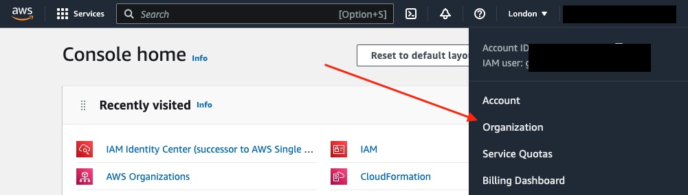

If you do not see the option to manage the organization within your AWS account, your account administrator may need to do this part for you.

Click the button to create a new account:

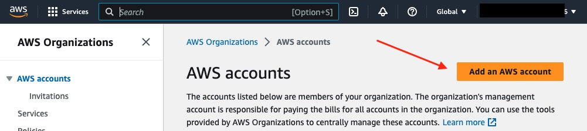

**Note:** You will need to enter a unique email address per AWS account. To save creating a new mailbox/user each time, some email providers support using an alias address. For example with Gmail you can append `+something` like `you+awstest@company.com`. We recommend sending a test email to your chosen address to make sure it works before using it.

The AWS account should be created within a couple of minutes. You may need to reload the page if you don't see it listed. Before leaving the page, make a note of the account number. You should see that in grey, next to its name. For example `123456778901`. You will use that to construct its sign in URL.

Sign out of that AWS account as from now on you will be working within the _new_ AWS account.

## Sign in

Depending on how your AWS accounts are configured, you _may_ sign in using single sign-on (SSO) via your employer's identity provider. Or be using AWS's own [IAM Identity Center](https://aws.amazon.com/iam/identity-center/). AWS has recently added IAM Identity Center (replacing AWS Single Sign-On) to let you control access to all AWS accounts within your AWS Organization, in addition to external SAML-enabled applications. You can connect it to on-premises Active Directory (AD) or provision identities from your existing identity provider. For _this_ example we only need to access _one_ AWS account, have no need to access other applications, and have no identity provider to connect to. So we won't use it here.

For the purpose of this guide we'll assume you are using the standard sign-in page (using an email and password to authenticate yourself). So visit `https://NUMBER.signin.aws.amazon.com/console`, replacing `NUMBER` with that 12-digit AWS account number noted above.

You may be initially prompted to sign in as an IAM user. If so, click the blue link to sign in as the new account's _root_ user instead:

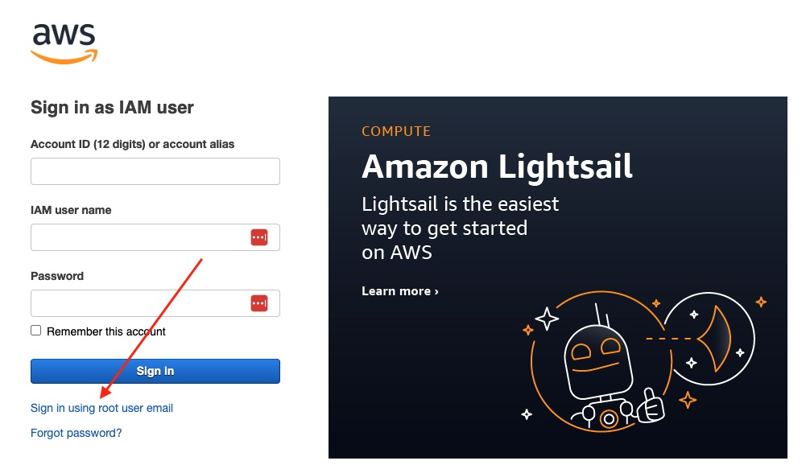

Enter your chosen email address (for example `you+awstest@company.com`) and click the blue **Next** button.

**Note:** If you have not yet been provided with a password (either by AWS, or your administrator) you can click the blue "Forgot password" link here. That will let you choose a new password:

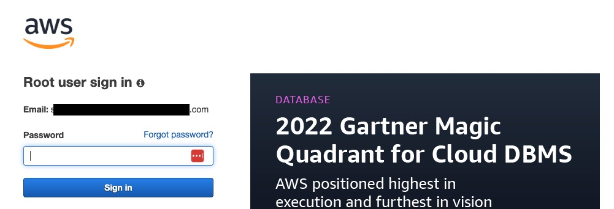

You should now be signed in to AWS. However you are signed in as the _root_ user. That's not ideal. That account should only be used when it [absolutely has to be](https://docs.aws.amazon.com/IAM/latest/UserGuide/id_root-user.html):

> We strongly recommend that you do not use the root user for your everyday tasks, even the administrative ones

You will want to create a new user. For that, AWS provides Identity and Access Management (IAM).

AWS IAM lets administrators control access to AWS resources and services. Ideally you want to allow only the minimum access required, initially by service (such as _EC2_ or _S3_), and then by actions on that service (such as limiting to _GetObject_).

## Create an IAM user

From the AWS console, click on _Security Credntials_:

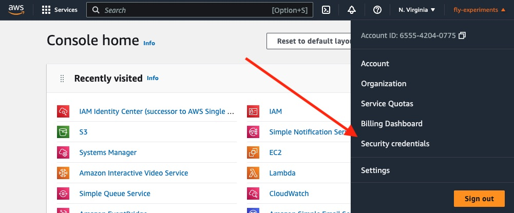

Click on _Users_ and then on the blue button to add users:

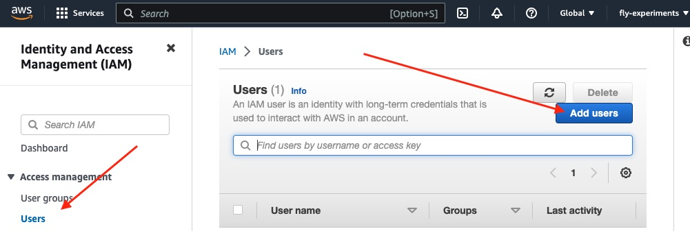

Enter your name (since you'll be using this account instead of the root one) and tick the box to allow console access. As mentioned above, AWS recommend using their new _Identity Center_ but we'll proceed on:

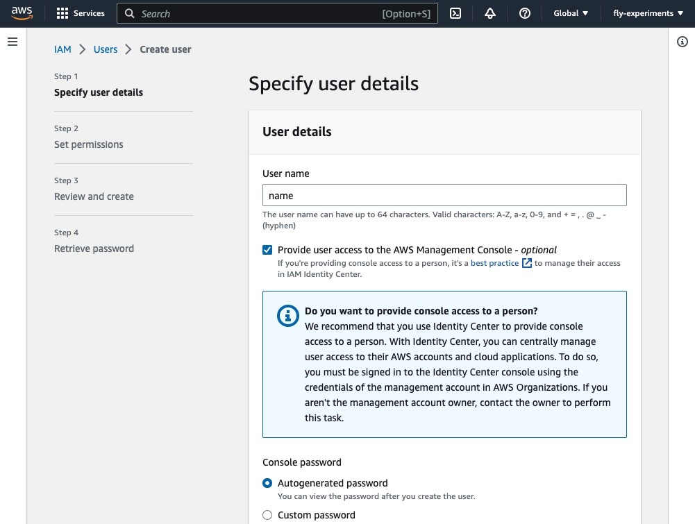

The next screen asks what the new user should be able to do. We need to set their permissions. You'll see that the recommend and pre-selected option is to add them to a group, and specify the access within that group. You don't have to, but we'll follow their advice. So go ahead and click the "Create group" button:

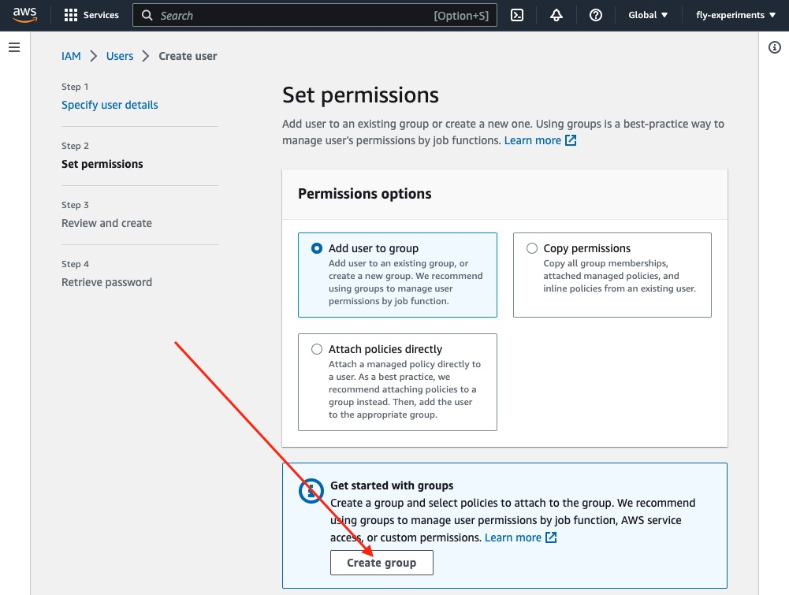

What level of access you grant (to yourself, as this is the user account you will be using in a moment) is up to you. If you know in advance what access you need, you can select the policies for just those services. In our case we are going to be trying multiple services later on and so we'll give ourselves the `AdministratorAccess` policy.

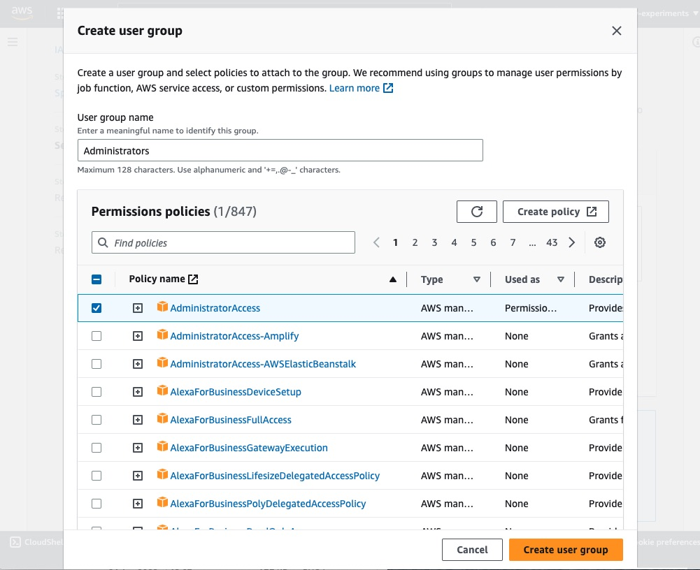

Create that group. Now it is listed as being available to add the new user to. Check the box:

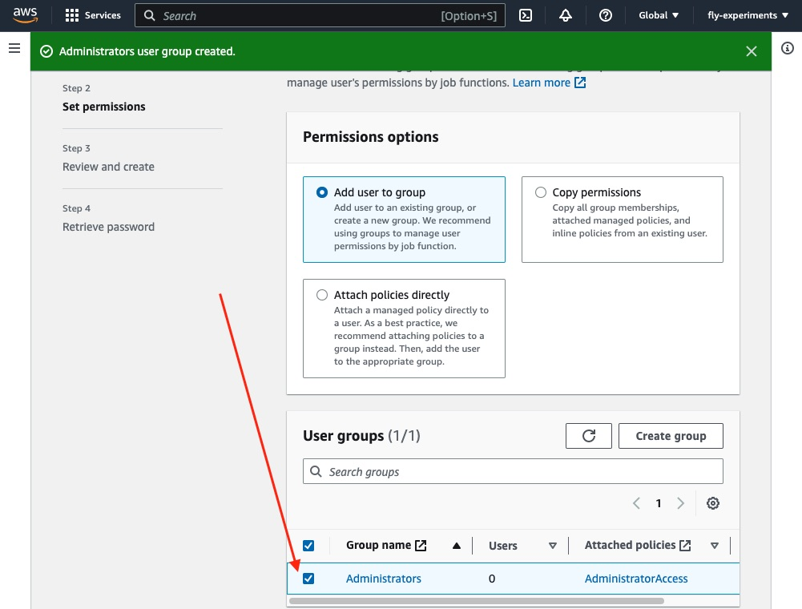

Click _Next_, review the details and click the button to _Create User_. If necessary you can now retrieve the generated password (you may have instead opted to set your own). It goes without saying that you should keep any password safe and secret.

For now we are done with the _root_ user as we _now_ have an IAM user. So sign out.

Visit the same `https://NUMBER.signin.aws.amazon.com/console` (replacing `NUMBER` with that 12-digit AWS account number) and if you recall last time you were prompted to sign in as an IAM user, but back then didn't have one? Now you do! So enter the _name_ you gave the IAM user and the generated/chosen password, and click the button to sign in.

These are the credentials you will use to sign in to your AWS account to use its console.

**Optional:** While here you may want to set your account's default language and home region to save having to keep switching them:

![Settings]img/aws_settings_language_region.jpeg)

**Optional:** You may want to assign MFA to add additional protection. You can use an authenticator app, security key or hardware token:

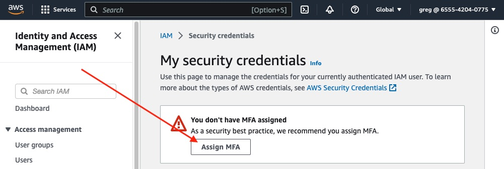

## AWS CLI

We will mainly be using the AWS console to deploy our app however since we will be deploying a containerized app, at some point we will need to push an image of that to AWS. That will be done using Docker, on the command line, and so we need to use the AWS CLI.

Make sure you have the latest version installed:

[AWS CLI](https://docs.aws.amazon.com/cli/latest/userguide/getting-started-install.html)

You can check which version of the CLI you have from your terminal:

```sh
$ aws --version
aws-cli/2.11.18 Python/3.11.3 Darwin/19.6.0 exe/x86_64 prompt/off
```

Next, you will need to be authenticated in order to interact with services in your AWS account. From the AWS console, click on _Security Credntials_:


Scroll down and click the button to create an access key:

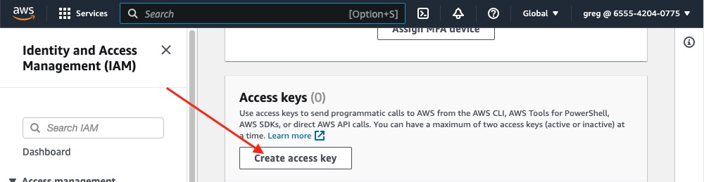

We are going to use the key for the CLI so select that option:

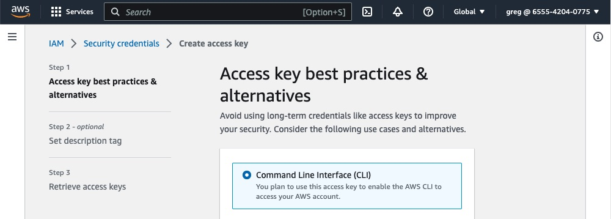

If you scroll down it mentions that _ideally_ we'd use IAM Identity Center in conjnction with the AWS CLI v2. As mentioned above, your organisation may already be doing that in conjunction with an identity provider. We haven't and so we'll proceed to create a new key.

You can provide a description for the key. That is a good idea to remind you of what it was used for (to know the impact of rotating/deleting it in future):

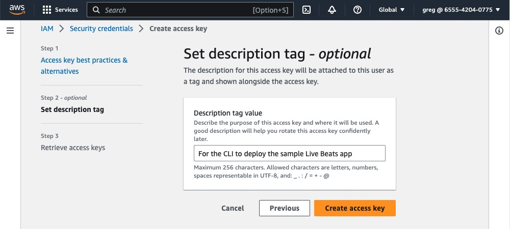

Click the button to proceed.

You should be shown _two_ values: the **Access key** and **Secret access key**. You need both of those values. They will only be shown once. You might find it helpful to click the small square icon that's just next to each of those values to copy them briefly to your clipboard.

As the console makes clear these values should **never** be stored in plain text, or in your code. They should be deleted when no longer needed.

Once you have noted them, click "Done".

You can now use those credentials with the AWS CLI, giving you programmatic access to your AWS account. In your terminal type `aws configure`. It will prompt you for the access key ID (the one starting `AK`) and the secret access key. You may be asked to add a profile. That let's you store multiple credentials for different users/accounts, and provide a `--profile name` flag when using the CLI. If not specified, it will set them as the default profile.

For reference, the credentials file is stored at `~/.aws/credentials` on Linux/macOS, or `C:\Users\USERNAME\.aws\credentials` on Windows.

## VScode

If you use VSCode, AWS [provide an extension](https://docs.aws.amazon.com/toolkit-for-vscode/latest/userguide/setup-toolkit.html) which lets you manage AWS resources within it:

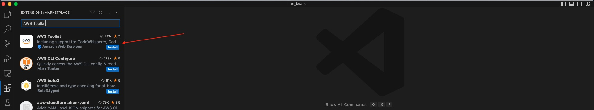

However for this guide we will be using the AWS console and AWS CLI.

## Prerequisites

Before proceeding on, this guide requires you to have both [Docker](https://docs.docker.com/engine/install/#installation) installed and running, and the [AWS CLI](https://docs.aws.amazon.com/cli/latest/userguide/getting-started-install.html) installed. Even though we'll be using the AWS console to set up our repository and cluster, we need them to push an image from our local machine _to_ that repository.

If you don't already have either one, those links should take you to the relevant page to install them.

You can check which version you have from your terminal:

```sh
$ docker --version
Docker version 23.0.1-rd, build 393499b
$ aws --version
aws-cli/2.11.18 Python/3.11.3 Darwin/19.6.0 exe/x86_64 prompt/off
```

This guide needs you to have IAM access to AWS, both to the console and also using that CLI. If you haven't already, please see the prior guide to [creating a new one](/docs/3-aws-create-account.md). In that example we created a new IAM user and gave that IAM user administrator access. You may be provided with access that is more locked down. At a minimum you will likely need access to RDS (for the database), ECR (for the image repository), ECS (for the container) and Systems Manager Parameter Store (for its secrets).

As you proceed through this guide, the CLI or console will reject your request with a forbidden error if your current user/role does not have enough access.

Let's now [create a database](/docs/4-aws-create-a-database.md) in AWS.
