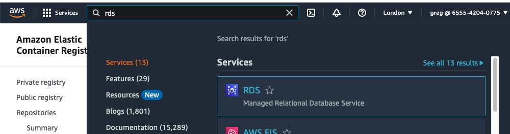
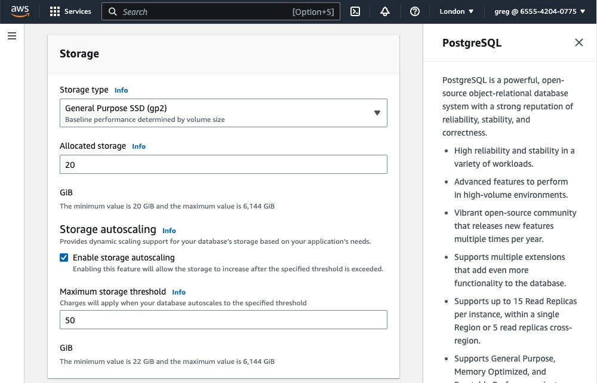
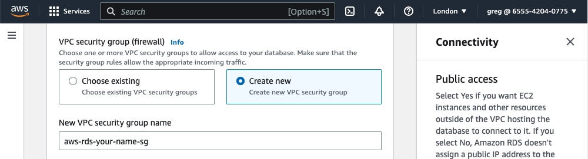
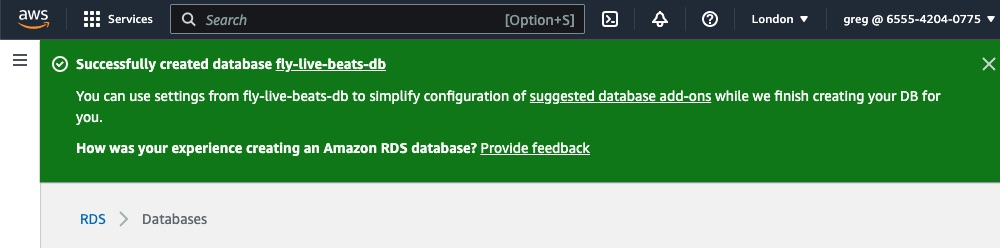

# Deploy to AWS

## Create a database

This app will need a PostgreSQL database. Like with Fly.io, we will create that first so that we can provide the app with a `DATABSE_URL` connection string.

The database will run on AWS Relational Database Service (RDS). Unlike on Fly.io, RDSs is a managed service and so AWS takes care of monitoring, restarting and letting you easily restore from a backup if necessary.

Search for "RDS" in the console and click that blue link:



Since RDS is a managed service, there are a variety of options to improve performance and reliability for production applications.

You may see AWS promote their new option to use [blue/green deployments](https://docs.aws.amazon.com/AmazonRDS/latest/UserGuide/blue-green-deployments.html). That lets you apply changes to the staging environment before promoting that to production. It may be worth considering if your app uses one of the supported engines, however currently that does not include PostgreSQL and so we'll skip it. Click the button to "create database":


We'll create a standard PostgreSQL database:


Scroll down. The templates are fairly self-explanatory. Pick the one appropriate to your usage. You'll notice that as you do so, the options further down get toggled. For example the number of instances you can choose, and later on the class of instance (which determines how much CPU/RAM it has).

A single DB instance is the cheapest. Just _one_ instance and so has no fail-over/high-availability. A Multi-AZ DB instance has _two_ instances: a primary and a standby (in a different AZ), so _does_ have high-availability. The most expensive option is a Multi-AZ DB cluster. This has _three_ instances: a primary and two read-replicas.

Scroll down and give the database a name.

Then give the initial main user a name. The default is _postgres_.

You can either let AWS generate a password for you, or enter your own random one. As with any password, make sure to keep it secret and keep it out of your code.

Scroll down to choose the instance configration. If you click on the dropdown menu you can see all of the available ones. The smallest size (the micro instance) has 2 vCPU and 1 GB of RAM. The "t" instances are bustable which means they get a share of the CPU. They can't use it continually however most applications would not need that. They are substantially cheaper than the larger classes.

Next you can choose the initial disk size. The default is the smallest value: 20GB. Handily that can auto-scale so you don't need to over-provision storage to begin with:



Next, the connectivity. It asks if you want to set up a connection to an existing EC2 instance. We don't have one, so we'll skip that.

For the network type, we'll leave the default as IPv4. If you recall, the default VPC created by AWS does not have IPv6 enabled. We could do that (you may have done so already, for dual-stack) however it is not needed here.

Next, the VPC. We'll leave the default one selected. We'll be using that later when it comes to setting up the ECS cluster so that our container(s) can connect to this database. We'll use the default subnet group too.

Next, whether to allow public access. Note that if you were to select yes (it's better not to) this does not open it up to the whole world. That would be _very_ bad. Instead it determines whether a public IP is added and so whether it is _possible_ to connect it from outside your VPC. For example your local PC. Who can access it is controlled within the security group, which acts as its firewall (in the next panel down). In the security group you can allow access from "the public" to only your IP, for example.

We recommend choosing the option to create a new security group rather than use the default one, as then (from its name) it is clear what it is being used for:



We'll leave the rest as their default options. Any AZ (Availability Zone). No RDS proxy (_that_ is much more applicable when your compute is AWS Lambda since that can quickly scale to many concurrent requests which potentially exceed the number of connections RDS can support). We'll leave the default of authentication with a password (it is not possible to use IAM-only). We'll leave the rest of the defaults (for example in the "Additional configuration" panel you can change the backup schedule - the default is to automatically backup, and keep those for seven days. If there is a particular time of day you would prefer the backup be taken, you can specify that there).

Before creating the database, make sure to look at the "estimated monthly costs" panel to make sure it is as you expect. Naturally the more replication/instances you have, and the larger their size, the more that cost will be. You can also check the [RDS pricing page](https://aws.amazon.com/rds/postgresql/pricing/?pg=pr&loc=3), making sure to pick _your_ AWS region as the pricing does vary per-region.

**Note:** If this is a new AWS account, RDS does have a free tier available for 12 months. Each month you get 750 hours (so, the full month) usage in a Single-AZ of a db.t2.micro, db.t3.micro or db.t4g.micro instance. You also get 20GB of storage. So for testing/development, your instance could well be free. Larger instance sizes would of course exceed that and have to be paid for.

Go ahead and click the button to "create database".

You may be prompted to set up some "add ons" such as Elasticache or RDS Proxy. You don't need any of those so close that panel.

You should see a blue panel saying your database is being created. It may take a few minutes so please be patient. You should then see it haas been created:



If you click on its name you should see all of its details. There are tabs for monitoring it (showing its load, connections, etc), logs and for accessing its backups.

Let's take a look at the first tab. Its "Connectivity & security". If you scroll down, that shows its endpoint and port (the default is 5432).

If you scroll down a bit further, _if_ you said "Yes" when asked whether to allow public access using the wizard, AWS should have created a new security group and added your current IP to that automatically. You should see in the "Security group rules" panel two rules, where the top row, the "CIDR/IP - Inbound", has your current IP as being allowed. For example "1.2.3.4/32". That means you will be able to access it from your local machine. You could either use your favourite database UI/editor or the command line. Since we have PostgreSQL installed we'll use the command line, using `psql`.

```sh
$ psql --version
psql (PostgreSQL) 14.2
```

The command should be: `psql -d postgres -U username -H hostname`. So try that using your choice of username (maybe you left it as `postgres`) and your RDS endpoint as the hostname:

```sh
$ psql -h your.endpoint.rds.amazonaws.com -U postgres -d postgres
```

It should prompt you for your password. Enter that, and you should be connected.

If not, make sure:

- Your database is set to allow public access
- The endpoint, username and password are all correct
- You are using the right port (our command did not specify one as we assume you are using 5432)
- Your IP (shown as that CIDR value in the security group rules) is correct

You can list the databases using `\l`. There should be a default `postgres` database, a `rdsadmin` database, and probably some template ones too:

```sh
postgres=> \l
                                  List of databases
   Name    |  Owner   | Encoding |   Collate   |    Ctype    |   Access privileges
-----------+----------+----------+-------------+-------------+-----------------------
 postgres  | postgres | UTF8     | en_US.UTF-8 | en_US.UTF-8 |
 ...
```

Great! It works.

Now our Live Beats app _could_ also use the `postgres` user. We know that works. However that is a super-user and it's probably better if we create a new user, just for the app. We can then avoid using the `postgres` password at all. So while here let's create a new user, give them a password, and then create a new database ready for our app to use (replace these values below with whatever database name, username and password _you_ want to use. Make a note of them as you'll need to provide them to the app later):

```sh
postgres=# create database fly_live_beats_db;
postgres=# create user fly_live_beats with encrypted password 'yourchoiceofpassword';
postgres=# grant all privileges on database fly_live_beats_db to fly_live_beats;
```

Done! Type `\q` to quit and return to your terminal. The database is now ready for our app to connect to.

Our database is now set up. We now need to store the `DATABASE_URL` connection string [as a secret](/docs/5-aws-create-secrets.md).
