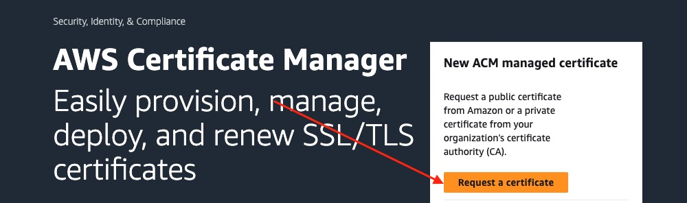
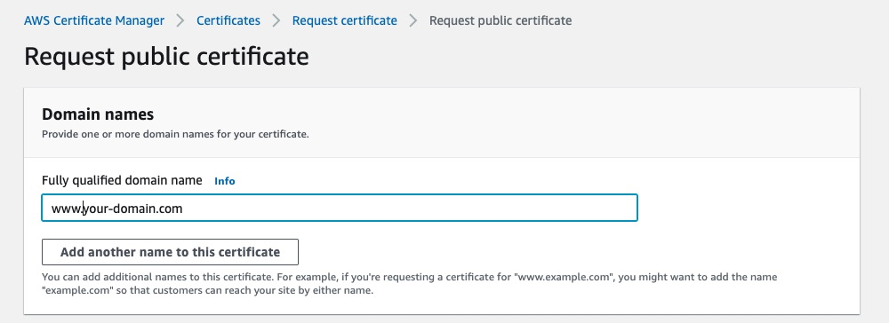
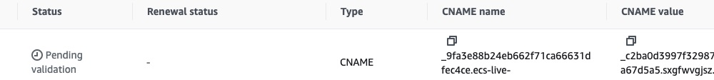
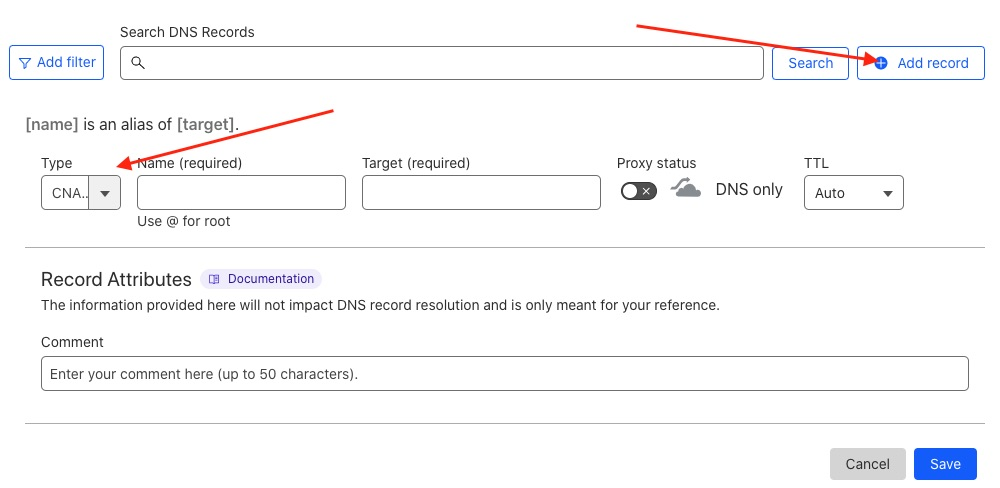

# AWS create certificate

All apps should be served over HTTPS. Some AWS services will provide you with HTTPS without additional configuration. For example if you deploy to AWS Lambda, you can ask for a [function URL](https://docs.aws.amazon.com/lambda/latest/dg/lambda-urls.html) like `https://<url-id>.lambda-url.<region>.on.aws`. AWS App Runner provides a TLS endpoint. So does AWS lightsail. But some (like ECS) won't. You need to use an [Application Load Balancer](https://docs.aws.amazon.com/elasticloadbalancing/latest/application/introduction.html). When creating one of those you need to choose the port to use as its listener. If you want to use `443` (for HTTPS) you need to pick an _existing_ certificate. Verifying ownership to issue a new one can take up to an hour (when not using AWS Route 53 for its DNS) so I figured it's best to do that first so it can be verifying in the background 🙂.

**Note:** If you are just experimenting, using a different service which does not need a load balancer, _don't_ want to use HTTPS, or are using an external proxy (such as Cloudflare's orange-cloud DNS records) to provide the certificate, you can of course skip over this. You would then need to use port `80` in place of `443` throughout the rest of the guide.

In my case I already own a domain. I already have DNS set up for it (I set up a free account on Cloudflare and manage its DNS records within its dashboard).

I want to use the sub-domain `www.your-domain.com` for the Live Beats app.

I _don't_ have a certificate in ACM for that but I need a certificate in ACM in order to use HTTPS when it comes to creating an Application Load Balancer.

Search for "ACM" in the console. Click "Request a certificate":

The only type available is a public one. Great, that's what I want. Click "Next".

Enter the domain name(s) it will be protecting. For example `www.your-domain.com`. You can click the button below that _if_ you want to use it for other sub-domains too:

It's usually easiest to [validate using DNS](https://docs.aws.amazon.com/acm/latest/userguide/dns-validation.html). That's the default option so that's fine. If you are using Route 53 for your domain, that is an AWS service and so this part should be automated. However I'm using an external DNS provider (Cloudflare) and so it needs to check.

Scroll down and click the "Request" button.

You should see it has been created. Its status will be "Pending validation" (you may need to click the refresh button).

Click on it to see what you need to do to verify it. If you scroll down the "Domains" section it will show you need to create a new `CNAME` record:

Create that CNAME using the service that provides your domain's nameservers. In my case, that's Cloudflare. So in the Cloudflare dashboard, I clicked the domain, and then on "DNS".

I'll click the blue button to add a new record to verify I do own that sub-domain.

As it says in ACM, its type should be `CNAME`. You can get the name and the target values to enter from the ACM's "Domains" panel (shown above).

**Important:** If you are using Cloudflare like me, make sure its proxy status is _off_ (a grey-cloud):

Click "Save" to add that DNS record.

Now switch back to the ACM console. It _usually_ validates a new domain within an hour. If not and your certificate still shows as pending, take a look at their [troubleshooting page](https://docs.aws.amazon.com/acm/latest/userguide/troubleshooting-DNS-validation.html).

You can carry on with this guide while you wait. At some point it should validate your domain and will then show as issued:

Now that you have a certificate you can create/edit AWS resources to use it 🚀 .

Next I'll [create a database](/docs/5-aws-create-database.md) for the app.
