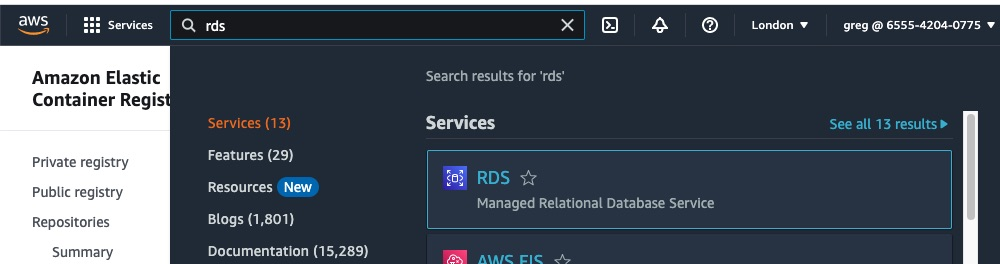
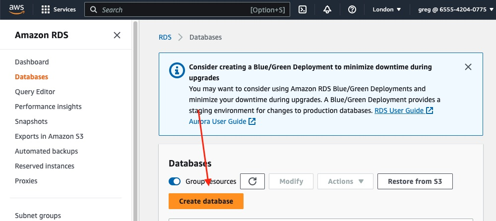
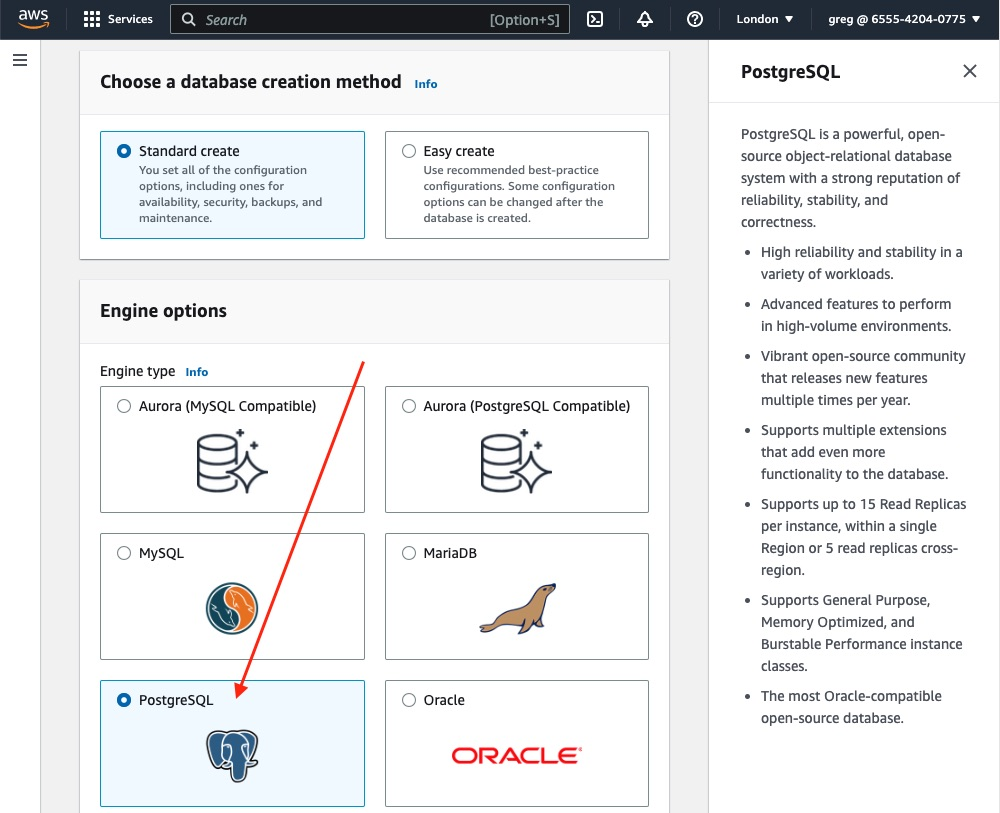
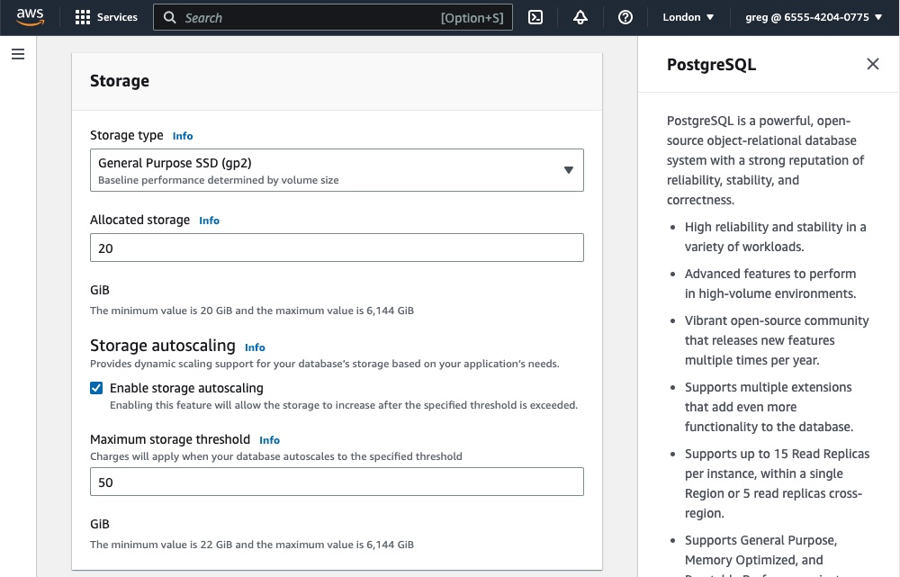
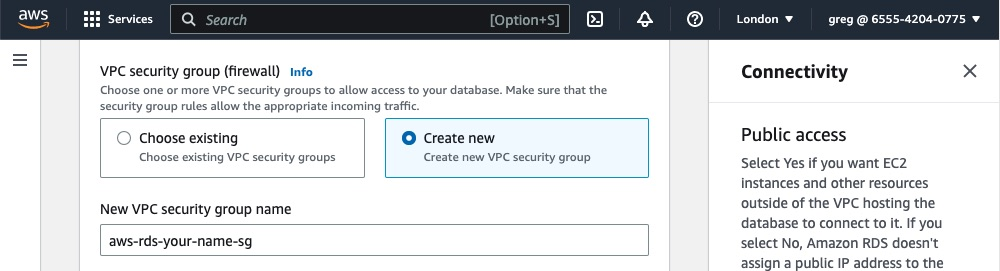
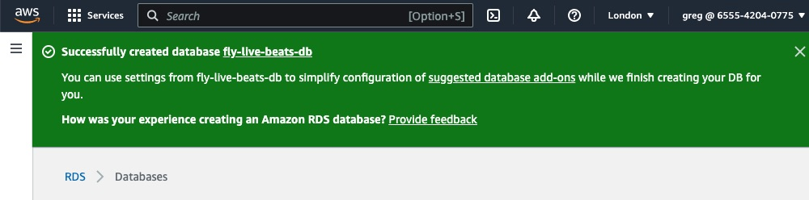

# Deploy to AWS

## Create a database

This app will need a PostgreSQL database. I will create the database _before_ creating the app so that I can provide it with a `DATABSE_URL` connection string.

The database will run on AWS Relational Database Service (RDS). Unlike on Fly.io, RDS is a managed service and so AWS takes care of monitoring, restarting and letting you easily restore from a backup if necessary.

Search for "RDS" in the console and click that blue link:



You may see AWS promote their new option to use [blue/green deployments](https://docs.aws.amazon.com/AmazonRDS/latest/UserGuide/blue-green-deployments.html). That lets you apply changes to the staging environment before promoting that to production. It may be worth considering if your app uses one of the supported engines, however (currently) that does not include PostgreSQL and so I'll skip it.

Click the button to "create database":



I'll create a standard PostgreSQL database:



Scroll down. The templates are fairly self-explanatory. Pick the one appropriate to your usage. You'll notice that as you do so, the options further down get toggled. For example the number of instances you can choose and later on the class of instance (which determines how much CPU/RAM it has).

A single DB instance is the cheapest. Just _one_ instance and so has no fail-over/high-availability. A Multi-AZ DB instance has _two_ instances: a primary and a standby (in a different AZ), so _does_ have high-availability. The most expensive option is a Multi-AZ DB cluster. This has _three_ instances: a primary and two read-replicas.

I'd recommend the middle option, HA (unless you need read-replicas). But this is just a demo and so I'll use a single-node.

Scroll down and give the database a name.

Then give the initial user a name. The default is _postgres_ which is fine.

You can either let AWS generate a password for you, or enter your own. As with any password, make sure to keep it secret. Keep it out of your code. If it has to be used in sa connection string, make sure that is stored encrypted.

Scroll down further and choose the instance configration. If you click on the dropdown menu you can see all of the available ones. The smallest size (the micro instance) has 2 vCPU and 1 GB of RAM. The "t" instances are bustable. That means they get a share of the CPU. They are substantially cheaper than the larger classes however support [fewer connections](https://docs.aws.amazon.com/AmazonRDS/latest/UserGuide/CHAP_Limits.html). You can always edit the size later.

Next choose its initial disk size. The default is the smallest value: 20GB. Handily RDS can auto-scale the disk so you don't need to over-provision storage to begin with:



Next, the connectivity. It asks if you want to set up a connection to an existing EC2 instance. We don't have one, so we'll skip that.

For the network type, I'll leave the default. IPv4. If you recall, the default VPC created by AWS does not have IPv6 enabled.

Next, [the VPC](https://docs.aws.amazon.com/AmazonRDS/latest/UserGuide/USER_VPC.Scenarios.html). I'll leave the default VPC selected.

Next, the subnet. I'll use the default subnet group. The default AWS VPC that each account comes with includes three _public_ subnets. It's best practice to put a RDS database in a _private_ subnet. What is the difference?

- A _public_ subnet is associated with a route table that _has_ a route to an Internet gateway.
- A _private_ subnet is associated with a route table that _does not_ have a route to an Internet gateway.

The default AWS VPC's main [route table](https://docs.aws.amazon.com/vpc/latest/userguide/VPC_Route_Tables.html) _has_ a route to an Internet gateway, which is why the initial three subnets are _public_. To create a new _private_ subnet you would need to create a route table that does not, then associate that with a new subnet.

My database is empty _and_ this is just a demo. I also want to demonstrate connecting to a database from my local machine later on. I will put _this_ RDS instance in a public subnet and will say "yes" to public access in a moment.

Technically you [can move RDS from a public subnet to a private subnet later on](https://repost.aws/knowledge-center/rds-move-to-private-subnet). But that's a bit awkward.

If you have opted for public subnet, decide whether to allow public access. Again, _ideally_ you want to pick "no". But saying "yes" does not directly open it up to the whole world, in _that_ sense of "public". That would be _very_ bad. Instead it determines whether a public IP is added. _Who_ can access it is controlled within its security group. That is a virtual firewall. In that security group you can allow access from only your IP.

If you have opted for a private subnet and you want to connect to it from your local machine, you can't (directly). One option would be using a bastion host (like an EC2 instance that _is_ inside the VPC that _can_ connect to it). That's outside the scope of this guide.

Next, choose the option to create a _new_ security group (rather than use the default one). That's important. It makes it _much_ easier to connect other applications to this database as you can then select this RDS security group by name rather than have to remember what a "default" one is being used by:



I'll leave the rest as their default options. Any AZ (Availability Zone). No RDS proxy (_that_ is more applicable when your compute is AWS Lambda since that can quickly scale to many concurrent requests, exceeding the number of connections RDS can support). I'll leave the default of authentication with a password (it is not possible to use IAM-only). I'll leave the rest of the defaults (for example in the "Additional configuration" panel you can change the backup schedule - the default is to automatically backup, and keep those for seven days. If there is a particular time of day you would prefer the backup be taken, you can specify that there).

Before creating the database, make sure to look at the "estimated monthly costs" panel. Naturally the more replication/instances you have and the larger their size, the more that cost will be. You can also check the [RDS pricing page](https://aws.amazon.com/rds/postgresql/pricing/?pg=pr&loc=3), making sure to pick _your_ AWS region as the pricing does vary per-region.

**Note:** If this is a new AWS account, RDS does have a free tier available for 12 months. Each month you get 750 hours (so, the full month) usage in a Single-AZ of a db.t2.micro, db.t3.micro or db.t4g.micro instance. You also get 20GB of storage. So for testing/development, your instance could well be free. Larger instance sizes would of course exceed that and have to be paid for.

Go ahead and click the button to "create database".

You may be prompted to set up some "add ons" such as Elasticache or RDS Proxy. You don't need any of those so close that panel.

You should see a blue panel saying your database is being created. It may take a few minutes so please be patient. You should then see it haas been created:



If you click on its name you should see all of its details. There are tabs for monitoring it (showing its load, connections, etc), logs and for accessing its backups.

Take a look at the first tab. It's "Connectivity and security". If you scroll down, that shows its endpoint and port (the default is `5432`).

## Connect to the database?

Assuming you said "Yes" when asked whether to allow public access, AWS should have added your current IP to its security group automatically. If so, you should see the "Security group rules" panel has two rules. The top row, the "CIDR/IP - Inbound", should have access from your current IP. For example `1.2.3.4/32`. That means you will be able to access it from your local machine. You could either use your favourite database UI/editor or use the command line. I'll use the command line `psql`:

```sh
$ psql --version
psql (PostgreSQL) 14.2
```

The command is: `psql -d postgres -U username -H hostname`. Try that using _your_ choice of username (maybe you left it as `postgres`) and your RDS endpoint as the hostname:

```sh
$ psql -h your.endpoint.here.rds.amazonaws.com -U postgres -d postgres
```

It should prompt you for your password. Enter that and you should be connected.

If _not_ make sure:

- Your database is set to allow public access
- The endpoint, username and password are all correct
- You are using the right port (my command did not specify one so it defaults to `5432`)
- Your IP (shown as that CIDR value in the security group rules) is correct

You can list the databases using `\l`. There should be a default `postgres` database, a `rdsadmin` database, and probably some template ones too:

```sh
postgres=> \l
                                  List of databases
   Name    |  Owner   | Encoding |   Collate   |    Ctype    |   Access privileges
-----------+----------+----------+-------------+-------------+-----------------------
 postgres  | postgres | UTF8     | en_US.UTF-8 | en_US.UTF-8 |
 ...
```

Great! It works.

The Live Beats app _could_ also use that `postgres` user. However that is a super-user and it's probably better to create a new user, just for the app. I can then avoid using the `postgres` password at all.

I'll create a new user, give them a password, and then create a new database ready for the app to use (replace these values below with whatever database name, username and password _you_ want to use). Make a note of them as you'll need to provide them to the app later:

```sh
postgres=# create database fly_live_beats_db;
postgres=# create user fly_live_beats with encrypted password 'yourchoiceofpassword';
postgres=# grant all privileges on database fly_live_beats_db to fly_live_beats;
```

Done!

Type `\q` to quit and return to your terminal. The database is now ready for the app to connect to.

You shouldn't need public access enabled and so you can edit that to be "no" if you like.

Next, we know the Live Beats app uses values that need to be kept secret. Let's [create those secrets](/docs/6-aws-create-secrets.md).
