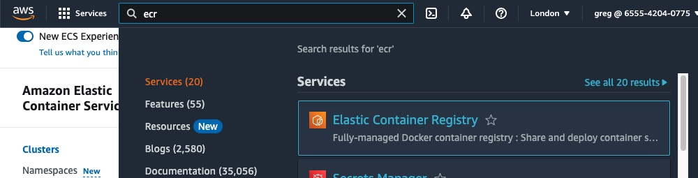
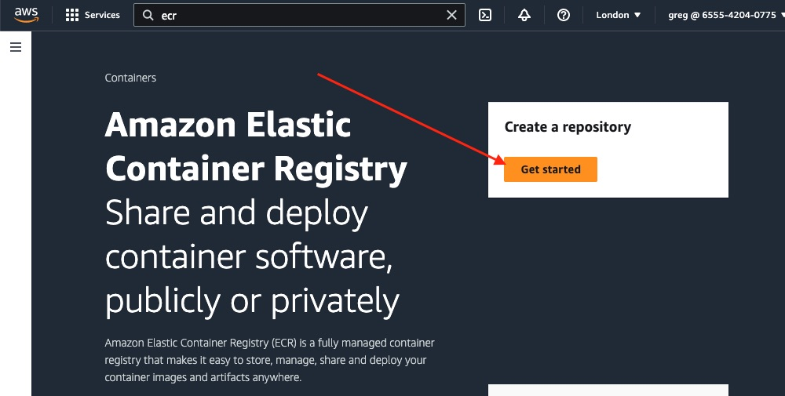
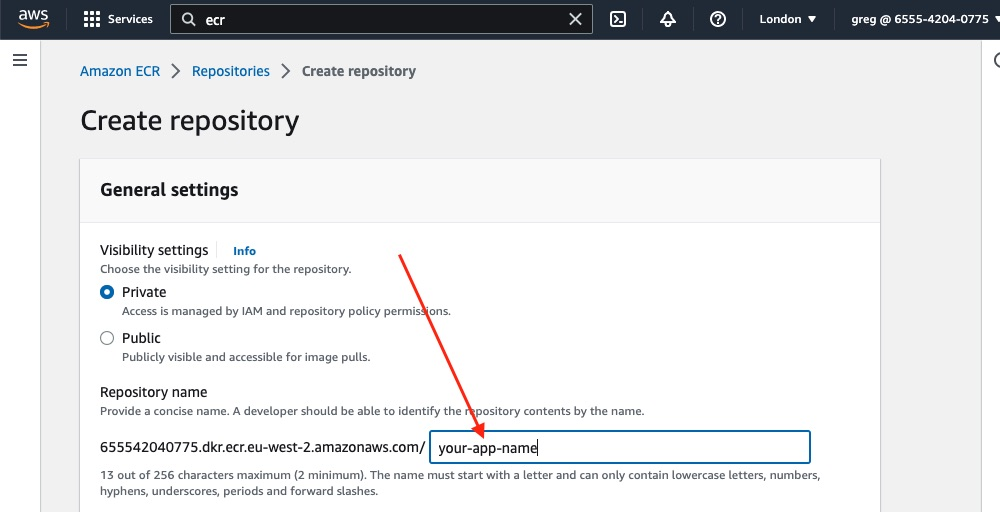
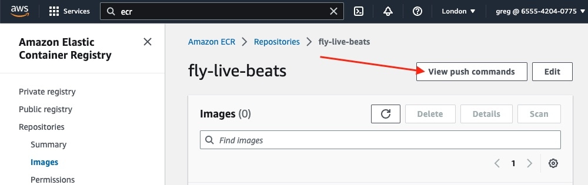
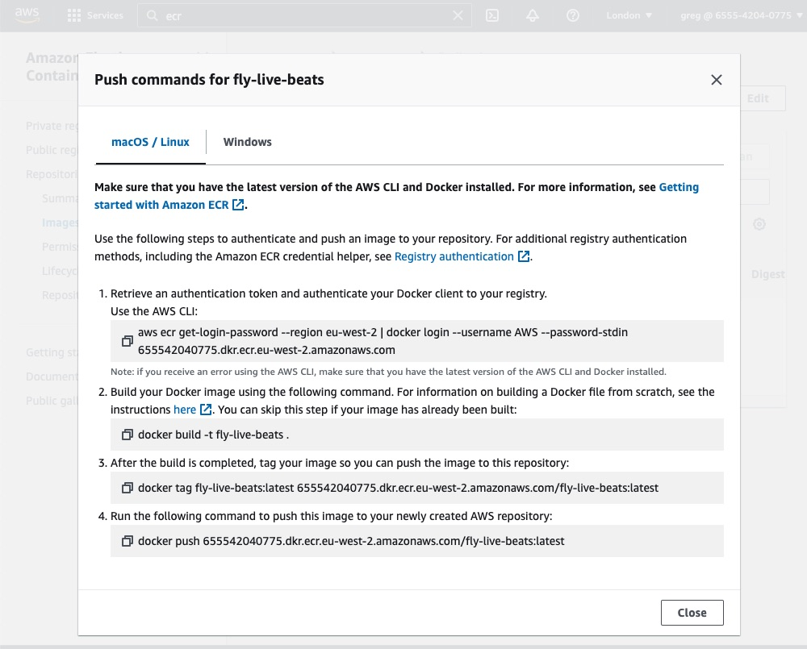

# Deploy to AWS

## Create an image

Elastic Container Registry (ECR) is where you will store your container images. You only pay for the data stored and transferred (which for this example will be minimal as the image is ~50MB).

We need to create a repository for our new app's images. Search for "ECR" in the console, then click on that blue link:



You should see the welcome screen. Click the "get started" button to create a new repository:



You will need to give it a name, likely the name of your app but you can call it anything. You can leave the other options as their default values:



Click the "create repository" button.

After a few seconds your repository will be created.

## Build an image locally

We need to get an image of the app into that remote repository. Like with Fly.io, you can choose whether to build locally or have a remote service (such as GitHub Actions) build the image for you. Building it locally is likely going to be slower (how fast it pushes is of course dependent on your network connection) however it is free.

We'll try building locally using Docker. If you don't already have [Docker](https://docs.docker.com/engine/install/#installation) installed and running, please add that:

```sh
$ docker --version
Docker version 23.0.1-rd, build 393499b
```

We need to get the commands to build, tag and push the image to ECR. Click on the name of the repository. We want these commands:



If you click that button in your console, you should see _your_ commands (prefilled with your repository URL). They will look something like this:



Let's take those four commands in turn (of course you will run the ones shown to you, using your registry, repository name and region):

1. First you need to get an authentication token from ECR. That's the first part of this command. That token is then be piped directly to the Docker client. That will allow it to push images to your registry. You will see we have added a `--profile example` flag to their command. That's because _we_ use the AWS CLI for multiple AWS accounts and need to specify which one to use. If you only have credentials for one AWS account, that is the default one and so your command would not need to specify that.

```sh
$ aws ecr get-login-password --region eu-west-2 --profile example  | docker login --username AWS --password-stdin 12345678.dkr.ecr.eu-west-2.amazonaws.com
```

You should see "Login Succeeded".

2. Next we need to build an image. If you tried running a local container earlier in the guide, you may already have one. But let's ensure that we have a new one (tagged latest).

**Note:** The original Live Beats app includes some code that is specific to running on Fly.io. If you have not made the changes to support deploying it elsewhere, please do so before building the image. If you search the app's code for "AWS" we should have commented where we need to make a change (for example where we work out its IP).

```sh
$ docker build -t fly-live-beats .
```

That build should proceed. It may take a few minutes:

```sh
[+] Building 56.7s (29/29)
 => [internal] load build definition from Dockerfile
=> => transferring dockerfile: 2.87kB
...
=> => naming to docker.io/library/your-app-name
```

3. Next we need to tag it, ready to push to the ECR. Replace `your-app-name` and your registry URL:

```sh
$ docker tag your-app-name:latest 1234567.dkr.ecr.eu-west-2.amazonaws.com/your-app-name:latest
```

4. Finally, push the image to the repository. Replace your URL:

```sh
$ docker push 1234567.dkr.ecr.eu-west-2.amazonaws.com/your-app-name:latest
```

That may take a minute depending on the speed of your internet connection. It may appear paused/stuck but be patient and it should resume. Eventually you should see a digest of it such as `latest: digest: sha256:abcdefg` confirming it completed.

If you still have the AWS console open, if you now check your repository (you may need to refresh) you should see your image is listed there.

Now the image is ready to be deployed.

We need to [decide which AWS compute service](/docs/7-aws-which-compute-service.md) to use to run the container.
