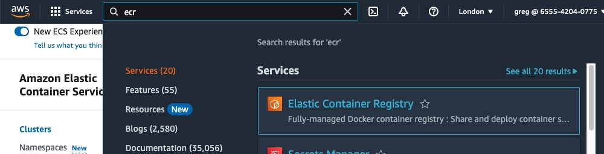
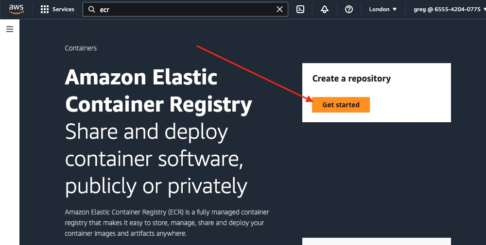
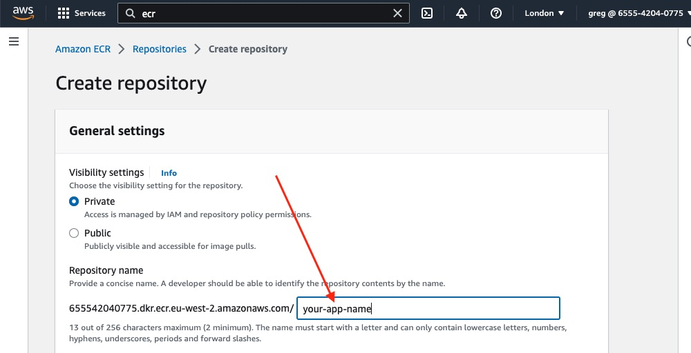
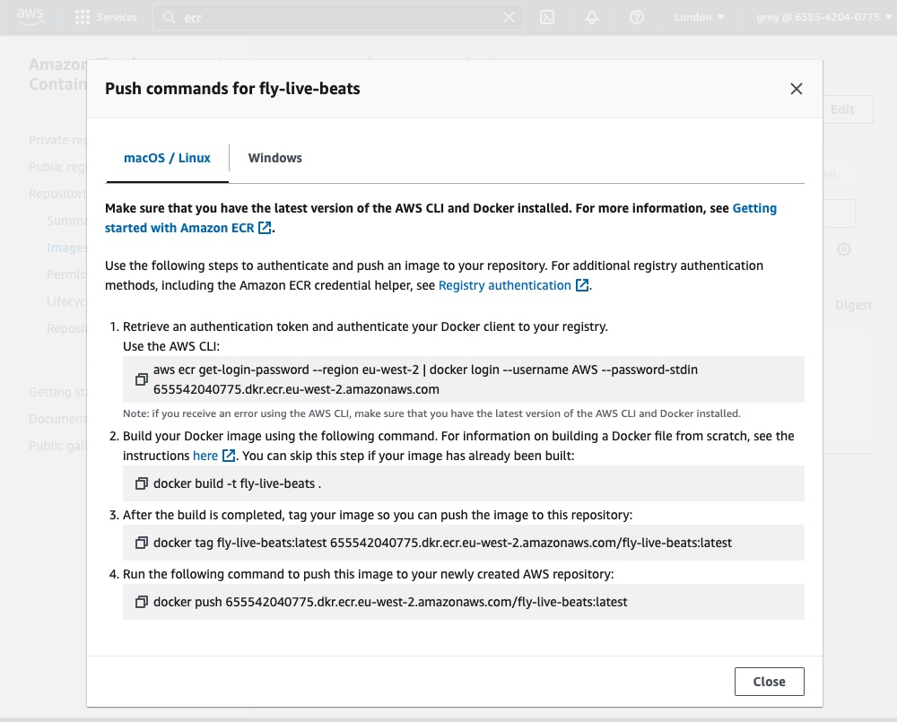

# Deploy to AWS

Elastic Container Registry (ECR) is used to store images. You only pay for the data stored and transferred (which for this example will be minimal as the image is ~50MB).

## Create an image

I need to create a repository for the Live Beats images. Search for "ECR" in the console, then click on that blue link:



You should see the welcome screen. Click the "get started" button to create a new repository:



You will need to give it a name, likely the name of your app but you can call it anything. You can leave the other options as their default values:



Click the "create repository" button.

After a few seconds your repository will be created.

## Build an image locally

I need to get an image of the app _into_ that remote repository. Like with Fly.io, you can choose whether to build locally _or_ have a remote service (such as [GitHub Actions](https://github.com/features/actions)) build the image for you. Building locally is likely going to be slower (how fast it pushes is of course dependent on your network connection) however it is free.

I'll build locally, using Docker. If you don't already have [Docker](https://docs.docker.com/engine/install/#installation) installed and running, you will need to add that.

```sh
$ docker --version
Docker version 23.0.1-rd, build 393499b
```

I need to get the commands to build, tag and push the image to ECR. Click on the name of the repository. Handily AWS builds those commands:


If you click that button in your console, you should see _your_ commands (prefilled with your repository URL). They will look something like this:



Taking those four commands in turn (of course you will run yours, using your registry, repository name and region):

1. First you need to get an authentication token from ECR. That's the first part of this command. That token is then be piped directly to the Docker client. That will allow it to push images to your registry. You will see I have added a `--profile example` flag to their command. That's because I'm using the AWS CLI for multiple AWS accounts and need to specify which one to use. If you only have credentials for one AWS account, that is the default profile and so your command would not need to specify that:

```sh
$ aws ecr get-login-password --region eu-west-2 --profile example  | docker login --username AWS --password-stdin 12345678.dkr.ecr.eu-west-2.amazonaws.com
```

You should see "Login Succeeded".

2. Next: build an image. If you tried running a local container earlier in the guide, you may already have one. But let's ensure there's a new one (tagged `latest`).

**Note:** The original Live Beats app includes some code specific to running on Fly.io. The one in _this_ repo should work on AWS.

```sh
$ docker build -t fly-live-beats .
```

That build should proceed. It may take a few minutes:

```sh
[+] Building 56.7s (29/29)
 => [internal] load build definition from Dockerfile
=> => transferring dockerfile: 2.87kB
...
=> => naming to docker.io/library/your-app-name
```

3. Next: tag it, ready to push to the ECR. Replace `your-app-name` and your registry URL:

```sh
$ docker tag your-app-name:latest 1234567.dkr.ecr.eu-west-2.amazonaws.com/your-app-name:latest
```

4. Finally: push the image to the repository. Replace your URL:

```sh
$ docker push 1234567.dkr.ecr.eu-west-2.amazonaws.com/your-app-name:latest
```

That may take a minute depending on the speed of your internet connection. It may appear paused/stuck but be patient and it should resume. Eventually you should see a digest of it such as `latest: digest: sha256:abcdefg` confirming it completed.

If you still have the AWS console open, if you now check your repository in ECR (you may need to refresh) you should see your image is listed there.

Now the image is ready to be deployed to ... _somewhere_.

But [which AWS compute service](/docs/8-aws-which-compute.md) to use ...
