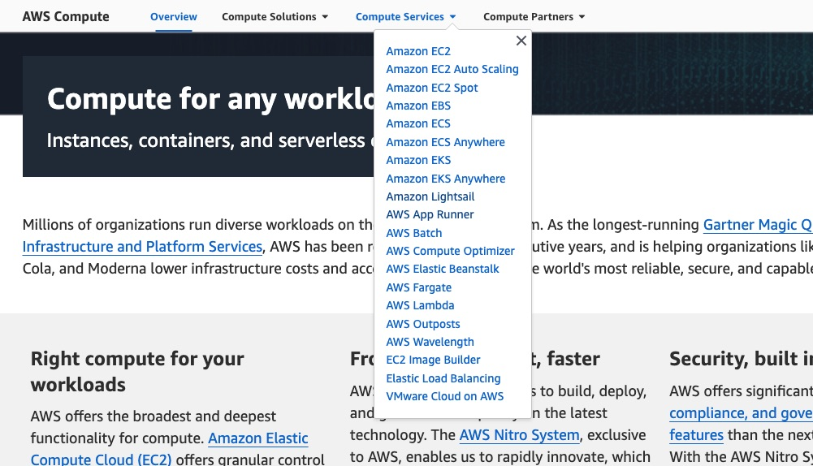

# Deploy to AWS

The choice of services can seem overwhelming. There are a _lot_:

.

The oldest compute service is EC2, exiting beta way back 2008. In fact that was only the third service AWS launched (following S3 for storage and SQS for queues). They added many more since, such as Elastic Container Service (ECS) in 2015, Fargate in 2017 and App Runner in 2021.

## Which AWS compute service should I use?

Even if we limit our selection to options to run a _container_, there are [still several](https://aws.amazon.com/containers/services/). These quotes are from th AWS site:

ECS?

> Amazon Elastic Container Service (Amazon ECS) is a fully managed container orchestration service that provides the most secure, reliable and scalable way to run containerized applications.

Fargate?

> AWS Fargate is a serverless compute engine for containers.

EC2?

> Run containers on virtual machine infrastructure with full control over configuration and scaling.

App Runner?

> AWS App Runner is a fully managed service that makes it easy for developers to quickly deploy containerized web applications and APIs, at scale and with no prior infrastructure experience required.

EKS?

> Amazon Elastic Kubernetes Service (Amazon EKS) is a fully managed Kubernetes service that provides the most secure, reliable, and scalable way to run containerized applications using Kubernetes.

Lightsail?

> Amazon Lightsail offers a simple way for developers to deploy their containers to the cloud.

:confused:

Some services provide more abstraction than others. For an objective comparison to Fly.io we really want to limit ourselves to services that _also_ hide (at least some of) the complexity. We'd also like to avoid learning a whole new set of terms (Kubernetes and its Ingress Controllers, Services, Pods, ConfigMaps ...). Your choices may well be different. You may already be experienced with Kubernetes and so immediately opt for EKS. You may be familiar with networking and favour working with the underlying instances to have the widest selection of types (EC2).

Essentially at the lowest level is EC2. They are the virtual machines (otherwise known as instances).

ECS lets you run a container. Two services can provide the _capacity_ to run that container: Fargate and EC2:

- ECS tasks run on _Fargate_ is the default option. It's now pre-selected for new ECS clusters. That is the "serverless" approach. It provides more abstraction. You only pay when the task is running. But when it _is_ running, that compute costs more.
- ECS tasks can instead run on _EC2_. Using EC2 to provide the capacity lets you pick from a much larger number of instances. It gives you greater control. Plus its cheaper. However it is more complex to manage as you are then responsible for provisioning EC2 instances and have to ensure you have _sufficient_ capacity for your container(s).

:confused:

Ideally we'd like a service which (like Fly.io) can take _in_ a `Dockerfile` and _return_ a load-balanced TLS endpoint.

Arguably that would be the newest compute service [App Runner](https://aws.amazon.com/apprunner/). Like Fly.io, it provides automated deployments, load-balancing, auto-scaling, logs, custom domains and certificate management. Its usage model is also similar, billing on vCPU and memory. Behind the scenes it runs on top of ECS and Fargate however we should not need to know that.

With App Runner you pay a separate price for compute (vCPU-hour) and memory (GB-hour). The smallest configuration being 0.25 vCPU and 0.5 GB. It's billed per-second, with a one-minute minimum. There is an additional small fee for enabling automatic deployments and then a per-minute fee for building. The main appeal is its ability to scale to zero when idle. The trade-off is the additional price for the convenience. AppRunner is ~60% more than ECS+Fargate for the equivalent compute power.

_But_ as of 11th May 2023 App Runner [does not support WebSockets](https://github.com/aws/apprunner-roadmap/issues/13). That's not ideal as Phoenix LiveView defaults to using WebSockets. It _can_ fall-back to long-polling. That may be sufficient for _your_ LiveView app _if_ its real-time updates are simply used to show updates. At the end of this page you can see you can modify the Live Beats application to use long polling. That initially seems to work. However file uploads are _then_ broken. The current Live Beats app [relies on WebSockets](https://fly.io/blog/livebeats/):

> ... drops a handful of MP3s into the app, we upload them concurrently over the WebSocket connection ...

This particular app _also_ makes use of another LiveView feature: clustering. It expects nodes to be able to communicate with each other. App Runner runs its instances in its own VPC. Those nodes can't communicate directly with each other.

App Runner is also relatively new. It's available in a limited number of AWS regions. If your application is particularly sensitive to latency (more of an issue with LiveView due to its server-rendered updates) this may be something to consider when looking at AWS services. It's currently available in these regions:

- Asia Pacific (Tokyo)
- Asia Pacific (Singapore)
- Asia Pacific (Sydney)
- Europe (Ireland)
- Europe (Frankfurt)
- US East (N. Virginia)
- US East (Ohio)
- US West (Oregon)

We also considered [Lightsail](https://aws.amazon.com/lightsail/). You can also deploy a container with load-balancing, auto-scaling, logs and certificate management. It also integrates with the AWS CDN, Cloudfront. So you can deliver static files faster and with lower latency.

With Lightsail you pay an hourly price per node which includes _both_ compute and memory. The smallest configuration being a nano node with the same 0.25 vCPU and 0.5 GB. It benefit from a free data allowance (the nano type includes 500 GB per month and then it increases from there). Load balancing is an additional fee (only needed if you have multiple container nodes) however it is a fixed monthly fee so you don't need to consider the variables of connections/bandwidth which you when provisioning your own load balancer (for example in front of EC2 or Fargate). However as of May 2023, container services are not available as targets for Lightsail load balancers. However (the FAQ states) the public endpoints of container services come with built-in load balancing.

WebSockets should also be supported.

_But_ there remains the problem that nodes on Lightsail are unable to talk to each other, in a cluster. They appear to run in an AWS-provided VPC. Your app may not need that, or use any kind of PubSub. Or perhaps you do but would support having it provided by another service, like Redis.

Finally there is ECS with Fargate. That should let us do everything we need. It has been around for a while, having [celebrated its 5th birthday last year](https://aws.amazon.com/blogs/containers/happy-5th-birthday-aws-fargate/). It is now used by the likes of Goldman Sachs and Vanguard. We'll try to [deploy the app to ECS](/docs/8-deploy-to-ecs.md) and use Fargate to provide the capacity.

#### Using long-polling instead of a WebSocket

Phoenix LiveView is built on top of Phoenix channels. You need _some_ form of bi-directional client/server messaging to send real-time updates back to the client, having been rendered on the server. The default is a WebSocket. However if that is not available, it can fallback to using long polling. That makes the client use regular HTTP requests to the server to see if there have been any changes.

To use a service (such as [App Runner](https://aws.amazon.com/apprunner/)) that does not support WebSockets, you could adapt it to use long polling.

We _could_ make these changes to the Live Beats app:

`/assets/js/app.js`

Change:

```js
import { Socket } from "phoenix";
```

to

```js
import { Socket, LongPoll } from "phoenix";
```

Change:

```js
let liveSocket = new LiveSocket("/live", Socket, {
  hooks: Hooks,
  params: { _csrf_token: csrfToken },
  dom: {
    onNodeAdded(node) {
      if (node instanceof HTMLElement && node.autofocus) {
        node.focus();
      }
    },
  },
});
```

to

```js
let liveSocket = new LiveSocket("/live", Socket, {
  transport: LongPoll,
  hooks: Hooks,
  params: { _csrf_token: csrfToken },
  dom: {
    onNodeAdded(node) {
      if (node instanceof HTMLElement && node.autofocus) {
        node.focus();
      }
    },
  },
});
```

`lib/live_beats_web/endpoint.ex`

Change:

```elixir
socket "/live", Phoenix.LiveView.Socket, websocket: [connect_info: [session: @session_options]]
```

to

```elixir
socket "/live", Phoenix.LiveView.Socket, websocket: [connect_info: [session: @session_options]], longpoll: [connect_info: [session: @session_options]]
```

However this app _also_ uses the WebSocket for uploading .mp3 files. That breaks when using long polling. You will see it throws an error when it parses the data. As such App Runner is not a suitable service for _this_ app in its current form. But it may be for yours.
