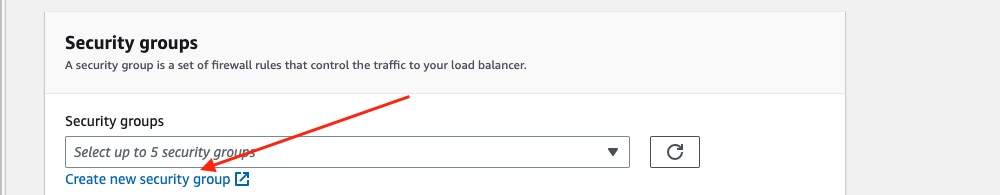
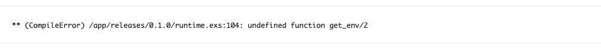

# AWS Elastic Container Service (ECS)

We will create the ECS cluster, the ECS task definition, and then finally the ECS service to run that.

_But_ it needs a level of access which it does not get by default. We need to make the IAM policy and matching IAM role first. Then we'll have them available to select later. If we don't, we'll probably see something like this:


## IAM roles and policies

### Task execution policy and role

From the top-right corner, click on "Security credentials", then on that page, on "Policies" in the left-hand menu.

Click the blue button to "Create policy".

Click the "JSON" option, as we have the JSON we can provide directly:


In that left-hand panel, delete all the JSON already there and in its place, put:

```json
{
  "Version": "2012-10-17",
  "Statement": [
    {
      "Effect": "Allow",
      "Action": [
        "ecr:GetAuthorizationToken",
        "ecr:BatchCheckLayerAvailability",
        "ecr:GetDownloadUrlForLayer",
        "ecr:BatchGetImage",
        "logs:CreateLogStream",
        "logs:PutLogEvents"
      ],
      "Resource": "*"
    },
    {
      "Effect": "Allow",
      "Action": ["ssm:GetParameters", "kms:Decrypt"],
      "Resource": "*"
    }
  ]
}
```

What is all that? This will be the new policy for the ECS task execution. The first statement is simply the whole of `AmazonECSTaskExecutionRolePolicy`. That is what it would give itself if we left it alone. However since we are using SSM for our secrets, [the AWS docs say you need to manually give it access](https://docs.aws.amazon.com/AmazonECS/latest/developerguide/secrets-envvar-ssm-paramstore.html). The second statement should let it fetch and decrypt the secrets (the ones we previously added to Parameter Store).

**Note:** If you prefer you can restrict the parameters it has access to (rather than use "\*"). If you recall we named our secrets in the Parameter Store using a path prefix for that very reason.

Click the blue "Next" button.

Give this one the name `ecs_task_execution_policy` (or something else you can identify as being what it is for).

Click "Create policy". That should only take a second.

Now you need to create an IAM role which that policy will be attached to. So in the left-hand menu, click on "Roles". Click on the blue button to "Create role".

For the trusted entity, that needs to be ECS, so in the dropdown menu start typing "Elastic ..." and you should see that option available. We want the "Elastic Container Service Task" as shown here, as that will assume this role:


On the next screen, check the box next to the policy you just created. For example `ecs_task_execution_policy` (or whatever you called it).

Scroll down and click "Next".

Give the role a name. It makes sense to use `ecs_task_execution_role` (or something along those lines) so it is obvious what it is used for.

Click the blue "Create role" button and that should be created in a few seconds. That's now available for us to use later on.

### Task policy and role

From the top-right corner, click on "Security credentials", then on that page, on "Policies" in the left-hand menu.

Click the blue button to "Create policy".

Click the "JSON" option, as we have the JSON we can provide directly:


In that left-hand panel, delete all the JSON already there and in its place, put:

```json
{
  "Version": "2012-10-17",
  "Statement": [
    {
      "Effect": "Allow",
      "Action": [
        "ssmmessages:CreateControlChannel",
        "ssmmessages:CreateDataChannel",
        "ssmmessages:OpenControlChannel",
        "ssmmessages:OpenDataChannel"
      ],
      "Resource": "*"
    },
    {
      "Sid": "libcluster",
      "Effect": "Allow",
      "Action": ["ecs:ListServices", "ecs:ListTasks", "ecs:DescribeTasks"],
      "Resource": "*"
    }
  ]
}
```

What is all that? This will be the new policy for the ECS task.

The _first_ statement is taken from the [AWS docs](https://docs.aws.amazon.com/AmazonECS/latest/developerguide/ecs-exec.html) to allow _ECS Exec_. That's the equivalent of the `flyctl ssh console` command, letting you SSH in to a container. We'll want to do that for debugging later so we'll add those permissions now.

The _second_ statement is needed because we are using a custom strategy for `libcluster`. Rather than use service discovery/connect, instead it queries the ECS API. The task needs permission to make those calls.

Click the blue "Next" button.

Give this one the name `ecs_task_policy` (or something else you can identify as being what it is for).

Click "Create policy". That should only take a second.

Now you need to create an IAM role which that policy will be attached to. So in the left-hand menu, click on "Roles". Click on the blue button to "Create role".

For the trusted entity, that needs to be ECS, so in the dropdown menu start typing "Elastic ..." and you should see that option available. We want the "Elastic Container Service Task" as shown here, as that will assume this role:


On the next screen, check the box next to the policy you just created. For example `ecs_task_policy` (or whatever you called it).

Scroll down and click "Next".

Give the role a name. It makes sense to use `ecs_task_role` (or something along those lines) so it is obvious what it is used for.

Click the blue "Create role" button and that should be created in a few seconds. That's now available for us to use later on.

## ECS cluster

Now that we have an image to deploy within it (in ECR), a database for it to connect to (in RDS) and secrets for it to access (in Parameter Store) we need a container.

Search for "ECS" and click on the link that appears:


You will likely see the welcome screen. Click "Get started":


Click the button to "Create cluster". There is no cost for the cluster itself, only the resources within it.

First, give it a name:


Scroll down to the _Networking_ panel. Since this is a new AWS account, we have automatically been provided with a default VPC. That is like a private network. If you are using this AWS account for other apps, you may want to create a new VPC to keep this app entirely isolated from them. You can do that from the blue VPC console link, as it mentions. We'll stick with the pre-filled default values:


Scroll down and you will see the _Infrastructure_ panel.

The default is to have Fargate provide the capacity. That is a _serverless_ approch, avoiding the need to manage instances (but costing more as a result). For now we will leave that as the sole provider and so leave the other two boxes unchecked.

Monitoring is optional but for now we want to see a bit more about what is happening. So we'll expand that panel and enable it:


Click "Create" and you should see a panel saying that cluster creation is in progress. That will take a few moments:


It has been created, but is currently empty.

Next we need a task defintion. That specifies _what_ to run (the image, the environment variables, and so on).

## Task (definition)

Click on "Task definitions" and then on the "create new task definition" button:


Start by giving it a name:


Next you need to specify the image that should be run in the container (of course there must be at least one, hence it labelling the first container as being essential). Recall that is the full ECR URL followed by the tag of the image you pushed to it earlier.

ECR _is_ a private registry however since it is within AWS you do not need to select that option or provide extra credentials.

The Live Beats app uses port 4000 by default and so we'll specify that here too.


Scroll down a bit further and you are asked for the environment variables.

We never want to store secrets like the `DATABASE_URL` in plain text. To solve that, recall earlier we created our secret values in AWS Systems Manager. ECS can fetch those values for us. We just enter the "Key" (which is the name we want the _app_ to see) and the "Value" is the name _we_ gave the parameter (in Parameter Store). We must make sure to choose "ValueFrom" in that dropdown else it would use the path _as_ the value. As it explains in this guide to [using AWS Parameter store](https://docs.aws.amazon.com/AmazonECS/latest/developerguide/secrets-envvar-ssm-paramstore.html) the reason we can simply use the name rather than its full "arn" is because the secret is in the same region.

This images shows one of those secrets:


You need to click the button to add more environment variables.

First, the secrets. For each of _these_ make sure to choose `ValueFrom` in the dropdown.

Key `SECRET_KEY_BASE`
Value `/staging/fly-live-beats/secret-key-base`

Key `DATABASE_URL`
Value `/staging/fly-live-beats/database-url`

Key `LIVE_BEATS_GITHUB_CLIENT_ID`
Value `/staging/fly-live-beats/live-beats-github-client-id`

Key `LIVE_BEATS_GITHUB_CLIENT_SECRET`
Value `/staging/fly-live-beats/live-beats-github-client-secret`

Key `RELEASE_COOKIE`
Value `/staging/fly-live-beats/release-cookie`

You also need to set some plain text environment variables. For _these_ make sure to choose `Value` as they don't need to be fetched from somewhere else. They _are_ the values:

Key `PHX_HOST`
Value This should _either_ be your own custom domain e.g `www.your-domain.com` or be the load balancer's hostname e.g `your-hostname.elb.amazonaws.com`

Key `AWS_ECS_CLUSTER_REGION`
Value The AWS region your cluster is in e.g `eu-west-2`

Key `AWS_ECS_CLUSTER_NAME`
Value The _name_ of your cluster e.g `my-ecs-cluster`

Key `AWS_ECS_SERVICE_ARN`
Value The full ARN of your service, starting `arnaws:ecs ...`

We'll skip over the rest of the options, but if you want to provide a healthcheck or specify any limits, you can.

Click "Next" to proceed on to step two.

We can now specify _what_ is providing the capacity for the task. We are using "Fargate" so we'll stick with that. Below you can choose the CPU and RAM for each container. The range is from 0.25 vCPU up until 16 vCPU, and the memory available adjusted too. The cost increases accordingly so we'll start off with the smallest size:


We need to pick `ecs_task_role` (or whatever you called it earlier) for the task's role. Why? We need to be able to query ECS as part of our `libcluster` strategy, and also allow access for ECS Exec (to SSH in to the container). Both are AWS services which that role allows access to.

We'll pick the `ecs_task_execution_role` (or whatever you called it earlier) for ECS itself to use. We did that because we are storing secrets in another service. ECS needs to be able to fetch those secrets. If it can't, the deployment will likely fail. And if we leave it to create an execution role for itself (the default) it does not realise it needs that access and so fails to add it.

We'll leave the rest of the values as their defaults.

Each container gets at least 21 GB of ephemeral storage so we don't need to enter any value to use that.

**Important:** The Live Beats app involves uploading files and storing them in a local drive (rather than S3). You would want that data to persist. As such, you would _not_ want to leave the storage option as it is by default, with ephemeral storage, as that would be lost. You would instead click 'Add volume" to add a volume. You would not want to opt for "Bind mount" either. As it says [in the docs](https://docs.aws.amazon.com/AmazonECS/latest/developerguide/using_data_volumes.html?icmpid=docs_ecs_hp-task-definition);

> Bind mounts are tied to the lifecycle of the container that uses them. After all of the containers that use a bind mount are stopped, such as when a task is stopped, the data is removed.

Since we are not using EC2 instances to provide the capacity, the "Docker volume" type is also not possible.

Instead you would pick "EFS" as the volume type, then add the rest of the details it asks for to configure it. EFS provides peristent storage.

We'll leave logging enabled. That goes to Cloudwatch. It should show you the name of your log (for example `/ecs/your-name`). We'll check on that later if there are any issues. We won't collect the extra values and so can leave them unchecked.

Click "Next" to proceed to the final step.

Scroll down to review all the values you have entered to check they look ok. All good? Click "Create".

In a few seconds you should see the task definition has been created. If you need to edit it, you should see a button to create a new revision with the exisitng values pre-entered. They are versioned by number.

AWS now knows _what_ to run. You now need to run it. That can be done either as a 'Service' or 'Task'. A task is generally a one-off action which runs and then ends (like when processing files, such as in a batch). We want a 'Service' which will keep running:


A service handles _running_ the task definition. The number of tasks running (min/max or auto-scaling) and load-balancing between them. If a task fails, the service replaces it.

## Service

Start by choosing your cluster from the list. We only have one, so that's easy.

Next you need to choose what will provide the capacity for your containers to run on. As mentioned previously you can use EC2 or Fargate. The appeal of Fargate over EC2 is then we don't need to set up or maintain the OS, or have to plan capacity as Fargate will launch the exact amount of capacty we need:


The initial configuration is relatively simple: we want to run a service. We'll use the latest version of our image. We'll give it a name.

To make sure the service itself is valid, we recommend **initially** setting the number of tasks to run as `0`. Why? Well if there is any issue, the _entire_ stack fails (which can take up to ten minutes), then rolls back (taking even longer) ... and your entire service is deleted. Meaning you have to enter _all_ these values above again. Setting it to `0` here means the service can be deployed. Only if _that_ works can we _then_ increase the tasks number (for example to `1`):


You might like to take a look at the AWS docs regarding [Fargate networking](https://docs.aws.amazon.com/AmazonECS/latest/userguide/fargate-task-networking.html). In _our_ networking panel, we'll leave the default VPC (that is where our RDS database is). By default a VPC has three public subnets. A _public_ subnet is one that is associated with a route table that _has_ a route to an Internet gateway. A _private_ subnet is associated with a route table that does _not_ have a route to an internet gateway. Generally you put things a load balancer and web servers in a public subnet. Also consider:

> For a task on Fargate to pull a container image, the task must have a route to the internet. The following describes how you can verify that your task has a route to the internet.

> When using a public subnet, you can assign a public IP address to the task ENI.

> When using a private subnet, the subnet can have a NAT gateway attached.

Plus a route to the internet is required to fetch secrets (from Parameter Store).

A NAT gateway incurs [additional costs](https://aws.amazon.com/vpc/pricing/).

Traffic between the instance and the load balancer (over a public IP) incurs a cost (data transfer using a private IP within the same region should be free).

We'll stick with using public subnets.

Next we want to create a new security group (which is a virtual firewall), rather than use the default one. We can control access to this service. Give it a name for example `fly-live-beats-service-sg`. When you also set up a new load balancer (which we will do in a moment), initially this is _also_ the security group which controls access to _that_. We will change that later.

In our case we want to make our app available to the public on port `80` (HTTP) so (for now) add a rule that allows access to `0.0.0.0/0` (which means any IP). If your app is using port `443` for HTTPS, you will need another rule for that. You can edit the rules later (if the load balancer can't connect to the container, or you can't connect to the load balancer). You also want to allow inbound connections on the custom TCP port of `4000`:


**Important:** We will leave _on_ the public IP. That can't be edited later. That setting is important because we are launching our Fargate tasks in a public subnet. According to this answer `https://repost.aws/knowledge-center/ecs-unable-to-pull-secrets` if you _don't_ have a public IP, by default ECS won't be able to fetch those secrets:

> If you have a Fargate task in a public subnet, then verify that your task has an assigned public IP address ... When you launch a new task or create a new service, turn on Auto-assign public.

Next we want to create a new load balancer. This is the kind of setup we will then have:


Image from: `https://aws.amazon.com/getting-started/guides/deploy-webapp-ecs/module-one/`.

We need a load balancer because the public IPs are ephemeral. Our containers will be stopped, restarted and replaced. We need a fixed hostname that can be pointed at them. Choose "Application Load Balancer" as we are working with HTTP requests. Give it a name. We only have one container to load balance, so that is already selected. Next you are asked for the port/protocol. In production you would pick `443` and `HTTPS`. However an ALB does not come with a default certificate ([people have asked](https://stackoverflow.com/questions/65326652/why-is-it-not-possible-to-create-an-alb-with-https-listener-without-a-custom-dom)). So if you do pick `443` you are then asked to provide an already-made SSL certificate, from the AWS ACM service. AWS can make a certificate for you (for free) using ACM, however we have not done that already and so none are available to pick. So for now we'll stick with using port 80/HTTP.

Since this is a new load balancer, there is no existing target group. This will be a new one. We just need to give it a name. That's because ALBs can be re-used across services (which also reduces cost). For example you may use this same ALB for another ECS service. Or have it pointed at something else, such as a Lambda function, on a different path. The target group's name identifies _this_ particular usage of it:


We won't enable the auto-scaling option. For now we'll manually decide how many tasks we want running.

That's it! Click "Create".

That should create the service, along with its dependencies (such as the load balancer). That may take a few minutes so please be patient.

**Note:** If it fails, it may take up to ten minutes to rollback. If there is no prior version to rollback to, that will delete your service entirely. You can click the CloudFormation link the console shows you to keep track.

It worked!

## Security groups

Before we start any tasks, we will configure access.

### Access to the load balancer

If you recall above, we provided a name to create a new security group for the service. For example `fly-live-beats-service-sg`. Since we opted to make a new load balancer, AWS assigns that security group to that new load balancer _too_. That's not ideal. We want to control access to those separately. For example we may want our app to be public and so allow inbound connections to the ALB from `0.0.0.0/0`, but _not_ for the containers (which we set to also have a public IP). If we create a different security group, we can then control access to them both separately.

In your AWS console, click on the name of your service to view its (with the tabs "Health and metrics", "Tasks" and so on).

Click the button to "View load balancer":


Scroll down that page and click on the "Security" tab. You should see one security group listed. On the right-hand side of that tab is an "Edit" button. Click that.

We are going to replace that security group with a new one, used only the load balancer. So click the blue link to create a new one for it:



Give this new one a new name to identify it. For example this one could be called `fly-live-beats-alb-sg`. In the description you could "Control access to the load balancer". Again, just making clear what it is for.

In the "Inbound rules" panel, click the "Add rule" button.

Assuming you want your load balancer open to the public to access, you can allow access from anyone by using `0.0.0.0/0`. If you are using HTTP, put port 80. If HTTPS, port 443. So your rule _may_ look like this:


Scroll down and click "Create security group".

You will now see _two_ security groups on that prior "Edit security groups" screen. The prior one _and_ this newly added one (as an ALB can have multiple ones). So click the little cross to remove the prior one, and "Save changes".

Now your load balancer has its _own_ virtual firewall. We'll now need to edit access to/from the service. Since we'll be editing multiple security groups, we'll do that from the VPC page.

### Access to the service

Type "VPC" in the search bar, and then enter the VPC console. In the left-hand menu you should see "Security groups" listed. Click that.

You should see four security groups applicable to us: a default one, one for ALB, for ECS and for RDS. You don't need the default one, so ignore that. You have already set up the ALB one, so ignore that. We just need to edit the one for ECS, and the one for RDS.

First, the service. Click the checkbox to the left of that one (for example `fly-live-beats-service-sg` or whatever you called it)

Click the "Inbound rules" tab.

You need _two_ rules in here (you may have a remnant of when this security group was used by the ALB using port 80 or 443? If so, that rule can go). So click the "Edit inbound rules" button.

You can see below our initial set up.

The first rule is to allow clustering. We want nodes to be able to discover and connect to each other. They need access to do that. It's not clear _which_ ports are used (various suggestions say port 4369, or 9000). We have allowed access on _any_ port. The source is the CIDR of your network (that the containers run in). So of course use your value, got from your ECS service, not ours. We have used a public IP range.

The second rule is needed to let the load balancer access the service. Our containers expose port 4000. The ID is the ID of the load balancer's security group. If you start typing in that box, your one should be available to select in place of this one:


At this point our load balancer is available to the world to access our app. Our service lets it connect on port 4000. The containers should be able to communicate with each other. However our service is not able to connect to our database. The database does not know it exists.

### Access to the database

You need the RDS security group to allow incoming connections from ECS. Tick the box next to the RDS security group. Click the "Inbound rules" tab. Click "Edit inbound rules". Click the "Add rule" button and allow TCP port 5432 from the ECS's security group. Something like this (as you type in the box, your security group should appear).

We use the security group to connect across these AWS services, not the IP range, since that may change but we know the security group ID won't:


## Start some tasks

If you recall earlier on we deliberately launched this service with `0` tasks to ensure we got a version that worked:


We now need to specify the number of tasks. Click the "Update service" button in the top-right and edit that desired tasks number to `1`:


You should see the tasks moved to pending ...


... then running ...


If the tasks keep failing, and being put back as "desired", see if the "Logs" tab shows any error. For example `init terminating in do_boot` or `Undefined function`:



If your code _does_ need changing, remember you will need to build an new image, tag it, then push it to ECR (unless you have remote builds set up using a CI service). Once your new image is in ECR, you will need to manually trigger a new deploy of your service (for example by using that "Update service" button).

Let's check the "Logs" tab:


Great! It's running. Those log lines have been generated by the app, running in the container.

## Database migration

Assuming you have the RDS and ECS security groups correctly configured, they should now be able to communicate with each other.

You should now see a new message appear in the "Logs" tab. It is complaining various tables do not exist. That confirms it _was_ able to both fetch the correct database URL (from SSM, provided as a secret) _and_ also connect to that database (in order to know that that table does not exist):


The reason that table does not exist is because it is created by running the migrate script. That has not been done anywhere yet,

The problem is that while it is now possible to execute a command (exec) in a Fargate container ... there is no task running. It keeps failing. Because ... of the lack of a database. Hmm ...

For now the solution appears to be (slightly awkwardly) to run the migration in the `Dockerfile`. That's not _ideal_ however it should work.

Change its last line to be (tmporarily):

```sh
# temporary (to get ECS up and running)
CMD /app/bin/migrate;/app/bin/server
```

Since you have changed its code, you need build a new image, tag it, and push it to ECR.

Then click "Update service" and tick the box to force a new deployment. You can keep track in the service's "Deployments and Events" tab.

Now when _that_ container runs in a minute or so, it should migrate the database and _then_ run the app.

If you switch to the "Logs" tab you should see when the container runs the `CMD`. You should see the database is migrated:


Now you can remove that migrate command from the `Dockerfile` and so putting it back how it was.

## Load the app

As part of the deployment of the service, a load balancer was created. You can access that via the EC2 console, scroll down, and click on "Load balancers" in the left-hand menu. You should see the ALB with the name you gave it listed there. It should have a "DNS Name" which you can copy.

You can load that in your browser, and if all is working and there is a healthy service, that should route requests to the container being run by the service.

If there is no response (like a 504) error, check the rules in the security groups. You can see which one from its "Security" tab. Click on its ID there to view its rules and make sure your IP is included for inbound access to the ALB (if it only allows access to certain ones, rather than `0.0.0.0/0`):


If its _target_ (her, that's the container) is showing as unhealthy, make sure the ECS service's security group allows incoming requests on TCP port 4000 from it (currently the Live Beats app defaults to listening on port 4000). Since _those_ requests (between the load balancer and the container) may be being blocked.

If that is not the issue, you may also need to check the load balancer's healthcheck. We have set our healthcheck to request the `/signin` path, on port `4000`,s with 2 retries, and a timeout of 2 seconds. That passes. We expect a success code of 200:


You should now be able to open your load balancer's DNS name (its hostname) in your browser, and see the Live Beats app. For example: `http://app-name-alb-1234567.eu-west-2.elb.amazonaws.com/`.

But you will likely see an error in the top-right complaining the WebSocket can not connect. If you recall from running this app locally, that is because it is set to check the hostname and it defaults to looking for `example.com`. Clearly that does not match and so the request is rejected. We can fix that by providing the `PHX_HOST` environment variable. Handily that is not secret and so there is no need to go back into SSM to add that one. We can add a new environment variable in plain text to the task definition. So in the ECS console, click on "Task definitions" in the left hand menu, then check the radio button to the left of your current one. In the top-right, click the "Create new revision" dropdown.

The values you currently have will be pre-filled. If you scroll down, you will see the current four environment variables (got from SSM). Click the button to add a new environment variable, call it `PHX_HOST`, pick "Value" from the dropdown, and then enter your app's hostname (for now that is the hostname of the ALB):


Scroll down and click "Create" to create the new revision.

As before, to apply that you will need to click on the service, and then click the "Update service" button in the top-right. Choose the revision you have just created from the dropdown, scroll down, and click "Update". Then wait for it to deploy.

## Signing in to the live Beats app

We should now be able to see the sign in page in th browser, which is served from the container.

But ... if you recall we did not create a GitHub OAuth app prior to deploying this. That was because we did not know what its hostname would be. We do now. So we need to create a new app in GitHub. We'll use the hostname of the ALB (again, you might be using your own custom domain, in which case use that in its place below).

You can create a new app from [this page](https://github.com/settings/applications/new). Give it a name, set the homepage to `http://app-name.alb-12345.eu-west-2.elb.amazonaws.com` (of course actually use your hostname) and the authorization callback URL to the matching one e.g `http://app-name.alb-12345.eu-west-2.elb.amazonaws.com/oauth/callbacks/github`. Click the button. You will be shown its client ID. Click the button to _Generate a new client secret_.

Copy both of those values.

The task definition fetches those two secret values from the Parameter Store. The path to them is the same. So we do not need to edit the ECS task definition. Instead, we need to edit the value in SSM. So ... in the console, search for "Systems Manager". Remember the "Parameter Store" is in there, in the left-hand menu.

Click on `/staging/fly-live-beats/live-beats-github-client-id` (or whatever you called it), click on the "Edit" button, scroll down, and now paste in that value box at the bottom the _actual_ value you just got from GitHub (in place of the "placeholder" value currently there). Save changes.

Do the same for the client secret. So on `/staging/fly-live-beats/live-beats-github-client-secret` (or whatever you called it), click on the "Edit" button, scroll down, and now paste in that value box at the bottom the _actual_ value you just got from GitHub (in place of the "placeholder" value currently there). Save changes.

Now we need another deployment of our task in order to force those new values to be used. ECS does not know we just changed them.

Go back to the ECS console. Click on the service, on "Update service", and since we haven't changed anything, this time simply tick the box at the top to force a new deployment. Click the button at the bottom, and wait a few moments for that deployment to start. As usual you can check on its progress in the "Deployments and Events" tab. It should start the new task and then stop the old task, transitioning over:


In the "Logs' tab you should see the ALB healthcheck requests being made (in our case, to `/signin`) and still continue to pass.

Switch over to your browser and reload the ALB's hostname (or your equivalent hostname).

Since we set the `PHX_HOST` variable as that value in the task definition that should now be running, the WebSocket error should have gone away.

And now that we have provided a valid GitHub OAuth app client ID/secret (using the correct hostname) we should now be able to sign in too.

It works! 🚀


**Note:** You can upload an .mp3 file, however it is uploaded to ephemeral storage. If you recall when we created the app, we did not specify to use EFS. That's the persistent store. Your file could be deleted at any time. If you do upload an .mp3 file and it does not play, that is _likely_ because (by default) the Live Beats app is set to serve those assets over https. We have not set up a certificate in AWS ACM and so when creating our ALB, we had to use port 80/HTTP for the listener (rather than port 443/HTPS). As such the request for the file will fail, since the ALB will not respond to HTTPS requests. We edited _our_ copy of the to instead use http (in `runtime.exs`).


## Resources

When idle the app should use minimal resources. Even on the smallest type (0.25 vCPU with 0.5GB of RAM) the usage is minimal:


When it is in use you will need to monitor its metrics so see what resource should be scaled. For Fargate containers, you can scale the vCPU and RAM (partly) independently and so it may be you need more depending on load.

The limit you are _probably_ going to hit first (if you started with a very small RDS database instance class) is database connections. You may need a larger size (a larger instance means more connctions are supported). By default this app uses a pool size (set via `POOL_SIZE`) of 10.

## SSH in to a container

If you recall from deploying the app to Fly.io (or from watching Chris McCord demonstrate in [this video](https://www.youtube.com/watch?v=JrqBudJd2YM&ab_channel=ChrisMcCord) from around _5:30_) the app is using `libcluster`. The containers know about each other.

If you want to be able to do the same as Chris, you will need shell access to the containers. On Fly.io, he could simply type `flyctl ssh console` and he was in. On ECS ... it's a little bit more work.

The first thing to consider is that currently it is not possible to enable "ECS Exec" (as it's called) in the AWS console. You need to use the AWS CLI. If you have not come from the prior pages in this guide, you will need to install and configure that.

```sh
$ aws --version
aws-cli/2.11.18 Python/3.11.3 Darwin/19.6.0 exe/x86_64 prompt/off
```

As you can see in [its prerequisites](https://docs.aws.amazon.com/AmazonECS/latest/developerguide/ecs-exec.html), you _also_ need to [install the AWS CLI "Session Manager" plugin](https://docs.aws.amazon.com/systems-manager/latest/userguide/session-manager-working-with-install-plugin.html).

Next you need you add the required permissions.

For reference they are shown below **however** you may recall seeing these alrady. That's because we knew we'd need them when creating the task's role earlier on. So your policy (the one attached to `ecs_task_role`) _already_ has these in. You don't need to do anything further to edit that.

```json
{
  "Version": "2012-10-17",
  "Statement": [
    {
      "Effect": "Allow",
      "Action": [
        "ssmmessages:CreateControlChannel",
        "ssmmessages:CreateDataChannel",
        "ssmmessages:OpenControlChannel",
        "ssmmessages:OpenDataChannel"
      ],
      "Resource": "*"
    }
  ]
}
```

The final step is to enable "ECS exec" for your tasks. Since that can currently only be done using the CLI, we needed a service to be created _before_ we could update it. We now can. Run this command in your terminal (replacing the values with your own region, cluster name and service name):

```sh
$ aws ecs update-service --profile if-you-need-one --region eu-west-2 --cluster its-name --service its-name --enable-execute-command
```

That should return a large block of JSON. At the very end of it should be `"enableExecuteCommand": true`. That confirms it has indeed been enabled.

However that has only been enabled for new tasks. It's easiest to just force a new deployment which will get us some brand new tasks. So in the AWS console click on the "Update service" button. Tick the box at thee top to force a new deployment. Scroll down, and click the "update" button.

It may take a couple of minutes for the containers to start and show as healthy targets in the load balancer

Let's try it. Get the ID of one of the running tasks (from the service's "Tasks" tab in the console) and type e.g:

```sh
$ aws ecs execute-command --profile if-you-need-one --region eu-west-2 --cluster cluster-name-here --task the-task-id-here --interactive --command "/bin/sh"
The Session Manager plugin was installed successfully. Use the AWS CLI to start a session.
Starting session with SessionId: ecs-execute-command-12345

#
```

It works! We have shell access. Now we can run commands within the container e.g `ls -l`.

Let's make sure the containers have discovered each other. If you recall how Chris McCord did that in his app (on Fly.io) he got shell access, first tried `node()` and then typed `Node.list()` which should return an array of the other nodes it knows about. We have two in total and so thee array should have one entry:

```
# /app/bin/live_beats remote

This container RELEASE_NODE is this: live-beats@172.31.12.68

Erlang/OTP 24 [erts-12.0.1] [source] [64-bit] [smp:2:2] [ds:2:2:10] [async-threads:1] [jit]

Interactive Elixir (1.12.0) - press Ctrl+C to exit (type h() ENTER for help)
iex(live-beats@172.31.12.68)1> node()
:"live-beats@172.31.12.68"
iex(live-beats@172.31.12.68)2> Node.list()
[:"live-beats@172.31.30.28"]
iex(live-beats@172.31.12.68)3>
```

`Ctrl+\` to end.

Type `exit` (to leave the shell).

It works! This container knows about the other one 🚀 .

In the "Logs" tab you may have seen mentions of:

```sh
[info] [libcluster:ecs] connected to :"live-beats@172.31.14.125" fly-live-beats
```

That also confirms the containers are able to connect to each other. Since when they can't (like if you break the security group) you _instead_ see lots of:

```sh
[warn] [libcluster:ecs] unable to connect to :"live-beats@172.31.14.125"
```

The IP should be its private IP. For example if you click on the "Tasks" tab, and then on the ID of one of the listed tasks, on the right hand side of its "Configuration" tab you should see e.g


If you were to try it, the shown _public_ IP should not load (because your service's security group should block access). That's correct.

**Note** If you need to do any debugging while in the container, you may need additional tools like `wget` or `jq` that were not installed in the `Dockerfile`. To install those you would need to _first_ run `apt-get update` and _then_ e.g `apt-get install wget` or `apt-get install jq`. You could then fetch all the data about the container by running e.g `wget -qO- http://169.254.170.2/v2/metadata`. That would return a block of JSON showing the Cluster, TaskARN, Containers, Limits and so on `{"Cluster":"arn:aws:ecs:eu-west-2:655...`.

## Scaling

You can either increase the number of tasks manually (to provision those resources in advance) or tick the box to enable auto-scaling. Fargate can then allocate the capacity for you.

There is no ability to scale globally since ECS is restricted to a particular geographic region. All containers run within that one region. If you wanted to reduce latency for users who are far away, in theory you could start another ECS cluster in that region. Then use DNS (for example Route 53) to route to the closest service to the user. However that would deploying multiple times (once to each region). Even if you did do that, your database remains in only one region. You would need to add read-replicas and adapt your application to use them instead.

How does [AWS pricing compare to Fly.io](/docs/9-pricing.md)?
