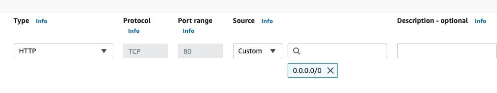

# AWS Elastic Container Service (ECS)

We will create the ECS cluster, the ECS task definition, and then finally the ECS service to run that.

_But_ ECS needs a level of access which it does not get by default (oddly!). We need to make the IAM policy and matching IAM role first. Then we'll have them to select later, when it gets to that point. If we don't, we'll probably see something like this:


## IAM roles and policies

So ... from the top-right corner, click on "Security credentials", then on that page, on "Policies" in the left-hand menu.

Click the blue button to "Create policy".

Click the "JSON" option, as we have the JSON we can provide directly:


In that left-hand panel, delete all the JSON already there and in its place, put:

```json
{
  "Version": "2012-10-17",
  "Statement": [
    {
      "Effect": "Allow",
      "Action": [
        "ecr:GetAuthorizationToken",
        "ecr:BatchCheckLayerAvailability",
        "ecr:GetDownloadUrlForLayer",
        "ecr:BatchGetImage",
        "logs:CreateLogStream",
        "logs:PutLogEvents"
      ],
      "Resource": "*"
    },
    {
      "Effect": "Allow",
      "Action": ["ssm:GetParameters", "kms:Decrypt"],
      "Resource": "*"
    }
  ]
}
```

What is all that? Well ... this will be the new policy for the ECS task execution. The first statement is the content of `AmazonECSTaskExecutionRolePolicy`. That is what it would give itself if we left it alone. However since we are using SSM for our secrets, [as it documents](https://docs.aws.amazon.com/AmazonECS/latest/developerguide/secrets-envvar-ssm-paramstore.html) we need to manually give that role additional access. So the second statement should let it fetch the secrets too.

**Note:** If you prefer you can restrict the parameters it has access to (rather than use "\*"). If you recall we named our secrets in the Parameter Store using a path prefix for that very reason.

Click the blue "Next" button.

Give it the name `ecs_task_execution_policy` (or something else you can identify as being what it is for).

Click "Create policy". That should only take a second.

Now you need to create an IAM role which that policy will be attached to. So in the left-hand menu, click on "Roles". Click on the blue button to "Create role".

For the trusted entity, that needs to be ECS, so in the dropdown menu start typing "Elastic ..." and you should see that option available. We want the "Elastic Container Service Task" as shown here, as that will assume this role:


On the next screen, check the box next to the policy you just created. For example `ecs_task_execution_policy` (or whatever you called it).

Scroll down and click "Next".

Give the role a name. It makes sense to use `ecs_task_execution_role` (or something along those lines) so it is obvious what it is used for.

Click the blue "Create role" button and that should be created in a few seconds. That's now available for us to use later on.

## ECS cluster

Now that we have an image to deploy within it (in ECR), a database for it to connect to (in RDS) and secrets for it to access (in Parameter Store) we need a container.

Search for "ECS" and click on the link that appears:


You will likely see the welcome screen. Click "Get started":


Click the button to "Create cluster". There is no cost for the cluster itself, only the resources within it.

First, give it a name:


Scroll down to the _Networking_ panel. Since this is a new AWS account, we have automatically been provided with a default VPC. That is like a private network. If you are using this AWS account for other apps, you may want to create a new VPC to keep this app entirely isolated from them. You can do that from the blue VPC console link, as it mentions. We'll stick with the pre-filled default values:


Scroll down and you will see the _Infrastructure_ panel.

The default is to have Fargate provide the capacity. That is a _serverless_ approch, avoiding the need to manage instances (but costing more as a result). For now we will leave that as the sole provider and so leave the other two boxes unchecked.

Monitoring is optional but for now we want to see a bit more about what is happening. So we'll expand that panel and enable it:


Click "Create" and you should see a panel saying that cluster creation is in progress. That will take a few moments:


It has been created, but is currently empty.

Next we need a task defintion. That specifies _what_ to run (the image, the environment variables, and so on).

## Task (definition)

Click on "Task definitions" and then on the "create new task definition" button:


Start by giving it a name:


Next you need to specify the image that should be run in the container (of course there must be at least one, hence it labelling the first container as being essential). Recall that is the full ECR URL followed by the tag of the image you pushed to it earlier.

ECR _is_ a private registry however since it is within AWS you do not need to select that option or provide extra credentials.

The Live Beats app uses port 4000 by default and so we'll specify that here too.


Scroll down a bit further and you are asked for the environment variables.

We never want to store values like the `DATABASE_URL` in plain text. To solve that, recall earlier we created our secret values in AWS Systems Manager. ECS can fetch those values for us. We simply need to do is enter the "Key" (which is the name we want the app to see) and the "Value" is the name we gave the parameter (in Parameter Store). We must make sure to choose "ValueFrom" in that dropdown else it would use the path _as_ the value. As it explains in this guide to [using AWS Parameter store](https://docs.aws.amazon.com/AmazonECS/latest/developerguide/secrets-envvar-ssm-paramstore.html) the reason we can simply use the name rather than the full "arn" is because the secret is in the same region.

This is the first of the four secrets:


You need to click the button to add more expected environment variables. These are the four the app needs:

1. SECRET_KEY_BASE
   /staging/fly-live-beats/secret-key-base
2. DATABASE_URL
   /staging/fly-live-beats/database-url
3. LIVE_BEATS_GITHUB_CLIENT_ID
   /staging/fly-live-beats/live-beats-github-client-id
4. LIVE_BEATS_GITHUB_CLIENT_SECRET
   /staging/fly-live-beats/live-beats-github-client-secret

We'll skip over the rest of the options, but if you want to provide a healthcheck or specify any limits, you can.

Click "Next" to proceed on to step two.

We can now specify _what_ is providing the capacity for the task. We are using "Fargate" so we'll stick with that. Below you can choose the CPU and RAM for each container. The range is from 0.25 vCPU up until 16 vCPU, and the memory available adjusted too. The cost increases accordingly so we'll start off with the smallest size:


If your container needs access to other AWS services (for example to upload a file to S3) you would need to create and provide a role for it. Our app doesn't.

We'll pick the `ecs_task_execution_role` that we created earlier for ECS to use. We did that because we are storing secrets in another service. ECS needs to be able to fetch those. If it can't, the deployment will likely fail. And if we leave it to create an execution role for itself (the default) it does not realise it needs that access and so fails to add it.

We'll leave the rest of the values as their defaults.

Each container gets at least 21 GB of ephemeral storage so we don't need to enter any value to use that.

**Important:** The Live Beats app involves uploading files and storing them in a local drive (rather than S3). You would want that data to persist. As such, you would _not_ want to leave the storage option as it is by default, with ephemeral storage, as that would be lost. You would instead click 'Add volume" to add a volume. You would not want to opt for "Bind mount" either. As it says [in the docs](https://docs.aws.amazon.com/AmazonECS/latest/developerguide/using_data_volumes.html?icmpid=docs_ecs_hp-task-definition);

> Bind mounts are tied to the lifecycle of the container that uses them. After all of the containers that use a bind mount are stopped, such as when a task is stopped, the data is removed.

Since we are not using EC2 instances to provide the capacity, the "Docker volume" type is also not possible.

Instead you would pick "EFS" as the volume type, then add the rest of the details it asks for to configure it. EFS provides peristent storage.

We'll leave logging enabled. That goes to Cloudwatch. It should show you the name of your log (for example `/ecs/your-name`). We'll check on that later if there are any issues. We won't collect the extra values and so can leave them unchecked.

Click "Next" to proceed to the final step.

Scroll down to review all the values you have entered to check they look ok. All good? Click "Create".

In a few seconds you should see the task definition has been created. If you need to edit it, you should see a button to create a new revision with the exisitng values pre-entered. They are versioned by number.

AWS now knows _what_ to run. You now need to run it. That can be done either as a 'Service' or 'Task'. A task is generally a one-off action which runs and then ends (like when processing files, such as in a batch). We want a 'Service' which will keep running:


A service handles _running_ the task definition. The number of tasks running (min/max or auto-scaling) and load-balancing between them. If a task fails, the service replaces it.

## Service

Start by choosing your cluster from the list. We only have one, so that's easy.

Next you need to choose what will provide the capacity for your containers to run on. As mentioned previously you can use EC2 or Fargate. The appeal of Fargate over EC2 is then we don't need to set up or maintain the OS, or have to plan capacity as Fargate will launch the exact amount of capacty we need:


The initial configuration is relatively simple: we want to run a service. We'll use the latest version of our image. We'll give it a name.

To make sure the service itself is valid, we recommend **initially** setting the number of tasks to run as `0`. Why? Well if there is any issue, the _entire_ stack fails (which can take up to ten minutes), then rolls back (taking even longer) ... and your entire service is deleted. Meaning you have to enter _all_ these values above again. Setting it to `0` here means the service can be deployed. Only if _that_ works can we _then_ increase the tasks number (for example to `1`):


In the networking panel, we'll leave the default VPC (that is where our RDS database is). However we want to create a new security group, rather than use the default one, as then we can control access to our service. It's not entirely clear however when you use a load balancer (which we will do), this is the security group which controls access to _that_. In our case we want to make our app available to the public on port 80 (HTTP) so add a rule that allows access to `0.0.0.0/0` (which means any IP). If your app is using port `443` (which it should be) or you want to control access to it, adjust that accordingly. You can edit it later too.

Next, we need to put a load balancer in front of this service. So give that a name:


For now we will leave _on_ the public IP toggle. However since we'll be using a load balancer we _should_ be able to control access using that instead.

Next we do need to provide a load balancer. This is the kind of setup we will then have:


Image from: `https://aws.amazon.com/getting-started/guides/deploy-webapp-ecs/module-one/`.

We need a load balancer because the public IPs are ephemeral. Our containers will be stopped, restarted and replaced. We need a fixed hostname that can be pointed at them. Choose "Application Load Balancer" as we are working with HTTP requests. Then give it a name. We only have one container to load balance, so that is already selected. Next you are asked for the port/protocol. In production you would pick `443` and `HTTPS`. However an ALB does not come with a default certificate ([people have asked](https://stackoverflow.com/questions/65326652/why-is-it-not-possible-to-create-an-alb-with-https-listener-without-a-custom-dom)). So if you do pick `443` you are then asked to provide an already-made SSL certificate, from the AWS ACM service. AWS can make a certificate for you (for free) using ACM, however we have not done that already and so none are available to pick. So for now we'll stick with using port 80/HTTP. And since this is a new load balancer, there is no existing target group. This will be a new one. We just need to give it a name. That's because ALBs can be re-used across services (which also reduces cost). You may re-use this ALB for another ECS service, or pointed at a Lambda function. The target group name just identifies this particular usage of it:


We won't enable the auto-scaling option. For now we'll manually decide how many tasks we want running.

That's it! Click "Create".

That should create the service, along with its dependencies (such as the load balancer). That may take a few minutes so please be patient.

**Note:** If it fails, it may take up to ten minutes to rollback. If there is no prior version to rollback to, that will delete your service entirely. You can click the CloudFormation link the console shows you to keep track.

It worked!

If you recall earlier on we launched the service with 0 tasks, to ensure we got a version set up. So that's currently the case:


Click the "Update service" button in the top-right. We now need to specify the number of tasks. We'll start with 1:


You should see the tasks moved to pending ...


... then running ...


If the tasks keep failing, and being put back as "desired", see if the "Logs" tab shows any error. For example `init terminating in do_boot` or `Undefined function`:


If your code _does_ need changing, remember you will need to build an new image, tag it, then push it to ECR (unless you have remote builds set up using a CI service). Once your new image is in ECR, a new version of the ECS service should be deployed (if it is set to use the latest revision, which ours is).

If this app is working correctly, you should see in the "Logs" tab:


Great! It's running. Those log lines have been generated by the app, running in the container.

But before we try loading it in the browser (which won't work - you'd get a 504 error), we need to let the container connect to the database. Currently it won't be able to since if you recall when we created the database we gave it a new security group. It knows nothing about ECS. We need to tell it.

## Database access

The first thing to make sure is that your database is in the same VPC as your ECS container. Throughout this guide we have been using the same default VPC, so it is.

Since we created a security group for ECS, and a security group for RDS, and their IPs may change, the simplest option is for each to reference the _other_ security group. That allows communication between them.

To edit their rules, type "VPC" in the search bar, and enter the VPC console. In the left-hand menu you should see "Security groups" listed. Click on that.

As you can see, we have two security groups. One is the RDS one, created when we created our database. We gave it the name `aws-rds-fly-live-beats-sg` to make it easily identifiable. And the other one is the security group that controls access to ECS, which we created earler. We gave that the name `fly-live-beats-service-sg`.


For the ECS security group, click the "Outbound rules" tab. Click on the edit rules button. You want to allow TCP traffic on port 5432. The destination is custom, and in the next box choose the RDS security group (it should pre-fill with options when you start typing).

Click "Save rules".

You also want to do the same for the RDS to allow _inbound- connections from ECS. And so select \_that_ RDS security group. Click the "Inbound rules" tab. Click "Edit inbound rules". You may already have a rule in here for allowing access (such as from your office IP). Click the "Add rule" button and allow TCP port 5432 from the ECS security group. Something like this:


**Important:** Do not delete or edit the outbound rule provided by AWS for ECS to send traffic to any IP. It needs to send data (for example to Cloudwatch) and if unable to, ECS will repeatedly try to start a task, and fail, and there won't be anything in the "Logs" tab to indicate why!

## Database migration

Assuming you have the RDS and ECS security groups correctly configured, they should be able to communicate with each other.

You should now see a new message appear in the logs tab: it is complaining that the "users" does not exist. That confirms it _was_ able to both fetch the correct database URL (from SSM, provided as a secret) _and_ also connect to that database (in order to know that that table does not exist):


The reason that table does not exist is because it is created by running the migrate script. That has not been done anywhere yet,

The problem is that while it is (in theory) possible to execute a command in a Fargate container ... there is no task running. It keeps failing. Because ... of the lack of a database.

For now the solution seems to be (slightly awkwardly) to run the migration in the `Dockerfile`. Generally not ideal, however it should work.

Change the last line to be:

```sh
# temporary (to get ECS up and running)
CMD /app/bin/migrate;/app/bin/server
```

... build a new image, tag it, and push it to ECR. That should trigger a new deployment of the ECS service. If not you can click "Update service" and tick the box to force a new deployment. You can keep track in the service's "Deployments and Events" tab. You may need to click the refresh icon.

Now when that container runs, it should migrate the database and then run the app.

If you switch to the "Logs" tab you should see when the container runs the `CMD` is executed, and so the database is migrated:


Now remove that migrate command from the `Dockerfile` CMD, putting it back how it was.

## Load balancer

As part of the deployment of the service, a load balancer was created. You can access that via the EC2 console, scroll down, and click on "Load balancers" in the left-hand menu. You should see the ALB with the name you gave it listed there. It should have a "DNS Name" which you can copy. You can load that in your browser, and if all is working and there is a healthy service, that should route requests to the container being run by the service.

If there is no response (like a 504) error, check the security group (that's a firewall) assigned to it. You can see which one from its "Security" tab. Click on its ID there to view its rules and make sure your IP is included (for example if it only allows access to certain ones).

You may also need to include TCP port 4000 to the security group as it is shared by ECS. Currently the Live Beats app defaults to listening on port 4000. Unless you change it by overriding that, such as by setting a `PORT` variable.

If you want your app available to the public, on IPv4, for HTTP requests, the security group should contain a rule like this to allow access to any IP:



You may also need to check its healthcheck. We have set the app's healthcheck to request the `/signin` path, on port 4000, with 2 retries, and a timeout of 2 seconds. That passes. We expect a success code of 200:


You should now be able to open your load balancer's DNS name (its hostname) in your browser, and see the Live Beats app. For example: `http://app-name-alb-1234567.eu-west-2.elb.amazonaws.com/`.

But you will likely see an error in the top-right complaining the WebSocket can not connect. If you recall from running this app locally, that is because it is set to check the hostname and it defaults to looking for `example.com`. Clearly that does not match and so the request is rejected. We can fix that by providing the `PHX_HOST` environment variable. Handily that is not secret and so there is no need to go back into SSM to add that one. We can add a new environment variable in plain text to the task definition. So in the ECS console, click on "Task definitions" in the left hand menu, then check the radio button to the left of your current one. In the top-right, click the "Create new revision" dropdown.

The values you currently have will be pre-filled. If you scroll down, you will see the current four environment variables (got from SSM). Click the button to add a new environment variable, call it `PHX_HOST`, pick "Value" from the dropdown, and then enter your app's hostname (for now that is the hostname of the ALB):


Scroll down and click "Create" to create the new revision.

As before, to apply that you will need to click on the service, and then click the "Update service" button in the top-right. Choose the revision you have just created from the dropdown, scroll down, and click "Update". Then wait for it to deploy.

## Signing in

If you recall, we did not create a GitHub OAuth app prior to deploying this to ECS. That was because we did not know what its hostname would be at that point. We do now. So we need to create a new app. We'll use the hostname of the ALB (again, you might be using your own custom domain and so use that in its place).

You can create one from [this page](https://github.com/settings/applications/new). Give it a name, set the homepage to `http://app-name.alb-12345.eu-west-2.elb.amazonaws.com` (of course actually use your hostname) and the authorization callback URL to the matching one e.g `http://app-name.alb-12345.eu-west-2.elb.amazonaws.com/oauth/callbacks/github`. Click the button. You will be shown its client ID. Click the button to _Generate a new client secret_.

Copy both those values.

Remember the task definition fetches them from SSM. The path to them is the same. So we do not need to edit the task definition. Instead, we need to edit the value in SSM. So in the console, search for "Systems Manager". Remember the "Parameter Store" is in there, in the left-hand menu.

Click on `/staging/fly-live-beats/live-beats-github-client-id` (or whatever you called it in SSM), click on the "Edit" button, scroll down, and now paste in that value box at the bottom the _actual_ value you just got from GitHub (in place of the "placeholder" value currently there). Save changes.

Do the same for the client secret. So on `/staging/fly-live-beats/live-beats-github-client-secret` (or whatever you called it in SSM), click on the "Edit" button, scroll down, and now paste in that value box at the bottom the _actual_ value you just got from GitHub (in place of the "placeholder" value currently there). Save changes.

Great! Now we need another deployment of our task in order to force those new ones to be used, as of course ECS does not know we just changed them.

Go back to the ECS console. Click on the service, on "Update service", and since we haven't changed anything, this time simply tick the box at the top to force a new deployment. Click the button at the bottom, and wait a few moments for that deployment to start. As usual you can check on its progress in the "Deployments and Events" tab. It should start the new task and then stop the old task, transitioning over.


In the "Logs' tab you should see the ALB healthcheck requests being made and still continue to pass.

Switch over to your browser and reload the ALB hostname (or your equivalent).

Since we set the `PHX_HOST` variable as that value, the WebSocket error should have gone away. It has!

And now we have provided a valid GitHub OAuth app client ID/secret, using the correct hostname, we should now be able to sign in:

It works! 🚀


**Note:** You can upload an .mp3 file, however it is uploaded to ephemeral storage. If you recall when we created the app, we did not specify to use EFS. That's the persistent store. Your file could be deleted at any time.

If you do upload an .mp3 file and it does not play, that is _likely_ because by default the Live Beats app is set to serve assets over https. We have not set up a certificate in AWS ACM and so when creating the ALB, we had to use port 80/HTTP for the listener (rather than port 443/HTPS). As such the request for the file will fail, since the ALB will not respond to HTTPS requests. Assuming at this point you are using 80/HTTP too, make sure the app will serve files over HTTP. If you need to change this part, remember you also need to build, tag and push a new image to ECR in order for ECS to access the latest version.

If you are building locally, push, _and_ see "Your authorization token has expired. Reauthenticate and try again.", you will need to do that. That means running the _first_ of the four commands (the one starting `aws ecr get-login-password ...` which gets a token from AWS and pipes that to your local Docker client).

Pushing a new image to ECR does not automatically trigger a new deployment, so click the "Update service" button, tick the box to "Force new deployment", and proceed. Wait a minute for the deployment to proceed, the ALB to drain the connections and the new service to load in its place.

Your .mp3 should then play:


# Resources

When idle the app should use minimal resources. Even on the smallest type (0.25 vCPU with 0.5GB of RAM) the usage is minimal:


## Scaling

You can either increase the number of tasks manually (to provision those resources in advance) or tick the box to enable auto-scaling. Fargate can then allocate the capacity for you.

There is no ability to scale globally since ECS is restricted to a particular geographic region. All containers run within that one region. If you wanted to reduce latency for users who are far away, in theory you could start another ECS cluster in that region. Then use DNS (for example Route 53) ro route to the closest service to the user. However that would deploying multiple times and so would be very awkward to do. Even if you were to, your database remains in one region. You would need to add read-replicas and adapt your application to use them instead.

How does [AWS pricing compare to Fly.io](/docs/9-pricing.md)?
