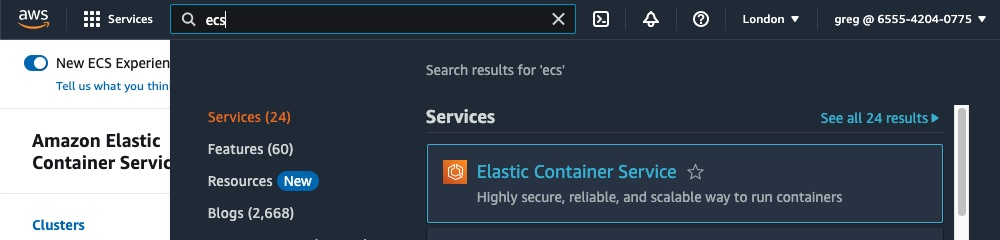
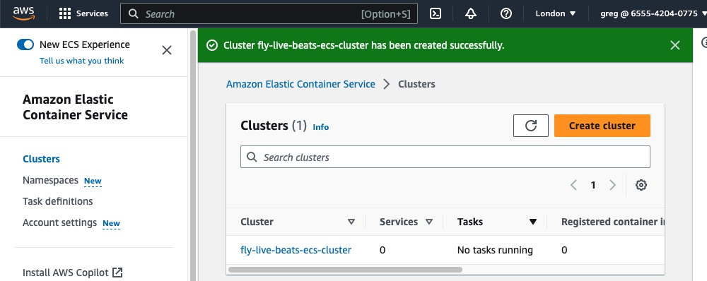
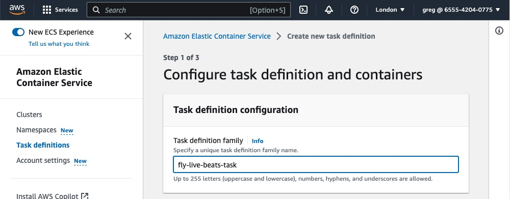

# AWS Elastic Container Service (ECS)

**Note:** If you want to use secrets (which I do) and/or want to get shell access to a container (which I also do), you need to make these IAM roles and policies first. They will then be available to select later on, when creating the task. If not, you'll probably see something like this:


## IAM roles and policies

### Task execution policy and role

From the top-right corner, click on "Security credentials", then on that page, on "Policies" in the left-hand menu.

Click the blue button to "Create policy".

Click the "JSON" option:


In that left-hand panel, delete all the JSON already there and in its place, put:

```json
{
  "Version": "2012-10-17",
  "Statement": [
    {
      "Effect": "Allow",
      "Action": [
        "ecr:GetAuthorizationToken",
        "ecr:BatchCheckLayerAvailability",
        "ecr:GetDownloadUrlForLayer",
        "ecr:BatchGetImage",
        "logs:CreateLogStream",
        "logs:PutLogEvents"
      ],
      "Resource": "*"
    },
    {
      "Effect": "Allow",
      "Action": ["ssm:GetParameters", "kms:Decrypt"],
      "Resource": "*"
    }
  ]
}
```

What is all that? This will be the new policy for the ECS task execution. The first statement is simply the whole of `AmazonECSTaskExecutionRolePolicy`. That is what it would give itself anyway. However since I'm using secrets, [the AWS docs say you need to manually give it access](https://docs.aws.amazon.com/AmazonECS/latest/developerguide/secrets-envvar-ssm-paramstore.html) else it can't fetch them. The second statement in the JSON policy should let it fetch and decrypt the secrets (the ones previously added to Parameter Store).

**Note:** You could modify that policy to restrict the parameters it has access to. If you recall I named the secrets in the Parameter Store using a path for that very reason.

Click the blue "Next" button.

Give this one the name `ecs_task_execution_policy` (or something else you can identify as being what it is for).

Click "Create policy". That should only take a second.

Now you need to create an IAM role which that policy will be attached to. So in the left-hand menu, click on "Roles". Click on the blue button to "Create role".

For the trusted entity, that needs to be ECS. In the dropdown menu start typing "Elastic ..." and you should see that option available. Pick the "Elastic Container Service Task" as shown here, as that will assume this role:


On the next screen, check the box next to the policy you just created. For example `ecs_task_execution_policy` (or whatever you called it).

Scroll down and click "Next".

Give the role a name. It makes sense to use `ecs_task_execution_role` (or something along those lines) so it is obvious what it is used for.

Click the blue "Create role" button and that should be created in a few seconds. That's now available to use later on.

### Task policy and role

Again, from the top-right corner, click on "Security credentials", then on that page, on "Policies" in the left-hand menu.

Click the blue button to "Create policy".

Click the "JSON" option:


In that left-hand panel, delete all the JSON already there and in its place, put:

```json
{
  "Version": "2012-10-17",
  "Statement": [
    {
      "Effect": "Allow",
      "Action": [
        "ssmmessages:CreateControlChannel",
        "ssmmessages:CreateDataChannel",
        "ssmmessages:OpenControlChannel",
        "ssmmessages:OpenDataChannel"
      ],
      "Resource": "*"
    },
    {
      "Sid": "libcluster",
      "Effect": "Allow",
      "Action": ["ecs:ListServices", "ecs:ListTasks", "ecs:DescribeTasks"],
      "Resource": "*"
    }
  ]
}
```

What is all that? This will be the new policy for the ECS task.

The _first_ statement is taken from the [AWS docs](https://docs.aws.amazon.com/AmazonECS/latest/developerguide/ecs-exec.html) to allow _ECS Exec_ later on. That's the equivalent of the `flyctl ssh console` command, letting you SSH in to a container. That's very handy for debugging.

The _second_ statement is needed because I'm [using a custom strategy](/docs/10-aws-phoenix-clustering.md) for `libcluster`. Rather than use service discovery/connect, instead it queries the ECS API. The task needs permission to make those calls.

Click the blue "Next" button.

Give this one the name `ecs_task_policy` (or something else you can identify as being what it is for).

Click "Create policy". That should only take a second.

Now you need to create an IAM role which that policy will be attached to. In the left-hand menu, click on "Roles". Click on the blue button to "Create role".

For the trusted entity, that needs to be ECS. In the dropdown menu start typing "Elastic ..." and you should see that option available. Pick the "Elastic Container Service Task" as shown here, as that will assume this role:


On the next screen, check the box next to the policy you just created. For example `ecs_task_policy` (or whatever you called it).

Scroll down and click "Next".

Give the role a name. It makes sense to use `ecs_task_role` (or something along those lines) so it is obvious what it is used for.

Click the blue "Create role" button and that should be created in a few seconds. That's now available to use later on.

## ECS cluster

Now there is an image to deploy (in ECR), a database for the app to connect to (in RDS) and secrets for it to access (in Parameter Store) the app can be run. That needs a container, which is run in an ECS cluster.

Search for "ECS" and click on the link that appears:



You will likely see the welcome screen. Click "Get started":


Click the button to "Create cluster". There is no cost for the cluster itself, only the resources within it.

First, give it a name:


Scroll down to the _Networking_ panel. Since this is a new AWS account, I'm using the default VPC. If you are using this AWS account for other apps, you may want to create a new VPC to keep this app entirely isolated from those. You can do that from the blue VPC console link, as it mentions. I'll stick with the pre-filled default values. I'm going to use a public subnet to make routing simpler.


Scroll down to the _Infrastructure_ panel.

The default is to have Fargate provide the capacity. That is a _serverless_ approch, avoiding the need to manage instances (but costing more as a result). For now leave Fargate as the sole provider and so leave the other two boxes unchecked.

Monitoring is optional but you might want to expand that panel and enable it:


Click "Create" and you should see a panel saying that cluster creation is in progress. That will take a few moments:



It has been created, but is currently empty.

Next: the task defintion. That specifies _what_ to run (the image/tag, the environment variables it expects, and so on).

## Task (definition)

Click on "Task definitions" and then on the "create new task definition" button:


Start by giving it a name:



You need to specify the image that should be run in the container (of course there must be at least one, hence it labelling the first container as being "essential"). Recall that is the full ECR URL followed by the tag of the image you pushed to it earlier.

**Note:** ECR _is_ a private registry however since it is within AWS you do not need to select that option or provide any extra credentials.

The Live Beats app uses port `4000` by default and so specify that here.


Scroll down a bit further and you are asked for the environment variable(s).

Recall earlier that I [created the secrets](/docs/6-aws-create-secrets.md). Using the custom IAM policy (the one you created earlier) will allow ECS to fetch those values. You need to tell it the "Key" (that is the name the _app_ will see) and the "Value" (which is the name of the parameter AWS sees, in Parameter Store).

Make sure to choose "ValueFrom" in the dropdown for each secret else it would use the path _as_ the value. As it explains in this guide to [using AWS Parameter store](https://docs.aws.amazon.com/AmazonECS/latest/developerguide/secrets-envvar-ssm-paramstore.html) the reason you can use the name (rather than its full "arn") is because the secret is stored in the same AWS region.

The image below shows one of the secrets:


Click the button to add the rest of the environment variables.

First, the secrets. For each of _these_ make sure to choose `ValueFrom` in the dropdown and of course use whatever name _you_ gave them in the Parameter Store:

Key: `SECRET_KEY_BASE`
Value: `/staging/fly-live-beats/secret-key-base`

Key: `DATABASE_URL`
Value: `/staging/fly-live-beats/database-url`

Key: `RELEASE_COOKIE`
Value: `/staging/fly-live-beats/release-cookie`

Key: `LIVE_BEATS_GITHUB_CLIENT_ID`
Value: `/staging/fly-live-beats/live-beats-github-client-id`

Key: `LIVE_BEATS_GITHUB_CLIENT_SECRET`
Value: `/staging/fly-live-beats/live-beats-github-client-secret`

You also need to set some plain text environment variables. For _these_ make sure to choose `Value` from that dropdown as they _don't_ need to be fetched from somewhere else. They _are_ the values:

Key: `PHX_HOST`
Value: This should be your own domain e.g `www.example.com`. If for some reason you do not want to use one, use the load balancer's hostname e.g `your-name-elb.region.amazonaws.com`.

Key: `AWS_ECS_CLUSTER_REGION`
Value: The AWS region your cluster is in e.g `eu-west-2`.

Key: `AWS_ECS_CLUSTER_NAME`
Value: The _name_ of your cluster e.g `my-ecs-cluster`.

Key: `AWS_ECS_SERVICE_ARN`
Value: The full _ARN_ of your service, starting `arnaws:ecs ...`. You can get that from the console.

If you want to provide a health check or specify any limits, you can. I won't here.

Click "Next" to proceed on to step two.

Now specify _what_ is providing the capacity for the task. I'll stick with "Fargate".

You can choose the CPU and RAM for each container. The range is from 0.25 vCPU up to 16 vCPU, and the memory available adjusted too. The cost increases accordingly so probably start off with the smaller ones:


Next, for the task's role pick `ecs_task_role` (or whatever you called it earlier). Why? That's needed to query ECS as part of the `libcluster` strategy and also allow access for ECS Exec (to SSH in to the container, for debugging).

For the execution role (ECS itself) pick the `ecs_task_execution_role` (or whatever you called it earlier). That's needed because of storing secrets in another service. ECS needs to be able to fetch those secrets. If it can't, the deployment will likely fail. If left to create an execution role for itself (the default) it does not realise it needs that access and so fails.

For now leave the rest of the values as their defaults.

Each container gets at least 21 GB of ephemeral storage, so that's plenty.

**Important:** The Live Beats app involves uploading files and storing them in a local drive (rather than S3) but then deleting them later. You probably _would_ want _your_ data to persist. If so, you would _not_ want to leave the storage option as the default (ephemeral storage) as that would be lost. You would instead click "Add volume" to add a volume. You would not want to opt for "Bind mount" either. As it says [in the AWS docs](https://docs.aws.amazon.com/AmazonECS/latest/developerguide/using_data_volumes.html?icmpid=docs_ecs_hp-task-definition):

> Bind mounts are tied to the lifecycle of the container that uses them. After all of the containers that use a bind mount are stopped, such as when a task is stopped, the data is removed.

For persistent storage you would pick "EFS" as the volume type, then add the rest of the details it asks for to configure it. EFS provides persistent storage.

I'll leave logging enabled. That goes to AWS Cloudwatch. It should show you the name of your log (for example `/ecs/your-name`). That's very handy if there are any issues.

Click "Next" to proceed to the final step.

Scroll down to review all the values you have entered to check they look ok. All good? Click "Create".

In a few seconds you should see the task definition has been created. If you need to create a new one, check it and you should see a dropdown/button to create a new revision with the existing values pre-entered. They are versioned and so it is clear which definition you are using.

AWS now knows _what_ to run:


A service handles _running_ that task definition. That's next.

## Service

Start by choosing your cluster from the list. I only have one, so that's easy!

You need to choose what will provide the capacity for your containers to run on. As mentioned previously you can use EC2 or Fargate. The appeal of Fargate over EC2 is there is no need to set up or maintain the OS, or plan capacity. Fargate will launch the exact amount of capacity needed:


The initial configuration is relatively simple: use the latest version of our image. Just give it a name.

To make sure the service itself is valid, for now set the number of tasks to run as `0`. Why? Well if there _is_ any issue, the _entire_ stack fails (which can take up to ten minutes) then rolls back (taking even longer) ... and your entire service is deleted. Meaning you have to enter _all_ those values above again. Setting it to `0` here means the service can be deployed. Only if _that_ works _then_ increase the tasks (for example to `1`). That can then be checked independently:


While here you might like to take a look at the AWS docs regarding [Fargate networking](https://docs.aws.amazon.com/AmazonECS/latest/userguide/fargate-task-networking.html). I'll leave the default VPC (remember that is where the RDS database is). For simplicity I'll also stick with using the provided public subnets. As mentioned when setting up the RDS, the default VPC has three _public_ subnets. A _public_ subnet being one that is associated with a route table that _has_ a route to an Internet gateway. A _private_ subnet being one that is associated with a route table that does _not_ have a route to an internet gateway. Generally a load balancer will be in public subnet. You can choose whether the ECS cluster should be in a public or private subnet. Each have advantages.

> For a task on Fargate to pull a container image, the task must have a route to the internet. The following describes how you can verify that your task has a route to the internet. When using a public subnet, you can assign a public IP address to the task ENI. When using a private subnet, the subnet can have a NAT gateway attached.

A route to the internet is required to fetch secrets (from Parameter Store).

If you use a private subnet, adding a NAT gateway incurs [additional costs](https://aws.amazon.com/vpc/pricing/).

However traffic between the instance and the load balancer also incurs a cost (data transfer using a private IP within the same region should be free).

Next, create a new security group (which is a virtual firewall), rather than use the default one. Give it a name for example `fly-live-beats-service-sg`.

**Note:** When you also set up a new load balancer (in a moment, to allow traffic to be split over multiple containers), initially this will also be its security group. That will be changed later as it seems there is no option to do that here right now.

You want to allow inbound connections to the _container_ on the TCP port `4000`. Set the source as `0.0.0.0/0` if you want to allow access to it from any IP. You will be changing these rules later on.


I'll opt to leave _on_ the public IP. **That can't be edited later**. That setting is important because I'm launching the Fargate tasks in a _public_ subnet. According to this answer `https://repost.aws/knowledge-center/ecs-unable-to-pull-secrets` if you _don't_ have a public IP, by default ECS won't be able to fetch those secrets:

> If you have a Fargate task in a public subnet, then verify that your task has an assigned public IP address ... When you launch a new task or create a new service, turn on Auto-assign public.

Next: opt to create a new load balancer. To reduce cost you don't _have_ to have one with ECS (assuming a single container) however if your app is to scale over 2+ containers, the load balancer handles that (as well as the TLS termination):


Image from `https://aws.amazon.com/getting-started/guides/deploy-webapp-ecs/module-one/`.

Choose "Application Load Balancer" as the Live Beats app is working with HTTP requests. Give it a name. There is only one container to load balance so that is already selected.

Next you are asked for the port/protocol for its listener. Pick `443` and `HTTPS`.

Note from earlier that an [ALB does not come with a default certificate](https://stackoverflow.com/questions/65326652/why-is-it-not-possible-to-create-an-alb-with-https-listener-without-a-custom-dom) and so I [created one in ACM](/docs/4-aws-create-certificate.md) for that very reason. Hopefully that is verified by now and so is available to select from ACM here. By picking `443` you are _then_ asked to provide an already-made SSL certificate.

Since this is a new load balancer, there is no existing target group. This will be a new one. We just need to give it a name. That's because ALBs can be re-used across services (which also reduces cost). For example you may use this same ALB for another ECS service. Or have it pointed at something else, such as a Lambda function, on a different path. The target group's name identifies _this_ particular usage of it:


Like on Fly.io, for now I won't enable auto-scaling.

That's it! Click "Create".

That should create the service, along with its dependencies (such as the load balancer). That may take a few minutes so please be patient.

**Note:** If it fails, it may take up to ten minutes to rollback. If there is no prior version to rollback to, that will delete your service entirely. You can click the CloudFormation link the console shows you to keep track.

It worked!

## Security groups

Before starting any tasks (containers) running, I'll configure access to them.

### Access to the load balancer

If you recall above, I provided a name to create a new security group for the service. For example `fly-live-beats-service-sg`. By opting to make a new load balancer, AWS assigns that security group to that new load balancer _too_. That's not ideal. I want to control access to those separately. For example to make the app public and so allow inbound connections to the ALB from `0.0.0.0/0` but _not_ directly to the containers. By creating a different security group, access can be controlled to them separately.

In your AWS console, click on the name of your service to view its (with the tabs "Health and metrics", "Tasks" and so on).

Click the button to "View load balancer":


Scroll down that page and click on the "Security" tab. You should see one security group listed. On the right-hand side of that tab is an "Edit" button. Click that.

I'm going to replace that security group with a _new_ one. One used only the load balancer. So click the blue link to create a new one:


Give this new one a new name to identify it. For example this one could be called `fly-live-beats-alb-sg`. In the description you could put "Control access to the load balancer". Again, just making clear what it is for.

In the "Inbound rules" panel, click the "Add rule" button.

Assuming you want your load balancer open to the public to access, you would allow access on `HTTPS` (which is TCP port `443`) from anyone by using `0.0.0.0/0`. Not port 80, which is shown here:


Scroll down and click "Create security group".

You will now see there are _two_ security groups on that prior "Edit security groups" screen. The prior one _and_ this newly added one (as an ALB can have multiple ones). So click the little cross to remove the prior one. Click "Save changes".

Now your load balancer has its _own_ virtual firewall.

Next, edit access to/from the service, in _its_ security group. I'll do _that_ from the VPC page.

### Access to the service

Type "VPC" in the search bar, and then enter the VPC console. In the left-hand menu you should see "Security groups" listed. Click that.

You should see four security groups applicable to this app: a default one, one for ALB, for ECS and for RDS. You don't need the default one, so ignore that. You have already set up the ALB one, so ignore that. You just need to edit the one for ECS and the one for RDS.

First, the service. Click the checkbox to the left of that one (for example `fly-live-beats-service-sg` or whatever you called it)

Click the "Inbound rules" tab.

You need _two_ rules in here (you may have a remnant of when this security group was used by the ALB too, using port `443`? If so, that rule can go). So click the "Edit inbound rules" button.

You can see below the initial set up.

The _first_ rule is to allow clustering. Nodes to be able to discover and connect to each other. They need access to do that. It's not clear to me _which_ ports are actually used (various suggestions/guides say port `4369`, or `9000`). For now I have allowed access on _any_ port. The source is the `CIDR` of your VPC (that the containers run in). So of course use _your_ `CIDR` value, got from your ECS service, not this one!

The _second_ rule is needed to let the load balancer access this service on port `4000` (since the containers expose TCP port `4000`). The ID is the ID of the load balancer's security group. If you start typing in that box in your console, your security group should be available to select in place of _this_ one:


At this point the load balancer is available to the world to access our app (using `HTTPS`). The service lets the load balancer connect to it (on port `4000`). The containers should be able to communicate with each other (using that any-IP-in-CIDR rule). However ... the service is not able to connect to the database. The database does not know it exists. That's next.

### Access to the database

You need the RDS security group to allow incoming connections from ECS. So next, tick the box next to the RDS security group. Click the "Inbound rules" tab. Click "Edit inbound rules". Click the "Add rule" button and allow TCP port 5432 from the ECS's security group. Something like this (as you type in the box, your security group should appear).

**Note:** It's best to use the security group to connect across AWS services since the instance IP may change, but its security group ID won't.


Now the ECS can access RDS (it knows the connection string as it was provided to it as the `DATABASE_URL` but up until now that connection would have been blocked).

## Start some tasks

If you recall earlier on I deliberately launched this service with `0` tasks. At that point it would have failed as the security groups were not configured.


So now click the "Update service" button in the top-right and edit that desired tasks number to e.g `1`:


You should see the tasks moved to pending ...


... then running ...


If your tasks keep failing, and being put back as "desired", see if the "Logs" tab shows any error. For example `init terminating in do_boot` or `Undefined function`:


If your code _does_ need changing, remember you will need to build an new image, tag it, then push it to ECR (unless you have remote builds set up using a CI service). Once your new image is in ECR, you will need to manually trigger a new deploy of your service (you can do that using that "Update service" button, and ticking the box to force a new deployment).

Check the "Logs" tab:


Great! It's running. Those log lines have been generated by the app, running in the container.

## Database migration

Assuming you have the RDS and ECS security groups correctly configured, they should now be able to communicate with each other.

In which case you will see a _new_ message appear in the "Logs" tab. It is complaining various tables do not exist. That confirms it _was_ able to both fetch the correct database URL (provided as a secret) _and_ also connect to that database (in order to know that that table does not exist):


The reason that table does not exist is because it gets created by running the migrate script. That has not been done anywhere yet.

The problem is that while it is now possible to execute a command in a Fargate container using ECS Exec ... there is no task running. It keeps failing. Because ... of the lack of a database. Hmm ...

For now the solution appears (?) to be to run the migration in the `Dockerfile`. That's not _ideal_ however it should work and at least get a task up and running.

Change the last line in `Dockerfile` to be (temporarily):

```sh
# temporary (to get ECS up and running)
CMD /app/bin/migrate;/app/bin/server
```

Since you have changed its code, build a new image, tag it, and push it to ECR.

Once pushed, click "Update service". Tick the box to force a new deployment. Scroll down and click "Update". You can keep track in the service's "Deployments and Events" tab.

Now when _that_ one container runs in a couple of minutes or so, it should migrate the database.

If you switch to the "Logs" tab you should see when the container runs the `CMD`. You should see the database _is_ now migrated:


Now that's done you can remove that migrate command from the `Dockerfile` putting it back how it was. In future you should be able to use ECS Exec to run a shell command.

## Check the app

As part of the deployment of the service, a load balancer was created. If you check your service's "Health and metrics" tab, there is a section for the "Load balancer health" that you can expand. On the right of that it shows the number of targets (currently `1`) and whether they are healthy.

If a target is unhealthy, make sure the tasks (containers) are running _and_ double-check that the ECS service's security group allows incoming requests on TCP port `4000` from the load balancer.

You may also need to check the load balancer's health check. I set it to request the `/signin` path, on port `4000`, with 2 retries, and a timeout of 2 seconds. That passes:


If all is well, click the "View load balancer" button. Within that large "Details" panel is a DNS Name for it. It should look something like `name-alb-12345.eu-west-2.elb.amazonaws.com`. You'll need that in a moment.

## Update domain DNS

Assuming you are using your own domain, now point that (for example `www.example.com`) at your load balancer.

In your DNS provider's records you will need to add _another_ `CNAME` record (alongside any AWS ACM verification record which also needs to be kept). This time its _name_ will be your chosen sub-domain (for example `www`) and its _value_ will be the hostname of the load balancer (for example `name-alb-12345.eu-west-2.elb.amazonaws.com`). If you are using Cloudflare, leave that record non-proxied (at least for now, until you confirm it works).

If that worked you should _now_ be able to request your app using that sub-domain and using `https://` since the load balancer should terminate that TlS connection for you. For example try loading `https://www.example.com` in your browser.

You should see the Live Beats app.

If there is a 504 error, again, check the targets behind it are healthy and rules in the security group allow it access. You can see which one from its "Security" tab. Click on its ID there to view its rules and make sure your IP is included for inbound access to the ALB (if it only allows access to certain ones, rather than `0.0.0.0/0`):


**Note:** If you see an error in the top-right complaining the WebSocket can not connect that would likely be because the `PHX_HOST` environment variable does not match the hostname in the browser. Check the "Task definitions" and make sure your one has the correct value for it.

## Signing in to the live Beats app

You should now be able to see the Live Beats sign in page (which is served from a container, run on ECS).

Assuming you provided a valid GitHub OAuth app client ID/secret (using the correct hostname) you should now be able to sign in.


It works! 🚀

**Note:** You can upload an .mp3 file, however it is uploaded to ephemeral storage and will be deleted. If you recall when I created the app, I did not specify to use EFS. That's the persistent local storage. Your file could be deleted at any time.

## Resources

When idle the app should use minimal resources. Even on the smallest type (0.25 vCPU with 0.5GB of RAM) the usage is minimal:


When it _is_ in use you will need to monitor its metrics so see what resource should be scaled. For Fargate containers, you can scale the vCPU and RAM (partly) independently and so it may be you need more.

The limit you are _probably_ going to hit first (if you started with a very small RDS database instance class) is the database connections. You may need a larger size (a larger RDS instance means more connections are supported).

## SSH in to a container

If you recall from deploying the app to Fly.io (or from watching Chris McCord demonstrate in [this video](https://www.youtube.com/watch?v=JrqBudJd2YM&ab_channel=ChrisMcCord) from around _5:30_) the app is using `libcluster`. The containers know about each other.

If you want to be able to do the same as Chris, you will need shell access to the containers. On Fly.io, he could simply type `flyctl ssh console` and he was in. On ECS ... it's a little bit more work.

The first thing to consider is that currently it is not possible to enable "ECS Exec" (as it's called) in the AWS console. You need to use the AWS CLI. If you have not come from the prior pages in this guide, you will need to install and configure that.

```sh
$ aws --version
aws-cli/2.11.18 Python/3.11.3 Darwin/19.6.0 exe/x86_64 prompt/off
```

As you can see in [its prerequisites](https://docs.aws.amazon.com/AmazonECS/latest/developerguide/ecs-exec.html), you _also_ need to [install the AWS CLI "Session Manager" plugin](https://docs.aws.amazon.com/systems-manager/latest/userguide/session-manager-working-with-install-plugin.html).

Next you need you add the required permissions.

For reference they are shown below **however** you may recall seeing these already. That's because I knew they would be needed them when creating the task's role earlier on. So your policy (the one attached to `ecs_task_role`) should _already_ have this statement. You don't need to do anything further to edit that.

```json
{
  "Version": "2012-10-17",
  "Statement": [
    {
      "Effect": "Allow",
      "Action": [
        "ssmmessages:CreateControlChannel",
        "ssmmessages:CreateDataChannel",
        "ssmmessages:OpenControlChannel",
        "ssmmessages:OpenDataChannel"
      ],
      "Resource": "*"
    }
  ]
}
```

The final step is to enable "ECS exec" for your tasks. That can currently only be done using the CLI which is why a service had to be created using the console _before_ it could be updated using the CLI.

Run this command in your terminal (replacing the values with your own region, cluster name and service name):

```sh
$ aws ecs update-service --profile if-you-need-one --region your-region --cluster its-name --service its-name --enable-execute-command
```

That should return a large block of JSON. At the very end of that should be `"enableExecuteCommand": true`. That confirms it has indeed been enabled.

However that has probably only been enabled for new tasks. It's easiest to just force a new deployment of the service to create brand new tasks. In the AWS console, click on your service and then click on the "Update service" button on the right-hand side. Tick the box at the top of that panel to force a new deployment.

While here, increase the number of tasks value to be `2`. That means you should have a _cluster_, as each container discovers the other one.

Scroll down and click the "Update" button.

It may take a couple of minutes for both those new containers to start and then register as healthy targets in the load balancer. You can check the service's "Deployments" tab to see what it is up to.

Once they are running, get the ID of one of those running tasks (from the service's "Tasks" tab) and type this command:

```sh
$ aws ecs execute-command --profile if-you-need-one --region your-region --cluster cluster-name-here --task the-task-id-here --interactive --command "/bin/sh"

The Session Manager plugin was installed successfully. Use the AWS CLI to start a session.

Starting session with SessionId: ecs-execute-command-12345

#
```

It works! Now you can run commands within that container e.g `ls -l`.

So while here, make sure the containers have discovered each other. If you recall how Chris McCord did that in his app (running on Fly.io), he got shell access, tried `node()` and then typed `Node.list()` which should return an array of the other nodes it knows about. I'll give that a try here too:

```
# /app/bin/live_beats remote

This container RELEASE_NODE is this: live-beats@172.31.12.68

Erlang/OTP 24 [erts-12.0.1] [source] [64-bit] [smp:2:2] [ds:2:2:10] [async-threads:1] [jit]

Interactive Elixir (1.12.0) - press Ctrl+C to exit (type h() ENTER for help)
iex(live-beats@172.31.12.68)1> node()
:"live-beats@172.31.12.68"
iex(live-beats@172.31.12.68)2> Node.list()
[:"live-beats@172.31.30.28"]
iex(live-beats@172.31.12.68)3>
```

`Ctrl+\` to end.

Type `exit` (to leave the shell).

It works! This container knows about the other one 🚀 (there are _two_ running tasks, so this one returns an array containing the _others_, and hence it has one element).

In the "Logs" tab you may have seen mentions of:

```sh
[info] [libcluster:ecs] connected to :"live-beats@172.31.14.125" fly-live-beats
```

That _also_ confirms the containers are able to connect to each other. Since when they can't (like if you break the security group) you _instead_ see lots of:

```sh
[warn] [libcluster:ecs] unable to connect to :"live-beats@172.31.14.125"
```

The IP should be its private IP, even if the container has a public IP enabled. If you click on the "Tasks" tab, and then on the ID of one of the listed tasks, on the right hand side of its "Configuration" tab you should see e.g


If you were to try it, the shown _public_ IP should not load (because your service's security group should block access). That's correct.

**Note** If you need to do any debugging while in the container, you may need additional tools like `wget` or `jq` that were not installed in the `Dockerfile`. To install those you would need to _first_ run `apt-get update` and _then_ e.g `apt-get install wget` or `apt-get install jq`. You could then fetch all the data about the container by running e.g `wget -qO- http://169.254.170.2/v2/metadata`. That would return a block of JSON showing the Cluster, TaskARN, Containers, Limits and so on `{"Cluster":"arn:aws:ecs:eu-west-2:655...`.

## Scaling

You can either increase the number of tasks manually (to provision those resources in advance) or tick the box to enable auto-scaling. Fargate can then allocate the capacity for you.

You might like to see a bit more about how I got [clustering set up on ECS](/docs/10-aws-phoenix-clustering.md).
