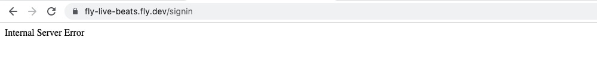

# Any errors?

This page lists some of the issues you may come across and some possible ways to fix them.

## Running locally?

##### Clustering does not work

You will likely see a lot of _these_ warnings:

```sh
15:59:13.292 [warn] [libcluster:ecs] ECS strategy is selected, but cluster is not configured correctly!
```

That's fine because in the `runtime.exs` file we expect the app to be run on AWS ECS and so use _its_ API calls. Those won't work when run in a container locally.

##### Database can't connect

If your database can't connect you will probably see an error messages like: ` (DBConnection.ConnectionError)`. Check your Postgres is running and listening on the expected port 5432:

```sh
$ netstat -an -ptcp | grep LISTEN
tcp4       0      0  127.0.0.1.5432         *.*                    LISTEN
```

Note that it is listening on `127.0.0.1`. That _should_ work, however if you can't connect you could try* temporarily* changing it to listen to any address in `postgresql.conf`:

```sh
listen_addresses = '*'
#listen_addresses = 'localhost'
```

If so, make sure to restart Postgres and then run the container again. See if you are _now_ able to connect to your local database. If not, well that wasn't the issue and so switch your database back to only listening on `localhost`.

Assuming not, open `http://localhost:4000` in your browser. You should see the sign in page :rocket:.

##### WebSocket error

The app may show a red panel complaining about the WebSocket failing, or having to reconnect. Sure enough, in the terminal it shows an error:

```elixir
[error] Could not check origin for Phoenix.Socket transport.

Origin of the request: http://localhost:4000

This happens when you are attempting a socket connection to
a different host than the one configured in your config/
files. For example, in development the host is configured
to "localhost" but you may be trying to access it from
"127.0.0.1". To fix this issue, you may either:

  1. update [url: [host: ...]] to your actual host in the
     config file for your current environment (recommended)

  2. pass the :check_origin option when configuring your
     endpoint or when configuring the transport in your
     UserSocket module, explicitly outlining which origins
     are allowed:

        check_origin: ["https://example.com",
                       "//another.com:888", "//other.com"]
```

The solution is to provide the hostname as an environment variable called `PHX_HOST`. For example `www.my-domain.com` (or whatever hostname your app can be accessed using).

## Running on Fly.io?

##### Error: no active leader found

That message means your database may have gone to sleep or been stopped (such as if it was a development one set to stop after an hour). You can [check on it](https://fly.io/docs/postgres/managing/monitoring/) by running: `flyctl status --app your-postgres-name`. If you see its state there as `stopped` then you will need to start it up again using `flyctl machine restart <id>`. Its ID is that first number returned in the status output. For example:

```sh
$ flyctl machine restart 123456789 --app your-postgres-name
Restarting machine 123456789
  Waiting for 123456789 to become healthy (started, 3/3)
Machine 123456789 restarted successfully!
```

If you _now_ check it using `flyctl status --app your-postgres-name` you should see its state as "started".

##### (System.EnvError) could not fetch environment variable "LIVE_BEATS_GITHUB_CLIENT_ID"

If you run `flyctl launch` and see _this_ error:

```sh
$ flyctl launch
Creating app in /path/here
An existing fly.toml file was found for app name
? Would you like to copy its configuration to the new app? Yes
Scanning source code
** (System.EnvError) could not fetch environment variable "LIVE_BEATS_GITHUB_CLIENT_ID" because it is not set
    (elixir 1.14.3) lib/system.ex:706: System.fetch_env!/1
    /path/config/dev.exs:11: (file)
    /path/config/config.exs:57: (file)
    (stdlib 4.2) erl_eval.erl:748: :erl_eval.do_apply/7
    (stdlib 4.2) erl_eval.erl:961: :erl_eval.expr_list/7
    (stdlib 4.2) erl_eval.erl:290: :erl_eval.expr/6
    (stdlib 4.2) erl_eval.erl:282: :erl_eval.expr/6
Detected a Phoenix app
? Choose an app name (leaving blank will default to 'your-app-names')
...
Preparing system for Elixir builds
Error: failed running /usr/local/bin/mix local.rebar --force: exit status 1
```

The solution is to make sure the GitHub variables _are_ set:

```sh
export LIVE_BEATS_GITHUB_CLIENT_ID="swap-this-for-yours"
export LIVE_BEATS_GITHUB_CLIENT_SECRET="swap-this-for-yours"
```

##### Failed deployment?

If the deployment failed at the build stage, a common cause is the Fly.io CLI being unable to connect to their remote builder. Fly.io provides a free app within your organization called a builder (if you run `flyctl apps list` you can see it). If you have Docker available locally (for example your have Docker Desktop installed and running), you can request that be used instead of the remote builder by running `flyctl deploy --local-only`. That may solve that issue.

If not, what does `flyctl doctor` report? Sometimes that can reveal network issues. It may be your local network/firewall blocking access to Fly.io.

If your app deploys but is not working, the first place to check for issues is the log. Either in your terminal directly, or by running `flyctl logs`. That will show a tail of the most recent lines. Often that will reveal the issue, for example a missing variable (secret not set) or failed healthcheck. You should see something like this:

```sh
2023-05-13T17:54:44Z app[12345] lhr [info]17:54:44.698 [info] Running LiveBeatsWeb.Endpoint with cowboy 2.9.0 at :::8080 (http)
2023-05-13T17:54:44Z app[12345] lhr [info]17:54:44.699 [info] Access LiveBeatsWeb.Endpoint at http://your-app-name.fly.dev
2023-05-13T17:54:49Z health[12345] lhr [info]Health check on port 8080 is now passing.
```

Depending on its load, your app may fail because it is out of memory. If so you may get an email from Fly.io to notify you about that ...

> Hello! Your “its-name-here” application hosted on Fly.io crashed because it ran out of memory. Adding more RAM to your application might help!

... with a link to its pricing and the community forums. You may want to (even temporarly) increase its memory to see if that resolves the issue.

##### Internal Server Error

You might see _this_ error:



A common cause of _that_ is the app not being able to connect to the database. Check `fly logs`. You might see an error like this:

```sh
[error] Postgrex.Protocol (#PID<0.1931.0>) failed to connect: ** (DBConnection.ConnectionError) tcp recv (idle): closed
```

If so, check your database is running:

```sh
$ flyctl status --app your-postgres-app-name
```

If you see:

```sh
ID              STATE   ROLE    REGION  CHECKS
12345           started error   lhr     3 total, 1 passing, 2 critical
```

... clearly that _is_ the issue. The database is not working correctly. Try restarting it (swapping in your ID value):

```sh
flyctl machine restart 12345 --app your-postgres-app-name
```

Wait about 30 seconds for it to restart. Hopefully your app is now able to connect to the database. Check `fly logs` again to see if that error is no longer shown.

## Running on AWS?

##### Database can't connect

If your database can't connect you will probably see an error messages like: ` (DBConnection.ConnectionError)`.

The first thing to check would be the "Monitoring" tab for your database in the RDS console. Check its CPU load, memory usage and connections. Does it appeaar overloaded? A temporary fix can be to increase its size. Longer-term that can be expensive though.

The smallest instances have a limited number of available connections. They can become exhaused. See `https://docs.aws.amazon.com/AmazonRDS/latest/UserGuide/CHAP_Limits.html` and scroll down to "Maximum number of database connections". If you see this error:

```sh
14:02:26.007 [error] Postgrex.Protocol (#PID<0.2080.0>) failed to connect: ** (Postgrex.Error) FATAL 53300 (too_many_connections) remaining connection slots are reserved for non-replication superuser and rds_superuser connections
```

... that will probably be why. You can force the app to use fewer by setting a plain text environment variable in your task definition called `POOL_SIZE`. Its default value is `10`. Temporarily you could try setting that as a lower number to make it open fewer connections.
